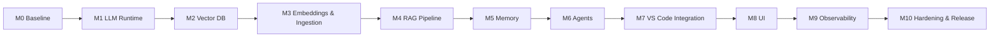

# PAIEP Implementation Milestone Prompts

These prompts break **Phase 10 (Implementation)** into small, independent, testable, and
**reversible** milestones. Each has objectives, prerequisites, deliverables, a validation
checklist, expected outputs, a rollback plan, troubleshooting, and a STOP condition.

> **Preconditions:** Architecture phases 01–09 approved and the Phase 10 roadmap
> ([`../10-implementation-roadmap.prompt.md`](../10-implementation-roadmap.prompt.md)) approved.
> Run **one milestone at a time**; approve before starting the next. Repo rules:
> [`../../copilot-instructions.md`](../../copilot-instructions.md).

## Milestone order & dependencies

## Index

| # | Milestone | Prompt | Outcome |
|---|-----------|--------|---------|
| M0 | Baseline environment | [M0-baseline.prompt.md](M0-baseline.prompt.md) | Reproducible local base + Compose skeleton |
| M1 | Local LLM runtime | [M1-llm-runtime.prompt.md](M1-llm-runtime.prompt.md) | Offline inference endpoint |
| M2 | Vector database | [M2-vector-db.prompt.md](M2-vector-db.prompt.md) | Persistent vector store + schema |
| M3 | Embeddings & ingestion | [M3-embeddings-ingestion.prompt.md](M3-embeddings-ingestion.prompt.md) | Populated index (idempotent) |
| M4 | RAG pipeline | [M4-rag-pipeline.prompt.md](M4-rag-pipeline.prompt.md) | Grounded answers with citations |
| M5 | Memory | [M5-memory.prompt.md](M5-memory.prompt.md) | Session + long-term memory |
| M6 | Agents | [M6-agents.prompt.md](M6-agents.prompt.md) | Multi-agent orchestration |
| M7 | VS Code integration | [M7-vscode-integration.prompt.md](M7-vscode-integration.prompt.md) | Assistants + MCP tools in-editor |
| M8 | UI | [M8-ui.prompt.md](M8-ui.prompt.md) | Local web UI |
| M9 | Observability | [M9-observability.prompt.md](M9-observability.prompt.md) | Metrics, logs, traces |
| M10 | Hardening & release | [M10-hardening-release.prompt.md](M10-hardening-release.prompt.md) | Hardened, documented v1 |

> Milestone boundaries assume the reference architecture from Phase 06. If Phase 06 selects
> different components, adjust service names/counts but keep the same milestone shape and gates.
