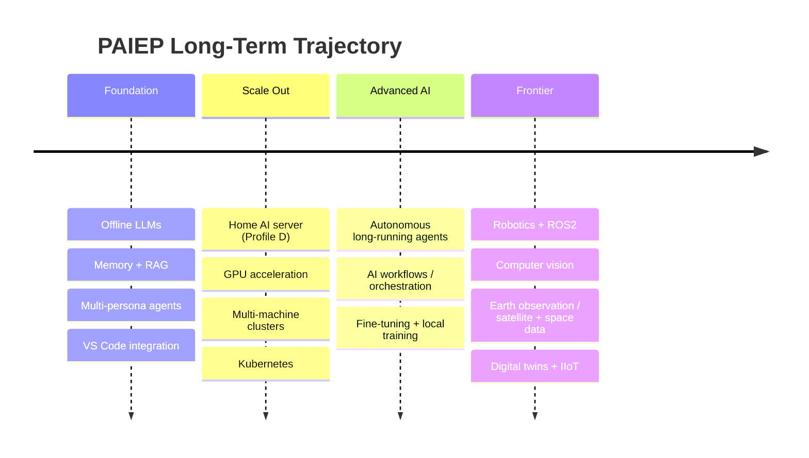
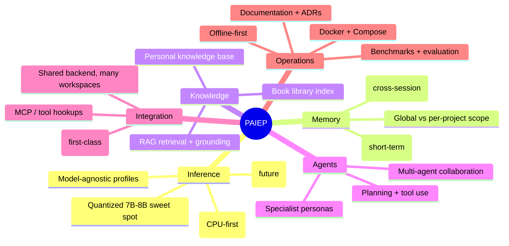
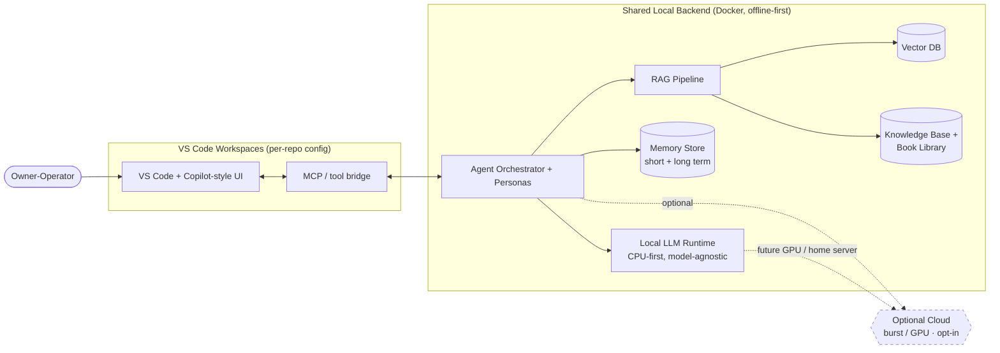

# Phase 01 — Project Vision

> **Personal AI Engineering Platform (PAIEP)** — an enterprise-grade, open-source,
> **offline-first** platform that runs primarily on a local laptop and grows into a
> personal AI operating system.
>
> **Phase status:** Drafted · **Author role:** Enterprise / AI Platform Architect ·
> **Date:** 2026-07-19

**Context (read first):**
[`.github/copilot-instructions.md`](../../.github/copilot-instructions.md) ·
[`docs/setup/environment.md`](../setup/environment.md) ·
[`docs/adr/0001-design-first-gated-phases.md`](../adr/0001-design-first-gated-phases.md)

---

## 1. Vision Statement

**PAIEP is a private, offline-first AI engineering platform that turns a single laptop into a
team of expert AI collaborators.** It reads your knowledge, remembers your work, and acts as a
Software Engineer, Data Engineer, Architect, Writer, and Researcher — without sending your data
to the cloud and without a per-token bill.

Where GitHub Copilot Agent is a powerful *cloud* assistant, PAIEP is its **open, local, and
fully-owned counterpart**: every model, every byte of memory, and every agent runs on hardware
you control, and every architectural decision is documented so the system stays understandable
and extensible for years.

### North Star

> **"A personal AI operating system I fully own — offline-capable, model-agnostic, and able to
> act as any engineering persona I need, on hardware ranging from a 16 GB laptop to a home
> server cluster."**

Every phase, decision, and line of future code is judged against that north star.

---

## 2. Why This Project Exists (Problem → Outcome)

| Problem today | PAIEP outcome |
|---------------|---------------|
| Cloud AI assistants send private code/data off-device and cost money per token. | Runs **locally and offline**; zero token cost by default. |
| Assistants are locked to one vendor's models and UX. | **Model-agnostic** and **cloud-agnostic** — swap runtimes/models freely. |
| Chat tools forget context between sessions and projects. | **Persistent long-term memory** and a personal **knowledge base (RAG)**. |
| A single "assistant" is a jack-of-all-trades. | A coordinated set of **specialist agent personas**. |
| Setups are ad-hoc and undocumented. | **Design-first, gated, documented** with ADRs and rollback plans. |
| Tools assume a beefy GPU. | Designed for **CPU-only first** (this laptop), scaling up to GPU/home-server. |

---

## 3. Personas the Platform Can Act As

PAIEP is not one bot; it is a roster of specialist personas that share memory and knowledge and
can collaborate on a task. Each persona is a configured combination of *system prompt + tools +
model profile + guardrails* (detailed in Phase 07).

| # | Persona | Core responsibility | Example request |
|---|---------|---------------------|-----------------|
| 1 | **AI Software Engineer** | Write, refactor, debug application code. | "Implement this feature and its tests." |
| 2 | **Data Engineer** | Build pipelines, ETL/ELT, data quality. | "Design an ingestion pipeline for these CSVs." |
| 3 | **Data Architect** | Model data, schemas, warehousing, lineage. | "Design a star schema for this domain." |
| 4 | **Solution Architect** | System design, trade-offs, ADRs. | "Compare 3 architectures for this service." |
| 5 | **Technical Writer** | Long-form docs, tutorials, references. | "Write the user guide for this module." |
| 6 | **Documentation Assistant** | Docstrings, READMEs, changelogs, comments. | "Document these functions." |
| 7 | **Learning Coach** | Explain concepts, build learning paths. | "Teach me vector databases step by step." |
| 8 | **Research Assistant** | Gather, summarize, compare sources. | "Summarize these papers on RAG." |
| 9 | **Knowledge Manager** | Curate the KB, tag, deduplicate, index. | "Add this book to the knowledge base." |
| 10 | **Project Generator** | Scaffold new projects from templates. | "Create a FastAPI + Postgres starter." |
| 11 | **Code Reviewer** | Review diffs for quality and correctness. | "Review this PR for bugs and style." |
| 12 | **Security Reviewer** | Find OWASP-class issues, secrets, risks. | "Audit this endpoint for vulnerabilities." |
| 13 | **DevOps Engineer** | Docker, CI/CD, infra-as-code, ops. | "Write a Compose stack for these services." |
| 14 | **MLOps Engineer** | Model serving, evaluation, fine-tuning ops. | "Set up a benchmark harness for local models." |

> Personas are **composable**: e.g., *Solution Architect* drafts a design, *Security Reviewer*
> audits it, *Technical Writer* documents it — orchestrated by an agent layer defined in Phase 07.

---

## 4. Primary Objectives (Near-Term)

1. **Run capable LLMs fully offline** on the primary laptop (CPU-only, 7B–8B quantized sweet spot).
2. **Model-agnostic runtime** — swap models/runtimes (Ollama, llama.cpp, others) without redesign.
3. **Persistent memory** — short-term (session) and long-term (cross-session/project) recall.
4. **Personal knowledge base + RAG** — index notes, docs, and a book library for grounded answers.
5. **Multi-persona agents** that can plan, use tools, and collaborate.
6. **First-class VS Code integration** so the platform is usable in daily engineering work.
7. **One shared backend, many workspaces** — services run once; every repo connects to them.
8. **Everything documented** — phases, ADRs, diagrams, comparisons, rollback plans.

---

## 5. Long-Term Goals (North-Star Horizon)

Sequenced roughly from nearest to most ambitious. These shape the architecture even though they
are **out of scope for early phases**.

- **Autonomous agents** — long-running, goal-driven agents with tool use and self-checking.
- **AI workflows** — reusable, composable multi-agent pipelines.
- **Fine-tuning & local training** — adapt small models (LoRA/QLoRA) on personal data.
- **Multi-machine clusters & Kubernetes** — distribute inference/services beyond one box.
- **GPU acceleration & home AI server (Profile D)** — the preferred scale-up path (see ADR 0100).
- **Robotics & ROS2** — connect agents to robotic control and simulation.
- **Computer vision** — perception pipelines for images/video.
- **Earth observation / satellite & space data** — geospatial and remote-sensing analytics.
- **Digital twins & IIoT** — model and monitor physical systems.

> These goals justify a **modular, cloud-agnostic, future-proof** architecture from day one.

---

## 6. Guiding Principles

| Principle | What it means in practice |
|-----------|---------------------------|
| **Offline-first** | Core features work with no internet; cloud is opt-in, never required. |
| **Open source** | Prefer permissively licensed, community-backed tools; avoid lock-in. |
| **Modular** | Components (model, memory, RAG, agents, UI) are swappable in isolation. |
| **Extensible** | New personas, tools, and models added via config, not rewrites. |
| **Documented** | Every decision recorded (why · benefits · drawbacks · alternatives · cost). |
| **Beginner friendly** | Clear onboarding, checklists, and rollback plans. |
| **Production inspired** | Enterprise patterns (ADRs, gating, observability) at personal scale. |
| **Future proof** | Ready to grow into robotics, EO, clusters, fine-tuning. |
| **Cloud-agnostic** | If cloud is used, no hard dependency on any single provider. |

---

## 7. Stakeholders & Usage Modes

The sole stakeholder is **the owner-operator ("me")** — architect, developer, and end user. The
platform must serve several distinct **usage modes**:

| Mode | Description | Dominant personas |
|------|-------------|-------------------|
| **Builder** | Writing/refactoring code in VS Code day to day. | Software Engineer, Code Reviewer, DevOps |
| **Architect** | Designing systems, recording decisions. | Solution Architect, Data Architect, Security Reviewer |
| **Learner** | Studying new topics and technologies. | Learning Coach, Research Assistant |
| **Researcher** | Digesting papers/docs, comparing options. | Research Assistant, Knowledge Manager |
| **Author** | Producing documentation and tutorials. | Technical Writer, Documentation Assistant |
| **Operator** | Running/maintaining the platform itself. | DevOps, MLOps |

---

## 8. Capabilities Map

---

## 9. High-Level Context Diagram

*The dashed paths are optional/future: cloud is opt-in only, and GPU/home-server acceleration is a
later scale-up (see [ADR 0100](../adr/0100-gpu-and-reuse-strategy.md)).*

---

## 10. Success Criteria

PAIEP's vision is realized when:

1. **Offline capability** — core workflows (chat, code assist, RAG, memory) run with the network
   disabled on the primary laptop.
2. **Usable latency** — interactive responses from a 7B–8B quantized model feel acceptable on
   CPU (target validated in Phase 04).
3. **Persistent recall** — the platform remembers facts/preferences across sessions and projects.
4. **Grounded answers** — RAG answers cite content from the personal knowledge base.
5. **Multiple personas** — at least the core engineering personas are configurable and usable.
6. **VS Code integration** — the platform is invocable inside real coding workflows.
7. **Shared backend reuse** — one backend serves multiple workspaces without duplication.
8. **Documentation completeness** — every phase has docs, diagrams, and ADRs; steps are reversible.
9. **Portability** — runs on Profiles A–D with documented scaling guidance.
10. **Zero mandatory cost** — no paid service is required to operate the core platform.

---

## 11. Non-Goals (Explicitly Out of Scope)

- **Not** a public multi-tenant SaaS product (single owner-operator only).
- **Not** a frontier-model competitor — quality is bounded by local, quantized models.
- **Not** cloud-dependent — cloud never becomes a hard requirement.
- **Not** writing implementation code during architecture phases (01–09, 12).
- **Not** requiring a discrete GPU to function (GPU is an optimization, not a prerequisite).
- **Not** locking into any single model, vendor, or orchestration framework.
- **Not** solving robotics/EO/clusters now — these are roadmap horizons, not near-term work.

---

## 12. Assumptions

- The primary machine is the HP EliteBook 840 G7 (i7-10610U, 32 GB RAM, **CPU-only**) as detailed
  in [environment.md](../setup/environment.md); build for it first.
- WSL2 + Docker Desktop (Compose v2) is the runtime substrate.
- The owner-operator is technically capable but wants beginner-friendly documentation.
- Small quantized models (7B–8B) are "good enough" for most interactive tasks; heavier work can
  wait for a home-server/GPU scale-up.
- Open-source tooling of sufficient quality exists for each capability (validated in Phases 03–06).

---

## 13. Risks (Vision-Level)

| Risk | Impact | Early mitigation direction |
|------|--------|----------------------------|
| CPU-only latency limits long agent chains. | Poor UX for complex tasks. | Concurrency limits, smaller models, home-server path (ADR 0100). |
| Scope is very broad (many personas + horizons). | Never-finished, unfocused build. | Strict **phase gating**; deliver core before horizons. |
| Local model quality below cloud frontier. | Weaker outputs on hard tasks. | Optional cloud burst; fine-tuning later; set expectations. |
| Fast-moving OSS ecosystem churns. | Chosen tools become obsolete. | Modularity + adapters; revisit in later phases. |
| Single operator = single point of failure/knowledge. | Fragile continuity. | Thorough docs/ADRs so the system is self-explaining. |
| Memory/knowledge of private data. | Privacy exposure if leaked. | Offline-first, local storage, security review persona. |

---

## 14. Future Improvements (Seeds for Later Phases)

- Formalize persona definitions and collaboration protocols (**Phase 07**).
- Decide memory scope: global vs per-project (**Phase 08 / M5**).
- Validate concrete model tiers and latency on this machine (**Phase 04**).
- Design the home-server topology and GPU path (**Phase 12**, ADR 0100).
- Template repo / cookiecutter for multi-workspace reuse (**milestone M7**).
- Evaluation & benchmarking harness for models and agents (**Phase 11**).

---

## 15. References

- [`.github/copilot-instructions.md`](../../.github/copilot-instructions.md) — repo-wide rules.
- [`docs/setup/environment.md`](../setup/environment.md) — primary target machine.
- [`docs/adr/0001-design-first-gated-phases.md`](../adr/0001-design-first-gated-phases.md) — phase-gating decision.
- [`docs/adr/0100-gpu-and-reuse-strategy.md`](../adr/0100-gpu-and-reuse-strategy.md) — GPU & multi-workspace reuse.
- [Phase 01 prompt](../../.github/prompts/01-project-vision.prompt.md) — source of this deliverable.

---

> **Phase 01 complete** — see the summary in the chat response, then **STOP** for approval before Phase 02.
