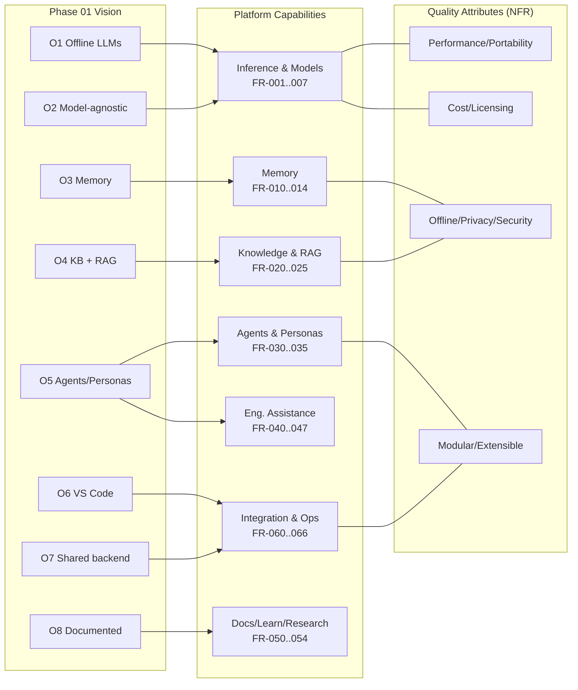

# Phase 02 — Requirements Analysis

> Translating the [Phase 01 Vision](01-project-vision.md) into a complete, testable set of
> **functional** and **non-functional** requirements, constraints, priorities, and traceability.
>
> **Phase status:** Drafted · **Author role:** Principal Software Engineer / Solution Architect ·
> **Date:** 2026-07-19

**Context (read first):**
[`.github/copilot-instructions.md`](../../.github/copilot-instructions.md) ·
[`docs/phases/01-project-vision.md`](01-project-vision.md) ·
[`docs/setup/environment.md`](../setup/environment.md) ·
[`docs/adr/0002-offline-first-priority.md`](../adr/0002-offline-first-priority.md)

---

## 1. How to Read This Document

- **FR-xxx** = Functional Requirement (what the platform *does*).
- **NFR-xxx** = Non-Functional Requirement (quality attributes: *how well* it does it).
- **CON-xxx** = Constraint (a fixed boundary we must design within).
- **Priority (MoSCoW):** **M** = Must (core, blocks the north star) · **S** = Should (important,
  not blocking) · **C** = Could (nice-to-have) · **W** = Won't-for-now (explicitly deferred).
- **Traceability** links each requirement to a Phase 01 **Persona (P1–P14)** and/or
  **Objective (O1–O8)** / **Long-Term Goal (LT)**.

### Phase 01 reference keys

| Personas (P) | Objectives (O) |
|--------------|----------------|
| P1 AI Software Engineer · P2 Data Engineer · P3 Data Architect · P4 Solution Architect · P5 Technical Writer · P6 Documentation Assistant · P7 Learning Coach · P8 Research Assistant · P9 Knowledge Manager · P10 Project Generator · P11 Code Reviewer · P12 Security Reviewer · P13 DevOps Engineer · P14 MLOps Engineer | O1 Offline LLMs · O2 Model-agnostic runtime · O3 Persistent memory · O4 KB + RAG · O5 Multi-persona agents · O6 VS Code integration · O7 Shared backend/many workspaces · O8 Everything documented |

---

## 2. Functional Requirements (FR)

### 2.1 Inference & Models

| ID | Requirement | Priority | Traces to |
|----|-------------|:--------:|-----------|
| FR-001 | Run one or more LLMs **fully offline** on the local machine. | M | O1 |
| FR-002 | Support a **model-agnostic** interface so models/runtimes can be swapped without redesign. | M | O2 |
| FR-003 | Manage multiple **model profiles** (size, quantization, context length, role). | M | O2, P14 |
| FR-004 | Default to **CPU-optimized** runtimes (e.g., Ollama / llama.cpp) on the primary machine. | M | O1, CON-001 |
| FR-005 | Serve local **embedding models** for retrieval. | M | O4 |
| FR-006 | Optionally route to **GPU / home-server / cloud** endpoints when available (opt-in). | C | LT, O2 |
| FR-007 | Expose model **health/status** and basic runtime metrics. | S | O8, P14 |

### 2.2 Memory

| ID | Requirement | Priority | Traces to |
|----|-------------|:--------:|-----------|
| FR-010 | Maintain **short-term (session)** memory within a conversation/task. | M | O3 |
| FR-011 | Maintain **long-term memory** persisted across sessions. | M | O3 |
| FR-012 | Scope memory as **global** and/or **per-project** (mechanism decided in Phase 08). | S | O3, O7 |
| FR-013 | Allow the user to **view, edit, and delete** stored memories. | S | O3, NFR-020 |
| FR-014 | Support **semantic recall** of relevant memories into context. | S | O3, O4 |

### 2.3 Knowledge Base & RAG

| ID | Requirement | Priority | Traces to |
|----|-------------|:--------:|-----------|
| FR-020 | Ingest personal documents (notes, docs, code, a **book library**) into a knowledge base. | M | O4, P9 |
| FR-021 | Chunk, embed, and index content in a **vector database**. | M | O4 |
| FR-022 | Retrieve relevant content and **ground answers** with citations/sources. | M | O4, P8 |
| FR-023 | Curate the KB: tag, deduplicate, re-index, and remove stale content. | S | P9 |
| FR-024 | Support incremental **re-ingestion** when source content changes. | S | O4, P9 |
| FR-025 | Retrieve **repo-aware** context (code files, structure) for coding tasks. | M | P1, P11 |

### 2.4 Agents & Personas

| ID | Requirement | Priority | Traces to |
|----|-------------|:--------:|-----------|
| FR-030 | Provide configurable **persona definitions** (system prompt + tools + model + guardrails). | M | O5, P1–P14 |
| FR-031 | Support the **core engineering personas** (at minimum P1, P4, P5, P11, P12, P13). | M | O5 |
| FR-032 | Enable an agent to **plan** and **use tools** (file, shell, search, retrieval). | M | O5, P1 |
| FR-033 | Enable **multi-agent collaboration** (personas hand off / review each other). | S | O5, P4, P11, P12 |
| FR-034 | Enforce **per-persona guardrails** (allowed tools, autonomy limits). | S | O5, NFR-021 |
| FR-035 | Support **long-running / autonomous** agent workflows. | W | LT |

### 2.5 Software & Data Engineering Assistance

| ID | Requirement | Priority | Traces to |
|----|-------------|:--------:|-----------|
| FR-040 | Assist with writing, refactoring, and **debugging code**. | M | P1 |
| FR-041 | Perform **code review** on diffs/files for quality and correctness. | M | P11 |
| FR-042 | Perform **security review** for OWASP-class issues and secrets. | S | P12 |
| FR-043 | Assist with **testing** (generate tests, suggest cases, interpret failures). | S | P1, P14 |
| FR-044 | Assist with **data engineering** (pipelines, ETL/ELT, data quality). | S | P2 |
| FR-045 | Assist with **data/solution architecture** (schemas, designs, trade-offs, ADRs). | S | P3, P4 |
| FR-046 | Assist with **DevOps** tasks (Docker, Compose, CI/CD, IaC). | S | P13 |
| FR-047 | Assist with **AI/prompt engineering** (author, test, and refine prompts). | S | O5, P14 |

### 2.6 Documentation, Learning & Research

| ID | Requirement | Priority | Traces to |
|----|-------------|:--------:|-----------|
| FR-050 | Generate **Markdown / technical documentation** (guides, references, READMEs). | M | P5, P6, O8 |
| FR-051 | Generate **diagrams** (e.g., Mermaid) alongside documentation. | S | P5, O8 |
| FR-052 | Act as a **Learning Coach** (explain concepts, build learning paths). | S | P7 |
| FR-053 | Act as a **Research Assistant** (gather, summarize, compare sources). | S | P8 |
| FR-054 | **Generate/scaffold new projects** from templates. | S | P10 |

### 2.7 Integration & Platform Operations

| ID | Requirement | Priority | Traces to |
|----|-------------|:--------:|-----------|
| FR-060 | Integrate with **VS Code** as a first-class client. | M | O6 |
| FR-061 | Expose services via a **tool/bridge protocol** (e.g., MCP) for the editor. | S | O6 |
| FR-062 | Run backend services **once** and let **multiple workspaces** connect to them. | M | O7 |
| FR-063 | Distribute **per-workspace config** via a template/cookiecutter mechanism. | C | O7 |
| FR-064 | Orchestrate all services with **Docker Compose**. | M | O7, CON-005 |
| FR-065 | Provide a **benchmarking/evaluation** harness for models and agents. | S | P14, O8 |
| FR-066 | Provide **observability** (logs, basic metrics) for running services. | S | O8, NFR-030 |

---

## 3. Non-Functional Requirements (NFR)

### 3.1 Performance & Portability

| ID | Requirement | Priority | Traces to |
|----|-------------|:--------:|-----------|
| NFR-001 | Interactive responses from a **7B–8B quantized** model must feel acceptable on **CPU-only** (concrete latency target validated in Phase 04). | M | O1, CON-001 |
| NFR-002 | Operate within **32 GB RAM** (≤ ~24 GB allocated to WSL) on the primary machine. | M | CON-001 |
| NFR-003 | Run across **hardware profiles A–D** with documented scaling guidance. | M | CON-002 |
| NFR-004 | Bound resource use with **concurrency limits** to protect interactivity. | S | NFR-001 |

### 3.2 Offline, Privacy & Security

| ID | Requirement | Priority | Traces to |
|----|-------------|:--------:|-----------|
| NFR-010 | **Offline-first:** all core workflows function with the network disabled. | M | O1, [ADR 0002](../adr/0002-offline-first-priority.md) |
| NFR-011 | No core feature has a **mandatory** cloud dependency. | M | O1, O2 |
| NFR-020 | All personal data (memory, KB) is stored **locally** and remains private. | M | O3, O4 |
| NFR-021 | Enforce **least-privilege** tool access per persona; sensitive actions require confirmation. | S | O5, FR-034 |
| NFR-022 | No secrets in logs or prompts; follow secure-by-default practices (OWASP-aware). | S | P12 |

### 3.3 Architecture Qualities

| ID | Requirement | Priority | Traces to |
|----|-------------|:--------:|-----------|
| NFR-023 | **Modular:** components (model, memory, RAG, agents, UI) are independently swappable. | M | Vision §6 |
| NFR-024 | **Extensible:** add personas/tools/models via **config**, not rewrites. | M | O2, O5 |
| NFR-025 | **Cloud-agnostic:** no hard dependency on any single cloud provider. | S | Vision §6 |
| NFR-026 | **Maintainable:** clear structure, conventions, and documented decisions. | M | O8 |
| NFR-030 | **Observable:** services emit logs and basic health/metrics. | S | FR-066 |
| NFR-031 | **Reversible:** implementation steps are small, testable, and roll-back-able (Phase 10+). | M | Vision §2, CON |

### 3.4 Cost & Licensing

| ID | Requirement | Priority | Traces to |
|----|-------------|:--------:|-----------|
| NFR-040 | **Zero mandatory cost** to operate the core platform. | M | O1 |
| NFR-041 | Prefer **permissively licensed, open-source** components. | M | CON-003 |

---

## 4. Constraints (CON)

| ID | Constraint | Rationale / Source |
|----|-----------|--------------------|
| CON-001 | Primary machine is **CPU-only** (HP EliteBook 840 G7, i7-10610U, 32 GB RAM, no discrete GPU). | [environment.md](../setup/environment.md) |
| CON-002 | Must support **hardware profiles A–D** (16 GB CPU → home server). | [copilot-instructions](../../.github/copilot-instructions.md) §5 |
| CON-003 | Prefer **open-source, permissively licensed** tools; avoid lock-in. | Vision §6, NFR-041 |
| CON-004 | **Local-first / offline-first**; cloud is opt-in only. | [ADR 0002](../adr/0002-offline-first-priority.md) |
| CON-005 | Runtime substrate is **VS Code + WSL2/Ubuntu + Docker Desktop (Compose v2)**. | [environment.md](../setup/environment.md) |
| CON-006 | **Design-first, gated phases**; no implementation code in phases 01–09, 12. | [ADR 0001](../adr/0001-design-first-gated-phases.md) |
| CON-007 | **Single operator**; documentation must make the system self-explaining. | Vision §7 |

---

## 5. MoSCoW Prioritization Summary

| Priority | Requirements |
|----------|--------------|
| **Must** | FR-001, FR-002, FR-003, FR-004, FR-005, FR-010, FR-011, FR-020, FR-021, FR-022, FR-025, FR-030, FR-031, FR-032, FR-040, FR-041, FR-050, FR-060, FR-062, FR-064; NFR-001, NFR-002, NFR-003, NFR-010, NFR-011, NFR-020, NFR-023, NFR-024, NFR-026, NFR-031, NFR-040, NFR-041 |
| **Should** | FR-007, FR-012, FR-013, FR-014, FR-023, FR-024, FR-033, FR-034, FR-042, FR-043, FR-044, FR-045, FR-046, FR-047, FR-051, FR-052, FR-053, FR-054, FR-061, FR-065, FR-066; NFR-004, NFR-021, NFR-022, NFR-025, NFR-030 |
| **Could** | FR-006, FR-063 |
| **Won't (for now)** | FR-035 (autonomous long-running agents — deferred to long-term roadmap) |

> The **Must** set defines the Minimum Viable Platform (MVP): offline model-agnostic inference +
> memory + RAG + core personas + VS Code + shared Dockerized backend, all documented.

---

## 6. Traceability Matrix (Requirement → Vision)

| Vision element | Requirements that serve it |
|----------------|----------------------------|
| **O1 Offline LLMs** | FR-001, FR-004, NFR-001, NFR-010, NFR-011, NFR-040 |
| **O2 Model-agnostic** | FR-002, FR-003, FR-006, NFR-024, NFR-025 |
| **O3 Persistent memory** | FR-010–FR-014, NFR-020 |
| **O4 KB + RAG** | FR-005, FR-020–FR-024, FR-014, NFR-020 |
| **O5 Multi-persona agents** | FR-030–FR-034, FR-047, NFR-021 |
| **O6 VS Code integration** | FR-060, FR-061 |
| **O7 Shared backend/workspaces** | FR-062, FR-063, FR-064, FR-012 |
| **O8 Documented** | FR-050, FR-051, FR-065, FR-066, NFR-026, NFR-030 |
| **Personas P1–P14** | FR-025, FR-040–FR-047, FR-050–FR-054 (see per-FR "Traces to") |

Every FR/NFR above lists a **Traces to** column; no requirement exists without a vision anchor.

---

## 7. Requirements-to-Capability Diagram

---

## 8. Assumptions & Dependencies

**Assumptions**
- 7B–8B quantized models are "good enough" for most interactive tasks on CPU (validated Phase 04).
- Sufficient-quality open-source tools exist for each capability (validated Phases 03–06).
- The owner-operator can run WSL2 + Docker Desktop and manage local resources.
- Personal data volume fits comfortably on the ~485 GB free SSD.

**Dependencies**
- Model runtime (e.g., Ollama / llama.cpp) — selected in Phase 06.
- Vector database + embedding model — selected in Phase 06/08.
- Agent orchestration framework — selected in Phase 06/07.
- VS Code + tool/bridge protocol (e.g., MCP) — designed in Phase 09.
- Docker + Compose v2 runtime substrate (already present).

---

## 9. Risks

| Risk | Impact | Mitigation direction |
|------|--------|----------------------|
| CPU latency makes some **Must** FRs feel sluggish. | Weak UX. | NFR-004 concurrency limits; smaller models; home-server path (ADR 0100). |
| Requirement scope is large; MVP could sprawl. | Delivery drift. | MoSCoW "Must" MVP boundary; phase gating (ADR 0001). |
| Ambiguous latency target for NFR-001. | Untestable requirement. | Quantify in Phase 04 feasibility benchmarks. |
| Memory-scope decision (FR-012) deferred. | Rework risk in KB/agents. | Resolve in Phase 08 before implementation. |
| Tool churn changes dependencies. | Requirements mismatch. | NFR-023/024 modularity + adapters; revisit each phase. |

---

## 10. Future Improvements

- Attach **measurable acceptance criteria** (latency, recall@k, throughput) once Phase 04 provides
  benchmarks — turning qualitative NFRs into testable thresholds.
- Promote **FR-035 (autonomous agents)** from *Won't* to *Should* after core agents are proven.
- Add **evaluation-driven requirements** from Phase 11 (accuracy/quality gates).

---

## 11. References

- [`docs/phases/01-project-vision.md`](01-project-vision.md) — vision, personas, objectives.
- [`docs/setup/environment.md`](../setup/environment.md) — primary target machine / constraints.
- [`docs/adr/0001-design-first-gated-phases.md`](../adr/0001-design-first-gated-phases.md).
- [`docs/adr/0002-offline-first-priority.md`](../adr/0002-offline-first-priority.md) — offline-first decision.
- [`docs/adr/0100-gpu-and-reuse-strategy.md`](../adr/0100-gpu-and-reuse-strategy.md).
- [Phase 02 prompt](../../.github/prompts/02-requirements-analysis.prompt.md).

---

> **Phase 02 complete** — see the chat summary, then **STOP** for approval before Phase 03.
