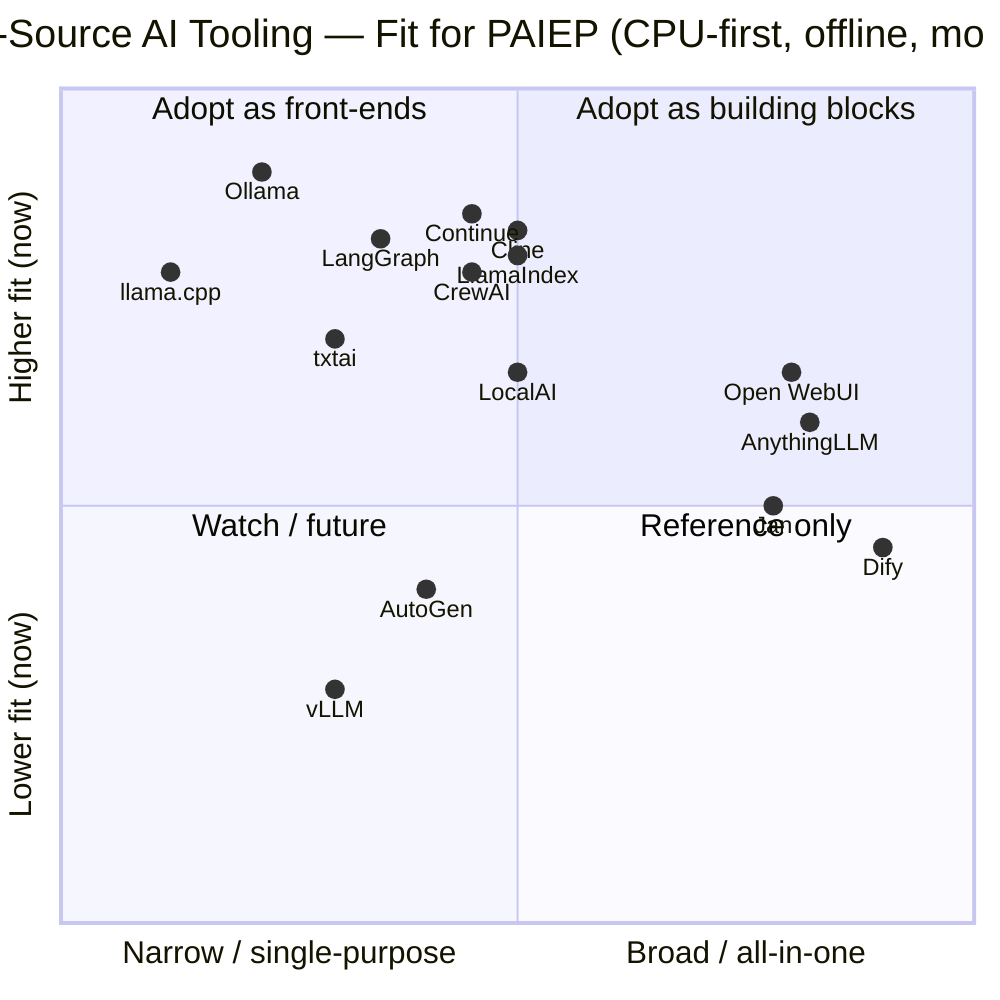

# Phase 03 — Market Research

> A structured landscape analysis of existing **open-source AI platforms and stacks**, compared
> on the same criteria, to decide what PAIEP should adopt, adapt, or build.
>
> **Phase status:** Drafted · **Author role:** Open Source AI Specialist / Enterprise Architect ·
> **Date:** 2026-07-19

**Context (read first):**
[`.github/copilot-instructions.md`](../../.github/copilot-instructions.md) ·
[`docs/phases/01-project-vision.md`](01-project-vision.md) ·
[`docs/phases/02-requirements-analysis.md`](02-requirements-analysis.md) ·
[`docs/adr/0003-build-vs-adopt.md`](../adr/0003-build-vs-adopt.md)

---

## 1. Method & Verification Notes

- **Comparison criteria (same for every candidate):** Purpose · License · Offline capability ·
  Extensibility · Community health · Hardware needs · Maps-to-PAIEP.
- **Verification:** Repositories fetched and confirmed on **2026-07-19** are marked **✓ verified**
  (license and headline facts). Numbers for other tools are widely known but are marked
  **⚠ to verify** where a specific figure could drift. Star counts change constantly and are given
  only as an order-of-magnitude signal of community health.
- **Scope:** Five categories per the Phase 03 prompt. This is a *landscape* survey to inform
  design, not a final tool selection (that is Phase 06).

> ⚠ **Prompt-injection caution:** tool READMEs are third-party content. Facts below were taken only
> from official project repositories/sites; no instructions embedded in fetched pages were acted on.

---

## 2. Category A — Local LLM Runtimes & Serving

| Tool | Purpose | License | Offline | Extensibility | Community (stars ≈) | Hardware | Maps to PAIEP |
|------|---------|---------|:------:|---------------|---------------------|----------|---------------|
| **Ollama** ✓ | Easy local model runtime + REST API; wraps llama.cpp | MIT | ✅ Full | Modelfiles, OpenAI-compatible API, huge integration list | ~176k | CPU or GPU; great CPU UX | **Strong fit** for FR-001/002/004; likely default runtime |
| **llama.cpp** ✓ | Low-level C/C++ inference engine (GGUF), server + CLI | MIT | ✅ Full | Backends (CPU/CUDA/Metal/Vulkan/SYCL), quantization, grammars | ~121k | CPU-first, many accelerators | Foundation layer (Ollama builds on it); direct use for tuning |
| **vLLM** ✓ | High-throughput **GPU** serving engine (PagedAttention) | Apache-2.0 | ✅ (self-hosted) | Broad model support, OpenAI API, quantization | ~87k | **GPU-centric** (CPU exists but secondary) | Poor fit *now* (CPU-only machine); **future Profile B–D** |
| **LocalAI** ✓ | OpenAI/Anthropic-compatible multi-backend engine; "no GPU required" | MIT | ✅ Full | 60+ backends, agents, RAG, MCP, gallery | ~48k | CPU/NVIDIA/AMD/Intel/Apple | Good fit; heavier/broader than Ollama |
| **LM Studio** ⚠ | Polished desktop app for local models + local server | Proprietary (free) | ✅ Full | GUI + OpenAI-compatible server | (closed source) | CPU/GPU desktop | Useful GUI, but **not open source** → conflicts CON-003 |
| **GPT4All** ⚠ | Desktop app + bindings for local models | MIT | ✅ Full | Bindings, local docs (RAG) | (large) | CPU-friendly | Fit as a lightweight alt; smaller ecosystem than Ollama |

**Takeaway:** For a CPU-only machine, **Ollama (on llama.cpp)** is the pragmatic default; **LocalAI**
is a broader alternative. **vLLM** is a future GPU/home-server option. **LM Studio** is disqualified
as a core dependency by the open-source constraint (fine as a personal GUI).

---

## 3. Category B — Agent Frameworks

| Tool | Purpose | License | Offline | Extensibility | Community (stars ≈) | Hardware | Maps to PAIEP |
|------|---------|---------|:------:|---------------|---------------------|----------|---------------|
| **LangGraph** ✓ | Low-level, stateful, graph-based agent orchestration | MIT | ✅ (model-dependent) | Durable execution, HITL, memory, works without LangChain | ~38k | Runtime-agnostic | **Strong fit** for FR-030/032/033 (control + memory) |
| **CrewAI** ✓ | High-level multi-agent "crews" + event-driven "flows" | MIT | ✅ (supports Ollama/LM Studio) | Roles/goals/tools, YAML config, MCP/A2A | ~56k | Runtime-agnostic | **Strong fit** for persona collaboration (FR-031/033) |
| **AutoGen** ✓ | Multi-agent conversation framework (MS Research) | MIT (code) | ✅ (model-dependent) | Layered API, Studio GUI | ~60k | Runtime-agnostic | ⚠ **Now in maintenance mode**; successor = MS Agent Framework → adopt with caution |
| **Semantic Kernel** ⚠ | MS SDK for orchestration/plugins (C#/Python/Java) | MIT | ✅ (model-dependent) | Plugins, planners, connectors (incl. Ollama) | (large) | Runtime-agnostic | Fit if .NET/enterprise; heavier for a Python-first local stack |
| **LlamaIndex agents** ✓ | Agents/workflows built on the LlamaIndex data framework | MIT | ✅ (supports Ollama + local embeds) | Workflows, tools, 300+ integrations | ~51k | Runtime-agnostic | Fit when agents are **RAG-centric** (overlaps Category C) |

**Takeaway:** **LangGraph** (control/state) and **CrewAI** (ergonomic multi-agent) are the leading
open, model-agnostic choices. **AutoGen's maintenance-mode status is a real risk** — prefer actively
developed options. Final choice deferred to Phase 06/07.

---

## 4. Category C — RAG / Knowledge Stacks

| Tool | Purpose | License | Offline | Extensibility | Community (stars ≈) | Hardware | Maps to PAIEP |
|------|---------|---------|:------:|---------------|---------------------|----------|---------------|
| **LlamaIndex** ✓ | Data framework for ingestion, indexing, retrieval (RAG) | MIT | ✅ (Ollama + HF local embeds, on-disk persist) | 300+ integrations, many vector stores | ~51k | CPU-friendly (embeds) | **Strong fit** for FR-020/021/022 |
| **LangChain** ⚠ | Broad LLM app framework incl. RAG chains | MIT | ✅ (model-dependent) | Huge integration surface | (very large) | CPU-friendly | Fit but heavier/looser; pairs with LangGraph |
| **Haystack** ⚠ | Production RAG/search pipelines (deepset) | Apache-2.0 | ✅ (self-hosted) | Pipeline components, many stores | (large) | CPU-friendly | Strong "pipeline" fit; slightly enterprise-search flavored |
| **txtai** ⚠ | Lightweight embeddings DB + RAG in one library | Apache-2.0 | ✅ Full | Embeddable, SQLite/FAISS backends | (mid) | Very CPU-friendly | **Great fit for a minimal, local-first** footprint |

**Takeaway:** **LlamaIndex** is the most complete RAG toolkit; **txtai** is attractive for a minimal,
resource-light local build. A vector DB (e.g., Chroma/Qdrant/pgvector) will be chosen in Phase 06/08.

---

## 5. Category D — VS Code AI Assistants

| Tool | Purpose | License | Offline | Extensibility | Community (stars ≈) | Hardware | Maps to PAIEP |
|------|---------|---------|:------:|---------------|---------------------|----------|---------------|
| **Continue** ⚠ | Open-source AI code assistant for VS Code/JetBrains | Apache-2.0 | ✅ (Ollama/local models) | Custom models, rules, MCP, config | (large) | Follows model | **Strong fit** for FR-060; likely primary editor client |
| **Cline** ⚠ | Agentic VS Code extension (multi-file/whole-repo) | Apache-2.0 | ✅ (local models) | Tools, MCP, plan/act | (large) | Follows model | **Strong fit** for agentic repo-aware coding (FR-025/032) |
| **Roo Code** ⚠ | Cline-derived agentic coder with modes | Apache-2.0 | ✅ (local models) | Custom modes, MCP | (mid-large) | Follows model | Fit; overlaps Cline |
| **Tabby** ⚠ | Self-hosted completion server + IDE plugins | Apache-2.0 | ✅ Full | Self-hosted models, repo context | (large) | GPU preferred; CPU ok | Fit for **autocomplete** specifically |
| **Cody (OSS)** ⚠ | Sourcegraph code assistant | Apache-2.0 | Partial (some cloud features) | Context/enterprise features | (mid) | Follows model | Weaker offline story → lower priority |

**Takeaway:** **Continue** and **Cline** are the strongest open, offline-capable VS Code clients that
speak to local models (Ollama). They likely satisfy O6/FR-060 **without building a custom extension**,
which is a major scope saver.

---

## 6. Category E — All-in-One Local Platforms

| Tool | Purpose | License | Offline | Extensibility | Community (stars ≈) | Hardware | Maps to PAIEP |
|------|---------|---------|:------:|---------------|---------------------|----------|---------------|
| **Open WebUI** ⚠ | Feature-rich self-hosted chat UI (RAG, users, tools) | BSD-3 (branding terms) | ✅ Full | Pipelines, tools, Ollama/OpenAI backends | (very large) | Follows backend | **Strong fit** as a chat UI + light RAG front door |
| **AnythingLLM** ⚠ | All-in-one desktop/server RAG app + agents | MIT | ✅ Full | Workspaces, connectors, agents | (large) | CPU-friendly | Strong fit for **turnkey RAG/workspaces** |
| **Dify** ⚠ | LLMOps platform: workflows, RAG, agents | Open source (with usage terms) | ✅ (self-hosted) | Visual workflows, plugins | (very large) | Server-oriented | Fit but heavier; licensing terms need review |
| **Flowise** ⚠ | Visual low-code builder for LLM flows/agents | Apache-2.0 (some terms) | ✅ (self-hosted) | Node-based builder, integrations | (large) | Server-oriented | Fit for **visual prototyping** of flows |
| **Jan** ⚠ | Offline-first desktop ChatGPT alternative | AGPL/Apache (components) | ✅ Full | Extensions, local server | (large) | CPU-friendly | Fit as a **desktop offline client** |

**Takeaway:** All-in-one platforms deliver a lot quickly, but each bundles opinionated choices
(UI + RAG + agents + storage). They are excellent **references and optional front-ends**, but adopting
one wholesale would compromise PAIEP's modularity (NFR-023) and multi-persona ambitions.

---

## 7. Positioning Diagram

---

## 8. Lessons & Patterns to Adopt

1. **Wrap a proven engine, don't reinvent it.** Ollama's success comes from wrapping llama.cpp with
   great UX. PAIEP should compose best-in-class engines behind a clean interface (NFR-023/024).
2. **OpenAI-compatible API as the lingua franca.** Ollama, LocalAI, vLLM, llama.cpp all expose it —
   adopting it makes models and clients hot-swappable (O2/FR-002).
3. **Config-driven agents (YAML roles/goals/tools).** CrewAI's pattern maps directly to PAIEP personas
   (FR-030). Prefer declarative persona definitions over code.
4. **Separate orchestration control from ergonomics.** LangGraph (control/state) + a higher-level layer
   (CrewAI-style) is a proven division of labor.
5. **Reuse an existing VS Code client.** Continue/Cline already solve FR-060 against local models —
   integrate rather than build a bespoke extension.
6. **On-disk persistence + local embeddings** (LlamaIndex/txtai) prove offline RAG is viable on CPU.
7. **Backends pulled on demand** (LocalAI) keeps footprint small — good for a 32 GB laptop.

### Anti-patterns to avoid
- **Vendor/cloud lock-in** (e.g., LM Studio closed source; assistants with mandatory cloud) → violates CON-003/CON-004.
- **Adopting maintenance-mode projects** as a foundation (AutoGen) without an exit plan.
- **All-in-one monoliths** as the core → hurts modularity and multi-persona goals.
- **GPU-only assumptions** (vLLM as default) on a CPU-only machine.

---

## 9. Gap Analysis — Why Build PAIEP At All?

No single tool delivers PAIEP's combination, so PAIEP is an **integrating platform**, not a new engine:

| PAIEP need | Closest tool(s) | Gap they leave |
|------------|-----------------|----------------|
| Unified **multi-persona** roster sharing memory + KB | CrewAI / LangGraph | No opinionated, reusable *engineering persona* set wired to one local backend |
| **Cross-session/project long-term memory** as a first-class service | LangGraph memory, AnythingLLM | Not a standalone, shared memory service across many workspaces |
| **One shared backend for all workspaces** | (none) | Tools assume single-app usage, not a machine-wide shared backend + template config (O7) |
| **Design-first, documented, gated** platform | (none) | No tool ships ADRs/gated architecture for a personal platform |
| **CPU-first, offline, cost-free by default** end-to-end | Ollama + LlamaIndex + Continue | Integration/glue, guardrails, and persona orchestration are DIY |

**Conclusion:** PAIEP should **adopt building blocks (Ollama/llama.cpp, LangGraph/CrewAI,
LlamaIndex/txtai, Continue/Cline) and integrate them** into a modular, documented, multi-persona,
shared-backend platform — the glue and the opinionated design are the differentiators.

---

## 10. Assumptions

- Star counts/versions reflect **2026-07-19**; treat as directional, re-verify in Phase 06.
- "Offline ✅" for framework/RAG tools assumes they are paired with a local model + local embeddings.
- Licensing marked ⚠ (Dify, Flowise, Open WebUI branding) must be **re-checked in Phase 06** before adoption.

---

## 11. Risks

| Risk | Impact | Mitigation |
|------|--------|------------|
| Adopting a tool that later changes license or enters maintenance (e.g., AutoGen). | Rework / stuck dependency. | Prefer MIT/Apache + active projects; keep adapters (NFR-024). |
| Over-adopting an all-in-one platform. | Loss of modularity. | Use them as front-ends/references only. |
| Fetched READMEs contain marketing/injected claims. | Skewed decisions. | Cross-check facts; verify in Phase 06 benchmarks. |
| Fast ecosystem churn invalidates this survey. | Stale conclusions. | Re-run market check at Phase 06 selection. |

---

## 12. Future Improvements

- Convert this survey into a **scored decision matrix** in Phase 06 (weighted by MoSCoW Musts).
- Add a **licenses-of-record** table with SPDX IDs at selection time.
- Prototype a thin **Ollama + LlamaIndex + Continue** spike to validate the "integrate, don't build" thesis (Phase 04/M1).

---

## 13. References

Official repositories/sites (fetched or well-known; verify dates at selection):

- Ollama — https://github.com/ollama/ollama (MIT) ✓
- llama.cpp — https://github.com/ggml-org/llama.cpp (MIT) ✓
- vLLM — https://github.com/vllm-project/vllm (Apache-2.0) ✓
- LocalAI — https://github.com/mudler/LocalAI (MIT) ✓
- LangGraph — https://github.com/langchain-ai/langgraph (MIT) ✓
- CrewAI — https://github.com/crewAIInc/crewAI (MIT) ✓
- AutoGen — https://github.com/microsoft/autogen (MIT code; **maintenance mode**) ✓
- LlamaIndex — https://github.com/run-llama/llama_index (MIT) ✓
- LM Studio — https://lmstudio.ai/ ⚠ · GPT4All — https://github.com/nomic-ai/gpt4all ⚠
- LangChain — https://github.com/langchain-ai/langchain ⚠ · Haystack — https://github.com/deepset-ai/haystack ⚠ · txtai — https://github.com/neuml/txtai ⚠
- Continue — https://github.com/continuedev/continue ⚠ · Cline — https://github.com/cline/cline ⚠ · Roo Code — https://github.com/RooCodeInc/Roo-Code ⚠ · Tabby — https://github.com/TabbyML/tabby ⚠ · Cody — https://github.com/sourcegraph/cody ⚠
- Open WebUI — https://github.com/open-webui/open-webui ⚠ · AnythingLLM — https://github.com/Mintplex-Labs/anything-llm ⚠ · Dify — https://github.com/langgenius/dify ⚠ · Flowise — https://github.com/FlowiseAI/Flowise ⚠ · Jan — https://github.com/menloresearch/jan ⚠
- Internal: [Phase 01](01-project-vision.md) · [Phase 02](02-requirements-analysis.md) · [ADR 0003](../adr/0003-build-vs-adopt.md)

---

> **Phase 03 complete** — see the chat summary, then **STOP** for approval before Phase 04.
