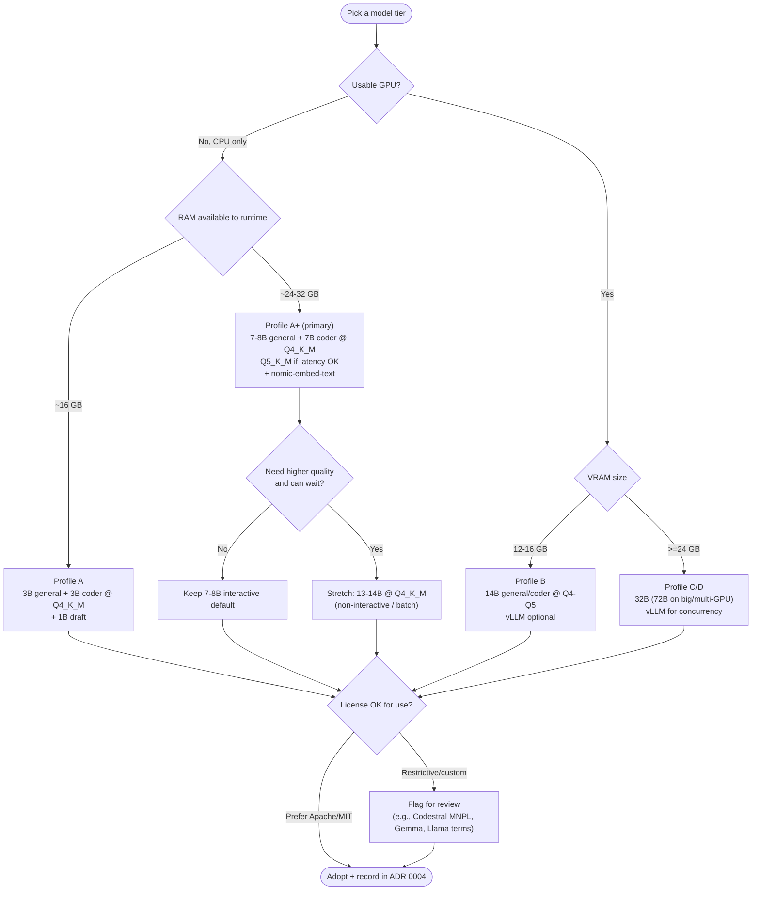

# Phase 04 — Feasibility Study (Models)

> Comparing open **coding** and **reasoning** models and recommending the best sets per hardware
> profile — with the **CPU-only primary machine** ("A+" hybrid) as the first-class target.
>
> **Phase status:** Drafted · **Author role:** AI Engineer / MLOps Engineer · **Date:** 2026-07-19

**Context (read first):**
[`.github/copilot-instructions.md`](../../.github/copilot-instructions.md) ·
[`docs/phases/01-project-vision.md`](01-project-vision.md) …
[`docs/phases/03-market-research.md`](03-market-research.md) ·
[`docs/setup/environment.md`](../setup/environment.md) ·
[`models/`](../../models/) ·
[`docs/adr/0004-default-model-selection.md`](../adr/0004-default-model-selection.md)

---

## 1. Method & Verification Notes

- **No benchmark numbers are invented.** Where a specific score/latency would be needed, this doc
  says **"measure in M1"** (the Phase 10 spike) rather than quoting a figure.
- **Licenses** are given by family and marked **⚠ verify** where terms are model/size-specific or
  change between releases. Confirm against the official model card before adoption (Phase 06).
- **Sizing math** (below) is deterministic and safe to state: it is derived from quantization
  bits-per-weight, not from benchmarks.
- **Primary machine reality:** CPU-only, 32 GB RAM (~24 GB to WSL). The interactive constraint is
  **latency**, not memory. Sweet spot = **7B–8B @ Q4_K_M/Q5_K_M** (see [environment.md](../setup/environment.md)).

---

## 2. Quantization Trade-offs (GGUF)

Quantization shrinks weights from FP16 to fewer bits, trading a little quality for large memory/speed
gains. Rough **RAM for weights ≈ params × bits-per-weight ÷ 8** (plus KV-cache + overhead).

| Quant | ~Bits/weight | Quality | Memory | When to use |
|-------|:-----------:|---------|--------|-------------|
| Q2_K | ~2.6 | Noticeably degraded | Smallest | Emergencies / tiny RAM only |
| Q3_K_M | ~3.4 | Degraded | Very small | Squeeze a bigger model into small RAM |
| **Q4_K_M** | ~4.5 | **Good — best balance** | Small | **Default** for CPU interactive use |
| **Q5_K_M** | ~5.5 | Very good | Moderate | When RAM allows, quality-sensitive tasks |
| Q6_K | ~6.6 | Near-FP16 | Larger | Quality with some speed cost |
| Q8_0 | ~8.5 | ~FP16 | Large | Small models, or eval baselines |

**Approx. weight footprint (Q4_K_M, guide only):** ~1B ≈ 0.7 GB · 3B ≈ 2 GB · 7–8B ≈ 4.5–5 GB ·
13–14B ≈ 8–9 GB · 32B ≈ 19–20 GB · 70B ≈ 40–43 GB. Add **KV-cache** (grows with context length)
and runtime overhead; keep headroom on a 24 GB WSL allocation.

**Guidance:** On CPU, prefer **Q4_K_M** for interactivity and step up to **Q5_K_M** when quality
matters and RAM permits. Reserve Q6/Q8 for small models or offline evaluation baselines.

---

## 3. Master Model Comparison Matrix

> Legend — Coding/Reasoning/Agent: ★☆☆–★★★ *relative* suitability (qualitative, confirm in M1).
> "GGUF" and "Ollama" = availability of community/official builds. Licenses ⚠ = verify per card.

### 3.1 Coding-focused models

| Model (family) | Sizes (typical) | Coding | Reasoning | Agent | Context | GGUF | Ollama | License | Notes |
|----------------|-----------------|:------:|:---------:|:-----:|---------|:----:|:------:|---------|-------|
| **Qwen2.5-Coder** | 0.5–32B | ★★★ | ★★☆ | ★★★ | up to 128K ⚠ | ✅ | ✅ | Apache-2.0 (most sizes) ⚠ | Leading open coder; strong tool/FIM support |
| **DeepSeek-Coder-V2** | 16B/236B (MoE) | ★★★ | ★★☆ | ★★☆ | up to 128K ⚠ | ✅ | ✅ | DeepSeek license ⚠ | MoE; Lite 16B feasible on GPU, heavy on CPU |
| **Codestral** (Mistral) | 22B | ★★★ | ★★☆ | ★★☆ | 32K ⚠ | ✅ | ✅ | MNPL (non-production) ⚠ | Strong coder but **restrictive license** |
| **CodeLlama** | 7/13/34/70B | ★★☆ | ★☆☆ | ★☆☆ | 16K–100K ⚠ | ✅ | ✅ | Llama Community ⚠ | Older; surpassed by Qwen2.5-Coder |
| **StarCoder2** | 3/7/15B | ★★☆ | ★☆☆ | ★☆☆ | 16K ⚠ | ✅ | ✅ | BigCode OpenRAIL-M ⚠ | Permissive-ish; good FIM/autocomplete |
| **DeepCoder** (community) | 1.5/14B ⚠ | ★★☆ | ★★☆ | ★★☆ | ⚠ | ✅ ⚠ | ✅ ⚠ | verify ⚠ | Emerging RL-tuned coder; validate provenance |

### 3.2 General / reasoning models (also code-capable)

| Model (family) | Sizes (typical) | Coding | Reasoning | Agent | Context | GGUF | Ollama | License | Notes |
|----------------|-----------------|:------:|:---------:|:-----:|---------|:----:|:------:|---------|-------|
| **Qwen2.5** | 0.5–72B | ★★☆ | ★★★ | ★★★ | up to 128K ⚠ | ✅ | ✅ | Apache-2.0 (most) ⚠ | Excellent all-rounder + tool use |
| **Llama 3.1 / 3.2** | 1/3/8/70B | ★★☆ | ★★☆ | ★★☆ | up to 128K ⚠ | ✅ | ✅ | Llama Community ⚠ | 3.2 1B/3B great for CPU; license has usage terms |
| **Gemma 2 / 3** | 1–27B ⚠ | ★★☆ | ★★☆ | ★★☆ | 8K–128K ⚠ | ✅ | ✅ | Gemma license ⚠ | Strong quality/size; custom license |
| **Mistral / Nemo** | 7B / 12B | ★★☆ | ★★☆ | ★★☆ | 32K–128K ⚠ | ✅ | ✅ | Apache-2.0 ⚠ | Solid, permissive, efficient |
| **Phi-3 / Phi-4** | 3.8–14B ⚠ | ★★☆ | ★★★ | ★★☆ | 4K–128K ⚠ | ✅ | ✅ | MIT ⚠ | Punches above weight on reasoning |
| **Granite 3** (IBM) | 2/8B ⚠ | ★★☆ | ★★☆ | ★★☆ | up to 128K ⚠ | ✅ | ✅ | Apache-2.0 ⚠ | Enterprise-friendly license; tool use |
| **DeepSeek-R1 (+ distills)** | 1.5–70B distills ⚠ | ★★☆ | ★★★ | ★★☆ | ⚠ | ✅ | ✅ | MIT (distills vary) ⚠ | Reasoning-focused; distills run locally |
| **SmolLM2** | 135M–1.7B | ★☆☆ | ★☆☆ | ★☆☆ | 8K ⚠ | ✅ | ✅ | Apache-2.0 ⚠ | Tiny; drafts/speculative/edge |

**Reading the matrix for a CPU-only machine:** the **7B–8B Apache/MIT** options (Qwen2.5 /
Qwen2.5-Coder 7B, Mistral 7B, Granite 3 8B, Phi reasoning) are the safest defaults — good quality,
permissive licenses, strong GGUF/Ollama support, and they fit comfortably in ~24 GB with headroom.

---

## 4. Per-Profile Recommendations

> Each profile lists a **general assistant**, a **coding specialist**, an optional **reasoning** pick,
> and a **draft/small** model. Detailed notes live in [`models/`](../../models/).

### Profile A — Small laptop (16 GB, CPU) → also the floor for our machine
- **General:** Llama 3.2 3B or Qwen2.5 3B @ Q4_K_M
- **Coding:** Qwen2.5-Coder 3B @ Q4_K_M
- **Draft/edge:** SmolLM2 1.7B / Llama 3.2 1B
- **Why:** keeps total RAM modest; interactive on CPU. Avoid >7B here.

### Profile "A+" — **Primary machine** (32 GB RAM, CPU-only) ⭐ build for this first
- **General (default):** **Qwen2.5 7B Instruct @ Q4_K_M** (step to Q5_K_M if latency acceptable)
- **Coding (default):** **Qwen2.5-Coder 7B @ Q4_K_M**
- **Reasoning (optional):** Phi-4 (or DeepSeek-R1 distill ~7–8B) @ Q4_K_M
- **Embeddings:** `nomic-embed-text` (see §5)
- **Draft:** Llama 3.2 1B / SmolLM2 for speculative or quick tasks
- **Why:** 7–8B Q4 fits with headroom; permissive licenses; best quality/latency balance on CPU.
  13–14B @ Q4 is a **"quality when patient"** stretch, not the interactive default.

### Profile B — Mid-range workstation (32 GB + consumer GPU, e.g., 12–16 GB VRAM)
- **General:** Qwen2.5 14B @ Q4/Q5 (fits ≥12 GB VRAM) or 7B for speed
- **Coding:** Qwen2.5-Coder 14B @ Q4_K_M
- **Reasoning:** DeepSeek-R1 distill 14B / Phi-4
- **Runtime note:** GPU unlocks larger models and much higher throughput; vLLM becomes viable.

### Profile C/D — High-end workstation / home server (≥24 GB VRAM, always-on)
- **General:** Qwen2.5 32B @ Q4/Q5 (24 GB VRAM); 72B on multi-GPU/large VRAM
- **Coding:** Qwen2.5-Coder 32B
- **Reasoning:** DeepSeek-R1 (larger distills / full where feasible)
- **Serving:** vLLM for throughput/concurrency; supports multiple personas concurrently.
- **Aligns with:** the home-AI-server upgrade path in [ADR 0100](../adr/0100-gpu-and-reuse-strategy.md).

---

## 5. Embedding Models for Local RAG (CPU-friendly)

| Model | Dim ⚠ | Size | Strengths | License ⚠ | Notes |
|-------|:-----:|------|-----------|-----------|-------|
| **nomic-embed-text** | 768 | small | Long context, strong general retrieval | Apache-2.0 ⚠ | **Default**; first-class in Ollama |
| **bge-small-en / bge-base** | 384/768 | small | Strong quality/size; multilingual variants | MIT ⚠ | Great CPU choice |
| **mxbai-embed-large** | 1024 | medium | Higher quality retrieval | Apache-2.0 ⚠ | Use when quality > speed |
| **all-MiniLM-L6-v2** | 384 | tiny | Very fast baseline | Apache-2.0 ⚠ | Lightweight fallback |

**Guidance:** default to **`nomic-embed-text`** on the primary machine (fast on CPU, good quality,
easy via Ollama). Keep the embedding model **fixed per index** — changing it requires re-embedding.

---

## 6. Decision Flow — Hardware → Model Tier

---

## 7. Assumptions

- Model availability, sizes, and context lengths reflect **2026-07-19** and evolve quickly; the
  **families** (Qwen, Llama, Gemma, Mistral, Phi, Granite, DeepSeek) are stable bets even as versions turn over.
- GGUF + Ollama builds exist for the recommended models (verify exact tags in Phase 06/M1).
- The primary machine allocates ~24 GB RAM to WSL, leaving headroom for KV-cache and services.
- Qualitative ★ ratings are directional; **M1 benchmarks** will replace them with measured data.

---

## 8. Risks

| Risk | Impact | Mitigation |
|------|--------|------------|
| License terms mis-stated (family-level). | Adoption of a restrictively licensed model. | Verify each model card in Phase 06; prefer Apache/MIT (Qwen/Mistral/Granite/Phi). |
| CPU latency worse than hoped at 7–8B. | Poor interactivity. | Fall back to 3B; use draft models; pursue GPU/home-server (ADR 0100). |
| Context length inflates KV-cache → OOM. | Crashes on long prompts. | Cap context; monitor RAM; smaller quant for long-context tasks. |
| Fast model churn dates recommendations. | Stale defaults. | Pin versions; re-evaluate at Phase 06 and periodically. |
| Emerging models (DeepCoder) have unclear provenance/license. | Legal/quality risk. | Treat as experimental; validate before use. |

---

## 9. Future Improvements

- Replace ★ ratings with **measured M1 benchmarks** (tokens/s, first-token latency, coding eval,
  RAG recall) on the primary machine.
- Add **speculative decoding** (small draft + larger target) to improve CPU throughput.
- Evaluate **quantization-aware** variants and newer formats as they mature.
- Revisit **MoE** models (e.g., DeepSeek-V2 Lite) once GPU/home-server exists.

---

## 10. References

Official model cards / hubs (verify versions & licenses at selection):

- Qwen2.5 / Qwen2.5-Coder — https://github.com/QwenLM (Hugging Face: Qwen)
- Llama 3.1 / 3.2 — https://www.llama.com/ · https://huggingface.co/meta-llama
- Gemma — https://ai.google.dev/gemma
- Mistral / Codestral — https://mistral.ai/ (Codestral = MNPL, non-production ⚠)
- Phi — https://huggingface.co/microsoft (Phi-3/Phi-4)
- Granite — https://www.ibm.com/granite · https://huggingface.co/ibm-granite
- DeepSeek (Coder-V2, R1) — https://github.com/deepseek-ai
- StarCoder2 — https://huggingface.co/bigcode (OpenRAIL-M)
- CodeLlama — https://huggingface.co/meta-llama
- SmolLM2 — https://huggingface.co/HuggingFaceTB
- Embeddings: nomic-embed-text (Nomic AI) · BGE (BAAI) · mxbai-embed-large (Mixedbread) · all-MiniLM (sentence-transformers)
- Runtimes: [Phase 03 market research](03-market-research.md) (Ollama/llama.cpp/vLLM)
- Internal: [environment.md](../setup/environment.md) · [ADR 0004](../adr/0004-default-model-selection.md) · [ADR 0100](../adr/0100-gpu-and-reuse-strategy.md)

---

> **Phase 04 complete** — see the chat summary, then **STOP** for approval before Phase 05.
