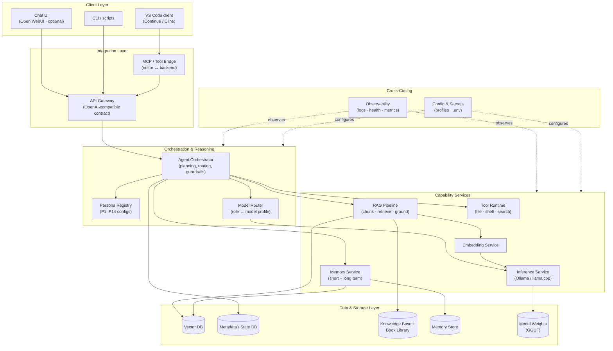
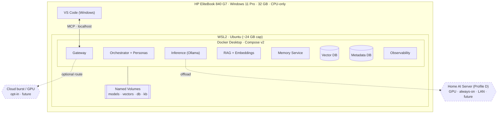
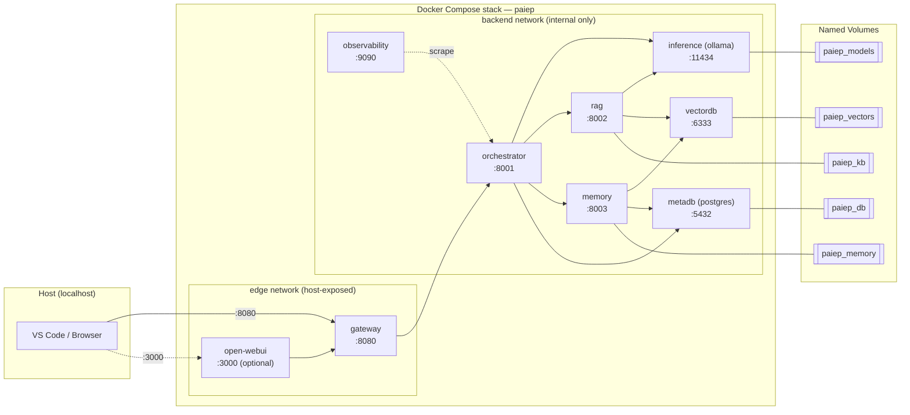
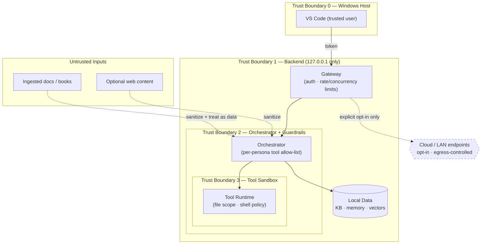
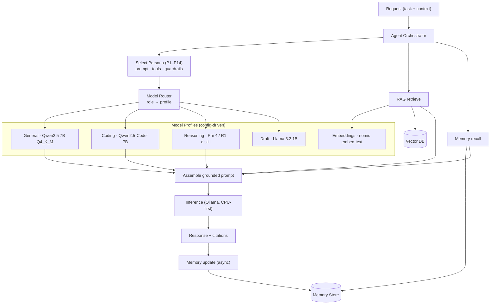
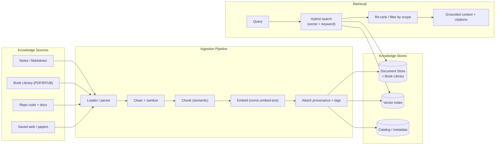
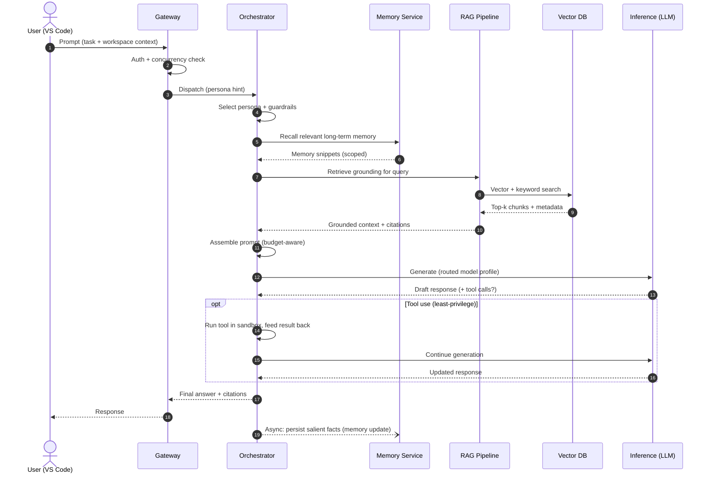
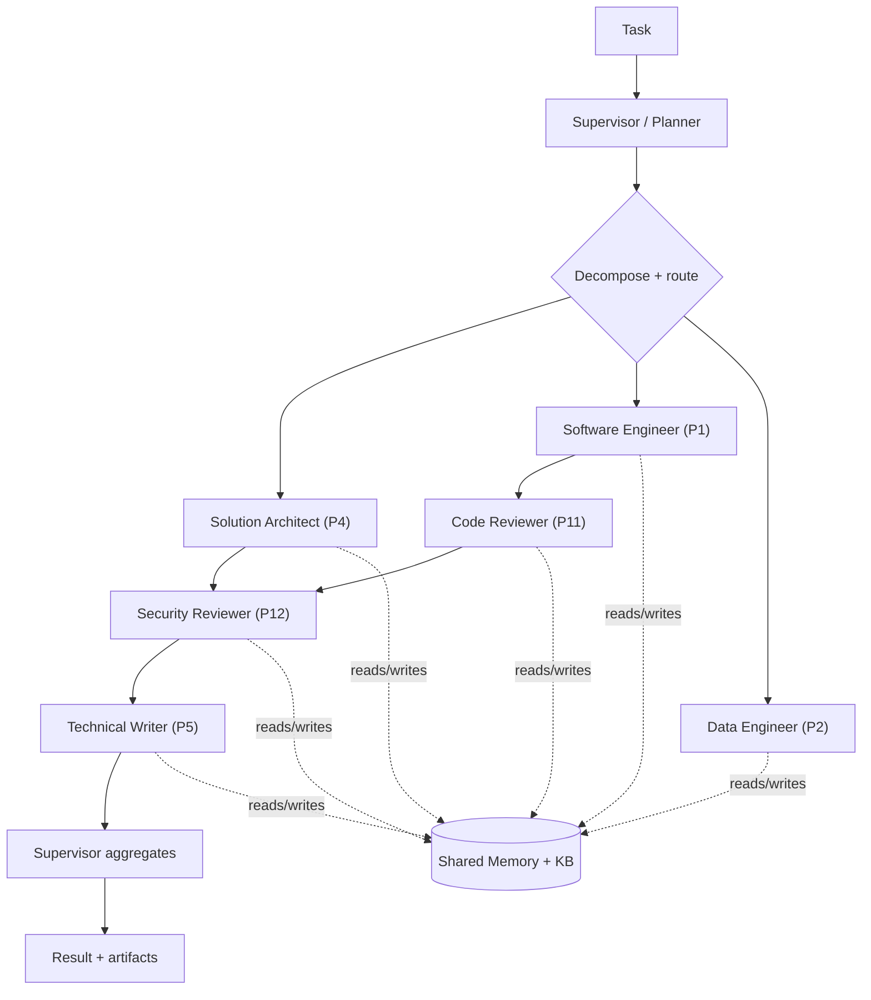

# Phase 05 — Enterprise Architecture

> The complete enterprise architecture for **PAIEP** across eight views — logical, physical,
> deployment, security, AI, knowledge, data flow, and agent collaboration — designed for the
> **CPU-only primary machine** ("A+" hybrid) first, and scaling across Profiles A–D.
>
> **Phase status:** Drafted · **Author role:** Enterprise Solution Architect / Infrastructure
> Architect / Security Architect · **Date:** 2026-07-19

**Context (read first):**
[`.github/copilot-instructions.md`](../../.github/copilot-instructions.md) ·
[`docs/phases/01-project-vision.md`](01-project-vision.md) ·
[`docs/phases/02-requirements-analysis.md`](02-requirements-analysis.md) ·
[`docs/phases/03-market-research.md`](03-market-research.md) ·
[`docs/phases/04-feasibility-study.md`](04-feasibility-study.md) ·
[`docs/setup/environment.md`](../setup/environment.md) ·
[`docs/adr/0003-build-vs-adopt.md`](../adr/0003-build-vs-adopt.md) ·
[`docs/adr/0004-default-model-selection.md`](../adr/0004-default-model-selection.md) ·
[`architecture/`](../../architecture/)

---

## 1. How to Read This Document

- This is **design only** — no implementation code (CON-006, [ADR 0001](../adr/0001-design-first-gated-phases.md)).
- Each of the **eight views** answers a different question and carries at least one **Mermaid diagram**.
- Significant choices carry a **design-discipline block**: *Why · Benefits · Drawbacks · Alternatives ·
  Complexity · Cost · Hardware impact · Future scalability*.
- **Per-profile (A–D)** scalability notes appear where placement/scaling differs by hardware.
- Requirement/persona keys (FR/NFR/CON, P1–P14, O1–O8) trace back to
  [Phase 02](02-requirements-analysis.md) and [Phase 01](01-project-vision.md).
- Diagrams are indexed for reuse under [`architecture/README.md`](../../architecture/README.md).

### Architectural principles carried into every view

| Principle | Architectural expression |
|-----------|--------------------------|
| **Offline-first** (NFR-010/011) | No view has a mandatory network path; cloud/GPU are dashed/optional edges. |
| **Model-agnostic** (O2, FR-002) | An **OpenAI-compatible API** is the internal contract between clients, gateway, and runtimes. |
| **Modular / swappable** (NFR-023/024) | Each capability is a component behind a stable interface; nothing hard-codes a peer. |
| **Shared backend, many workspaces** (O7, FR-062) | Backend runs **once**; workspaces are thin clients over local endpoints. |
| **Least privilege** (NFR-021) | Agents and containers receive only the tools/permissions they need. |
| **Documented + reversible** (O8, NFR-031) | Every component maps to an ADR/requirement; deployment is Compose-defined and roll-back-able. |

---

## 2. View 1 — Logical Architecture

**Question:** *What are the components, and what is each responsible for?*

The platform is a layered set of components communicating over stable internal contracts. The
**API Gateway** is the single internal seam that makes models and clients hot-swappable.

### 2.1 Component responsibilities

| Component | Responsibility | Traces to |
|-----------|----------------|-----------|
| **VS Code client** | First-class editor UX; sends prompts, receives completions/actions. | O6, FR-060 |
| **MCP / Tool Bridge** | Standard protocol exposing backend tools/resources to the editor. | FR-061 |
| **API Gateway** | Single OpenAI-compatible entry point; auth, rate/concurrency limits, routing. | O2, FR-002, NFR-004 |
| **Agent Orchestrator** | Plans tasks, invokes tools, enforces guardrails, coordinates personas. | O5, FR-030/032/033 |
| **Persona Registry** | Declarative persona configs (prompt + tools + model + guardrails). | FR-030, P1–P14 |
| **Model Router** | Maps a role/task to a model profile; enables model-agnostic swap. | O2, FR-003 |
| **Inference Service** | Runs local LLMs (CPU-first) behind the OpenAI API. | O1, FR-001/004 |
| **Embedding Service** | Serves embedding models for retrieval and memory. | FR-005 |
| **RAG Pipeline** | Ingest → chunk → embed → index → retrieve → ground with citations. | O4, FR-020–025 |
| **Memory Service** | Short-term (session) + long-term (cross-session) recall; CRUD on memories. | O3, FR-010–014 |
| **Tool Runtime** | Sandboxed execution of file/shell/search/retrieval tools. | FR-032, NFR-021 |
| **Vector DB** | Stores embeddings for RAG and semantic memory. | FR-021 |
| **Metadata / State DB** | Persona state, run history, job metadata, indices bookkeeping. | O8, FR-066 |
| **Knowledge Base** | Source documents, notes, book library, ingestion provenance. | O4, P9 |
| **Memory Store** | Durable long-term memory records + scope (global/project). | O3 |
| **Model Weights** | GGUF model files on the fast SSD, in a named volume. | O1 |
| **Observability** | Logs, health checks, basic metrics for every service. | O8, FR-066/007 |
| **Config & Secrets** | Profiles, model defaults, endpoints, local secrets. | NFR-022/024 |

### 2.2 Design discipline — the API Gateway seam

- **Why:** A single OpenAI-compatible contract is the market's lingua franca (Ollama, LocalAI, vLLM,
  llama.cpp all speak it — see [Phase 03](03-market-research.md) §8), making models/runtimes/clients
  hot-swappable without touching callers.
- **Benefits:** True model-agnosticism (O2); clients unchanged when a runtime is replaced; one place
  for auth, concurrency limits, and routing.
- **Drawbacks:** One more hop; risk of it becoming a "god service" if orchestration leaks into it.
- **Alternatives:** Point-to-point calls to each runtime (couples clients to runtimes — rejected);
  a heavyweight service mesh (over-engineered for a single box — rejected).
- **Complexity:** Low–moderate (a thin reverse proxy / router in front of runtimes).
- **Cost:** Negligible compute; zero license (open source).
- **Hardware impact:** Minimal CPU/RAM overhead; no GPU needed.
- **Future scalability:** Becomes the natural place to fan out to GPU/home-server/cloud endpoints
  (Profiles B–D) without changing clients.

---

## 3. View 2 — Physical Architecture

**Question:** *How do logical components map onto real hardware?*

On the **primary "A+" machine** everything runs inside **WSL2 + Docker Desktop** on one laptop.
The diagram shows the host → WSL2 → container mapping and the optional scale-out edges.

### 3.1 Placement rationale

- All stateful data lives in **Docker named volumes** on the internal SSD (fast, ~485 GB free) so
  models/vectors/DB survive container restarts and are easy to back up.
- **Inference is the RAM/CPU-dominant** tenant; everything else (gateway, RAG, memory, DBs) is light.
  On CPU-only, model choice (7B–8B Q4_K_M) is what keeps the box interactive (CON-001, NFR-001/002).
- The **editor stays on Windows**, talking to the backend over `localhost` — the backend is a shared
  service, not per-workspace (O7).

### 3.2 Per-profile physical placement (A–D)

| Profile | Physical layout | Inference device | Notes |
|---------|-----------------|------------------|-------|
| **A** (16 GB, CPU) | Single box; smaller models (3B) | CPU | Reduce concurrency; fewer background services. |
| **A+** (primary, 32 GB, CPU) | Single laptop, WSL2+Docker | CPU | Default target; 7–8B Q4_K_M sweet spot. |
| **B** (32 GB + consumer GPU) | Single box; GPU passthrough | GPU (12–16 GB VRAM) | vLLM viable; 14B models; higher throughput. |
| **C** (workstation, ≥24 GB VRAM) | Single powerful box | GPU | 32B-class models; multiple concurrent personas. |
| **D** (home server) | **Split:** laptop = thin client, server = inference over LAN | GPU on server | Laptop orchestrates; heavy compute offloaded (see [ADR 0100](../adr/0100-gpu-and-reuse-strategy.md)). |

### 3.3 Design discipline — WSL2 + Docker as the substrate

- **Why:** It is the detected, supported runtime on the primary machine (CON-005), giving Linux
  containers on Windows with a single, reproducible topology.
- **Benefits:** Reproducible, isolated, offline-capable; identical Compose files scale to a server.
- **Drawbacks:** WSL2 memory ceiling must be tuned (~24 GB); Docker Desktop adds some overhead.
- **Alternatives:** Native Windows processes (poor isolation/reproducibility — rejected); a Linux
  dual-boot (loses Windows workflow — rejected); a VM (heavier than WSL2 — rejected).
- **Complexity:** Low; well-trodden path.
- **Cost:** $0 (Docker Desktop personal use / Docker Engine).
- **Hardware impact:** Reserve ~8 GB for Windows; cap WSL2 at ~24 GB (see environment.md §5).
- **Future scalability:** The same Compose stack deploys unchanged to a Profile-D server.

---

## 4. View 3 — Deployment Architecture

**Question:** *What containers, networks, volumes, and ports make up the running system?*

A single **Docker Compose** stack (FR-064) defines the backend. Services share an internal network;
only the gateway (and optional UI) are reachable from the host. Detailed rationale is captured in
[ADR 0005 — Container Topology](../adr/0005-container-topology.md).

### 4.1 Services, ports & exposure

| Service | Role | Internal port | Host-exposed? | Network |
|---------|------|:-------------:|:-------------:|---------|
| `gateway` | OpenAI-compatible entry, auth, limits | 8080 | ✅ `127.0.0.1:8080` | edge + backend |
| `open-webui` *(optional)* | Chat front-end | 3000 | ✅ `127.0.0.1:3000` | edge |
| `orchestrator` | Agents, personas, routing, tools | 8001 | ❌ | backend |
| `inference` | LLM runtime (Ollama) | 11434 | ❌ | backend |
| `rag` | Ingestion + retrieval | 8002 | ❌ | backend |
| `memory` | Short/long-term memory | 8003 | ❌ | backend |
| `vectordb` | Embeddings store | 6333 | ❌ | backend |
| `metadb` | State/metadata (Postgres) | 5432 | ❌ | backend |
| `observability` | Logs/health/metrics | 9090 | ❌ (or `127.0.0.1`) | backend |

**Exposure principle:** bind host-exposed ports to **`127.0.0.1` only** (not `0.0.0.0`) so the
backend is not reachable from the LAN by default (NFR-020, security §5). The two-network split keeps
data services off the host-facing surface.

### 4.2 Volumes & persistence

| Volume | Holds | Backup priority |
|--------|-------|:---------------:|
| `paiep_models` | GGUF weights (large, re-downloadable) | Low |
| `paiep_vectors` | Embeddings/index (re-buildable from KB) | Medium |
| `paiep_db` | Persona/run state, metadata | High |
| `paiep_kb` | Source documents + book library | **High (originals)** |
| `paiep_memory` | Long-term memory records | **High** |

### 4.3 Per-profile deployment (A–D)

| Profile | Compose changes |
|---------|-----------------|
| **A** | Drop optional UI/observability; smaller model tags; lower concurrency env vars. |
| **A+** | Full stack as above; CPU inference; `127.0.0.1` bindings. |
| **B/C** | Add GPU device reservations to `inference` (or swap in a vLLM service); larger models. |
| **D** | Split Compose: run `inference` (+`vectordb`) on the LAN server; laptop runs gateway/orchestrator; use a Compose **profile/override** and env-driven endpoints. |

### 4.4 Design discipline — one Compose stack, two networks

- **Why:** Compose is the mandated substrate (CON-005/FR-064) and models the whole backend as one
  reversible, version-controlled unit.
- **Benefits:** One-command up/down; reproducible; network segmentation limits blast radius; env-
  and override-driven so profiles diverge without forking the stack.
- **Drawbacks:** Compose is single-host (not multi-node); large stacks need discipline to stay legible.
- **Alternatives:** Kubernetes (over-engineered for one laptop; deferred to the long-term roadmap);
  bare processes (no isolation/reproducibility — rejected); one flat network (weaker isolation — rejected).
- **Complexity:** Low–moderate; standard Compose features (networks, volumes, profiles, overrides).
- **Cost:** $0.
- **Hardware impact:** Container overhead is minor vs. the inference tenant.
- **Future scalability:** Overrides add GPU/remote endpoints (B–D); a later migration to Kubernetes is
  a documented long-term horizon, not a near-term need.

---

## 5. View 4 — Security Architecture

**Question:** *What are the trust boundaries, and how is local data and tool use protected?*

PAIEP's security model is **local-first data protection + least-privilege tool use**, not perimeter
network security. The threat model is dominated by (a) accidental data exfiltration, (b) over-broad
agent tool actions, and (c) prompt injection from ingested/third-party content. Full rationale is in
[ADR 0006 — Security Model](../adr/0006-security-model.md).

### 5.1 Threat model (STRIDE-lite, mapped to OWASP where relevant)

| Threat | Vector | Control | Traces to |
|--------|--------|---------|-----------|
| **Data exfiltration** | An agent/tool sends private data to the network. | Offline-by-default; **egress is opt-in** and explicit; `127.0.0.1` bindings. | NFR-010/011/020 |
| **Prompt injection** (OWASP LLM01) | Malicious instructions embedded in ingested docs/web. | Treat retrieved content as **data, not instructions**; system-prompt isolation; tool allow-lists. | P12, FR-034 |
| **Over-broad tool actions** | Agent runs destructive shell/file ops. | Per-persona **least-privilege** allow-lists; path scoping; confirmation for sensitive actions. | NFR-021, FR-034 |
| **Secret leakage** | Secrets in logs/prompts. | No secrets in logs/prompts; secrets via env/secret files; redaction in observability. | NFR-022 |
| **Tampering / integrity** | Malicious model or dependency. | Prefer official model tags; pin versions; verify sources (Phase 06). | ADR 0003 |
| **Local unauthorized access** | Another LAN device reaches the backend. | Bind to loopback; optional gateway token; no `0.0.0.0` by default. | NFR-020 |
| **Sensitive data recall** | Memory surfaces private info unexpectedly. | User can view/edit/delete memories; scope controls (global/project). | FR-013 |

### 5.2 Controls by layer

- **Network:** loopback-only host bindings; internal-only backend network; egress off by default.
- **AuthN/Z:** optional bearer token at the gateway; per-persona tool authorization at the orchestrator.
- **Tooling:** sandboxed Tool Runtime with a **default-deny** policy; file operations scoped to allowed
  roots; shell disabled unless a persona explicitly needs it.
- **Data:** all personal data in local volumes; documented backup priorities; user-controlled deletion.
- **Content:** ingested/web content sanitized and clearly delimited so it cannot escalate to instructions.
- **Secrets:** `.env` / secret files excluded from VCS; redaction in logs (NFR-022).

### 5.3 Per-profile security notes (A–D)

| Profile | Delta |
|---------|-------|
| **A / A+** | Loopback-only; single trusted user; token optional. |
| **B / C** | Same, plus protect any GPU-serving port on loopback. |
| **D (server on LAN)** | Backend now spans the LAN → **require** the gateway token, restrict by host/subnet, and consider TLS on the LAN link; egress policy enforced centrally. |

### 5.4 Design discipline — least-privilege tool sandbox

- **Why:** Autonomous agents with tools are the largest local risk; a sandbox with default-deny
  contains mistakes and injection.
- **Benefits:** Contains blast radius; makes autonomy safe to grow; auditable via logs.
- **Drawbacks:** Some friction (confirmations, scoping); more config per persona.
- **Alternatives:** Trust-all tools (unsafe — rejected); full VM-per-tool isolation (heavy for a
  laptop — deferred).
- **Complexity:** Moderate (policy engine + path/shell scoping).
- **Cost:** $0.
- **Hardware impact:** Negligible.
- **Future scalability:** Policy scales to multi-agent workflows and a shared server (Profile D).

---

## 6. View 5 — AI Architecture

**Question:** *How do models, routing, agents, RAG, and memory fit together at inference time?*

### 6.1 How the pieces cooperate

1. **Persona selection** sets the system prompt, permitted tools, and guardrails (FR-030).
2. **Model routing** maps the task's role to a **model profile** (general/coding/reasoning/draft),
   preserving model-agnosticism (O2). Defaults are the [ADR 0004](../adr/0004-default-model-selection.md) set.
3. **Retrieval + recall** gather grounding: RAG pulls KB chunks; Memory surfaces relevant long-term facts.
4. **Prompt assembly** composes system + persona + retrieved context + memory + user task within the
   model's context budget (KV-cache aware on CPU).
5. **Inference** runs on the CPU-first runtime; **draft models** enable optional speculative decoding.
6. **Memory update** happens asynchronously so it never blocks the response.

### 6.2 Design discipline — role-based model routing

- **Why:** Different tasks (coding vs. reasoning vs. drafting) have different best models; routing by
  role lets each persona use the right profile while staying swappable.
- **Benefits:** Best quality/latency per task; trivial model upgrades via config; supports draft/target.
- **Drawbacks:** Multiple resident models compete for RAM on CPU; needs load/unload strategy.
- **Alternatives:** One model for everything (simpler, lower quality — kept as a low-RAM fallback);
  a giant model (too slow on CPU — rejected).
- **Complexity:** Low (a config-driven mapping + runtime model management).
- **Cost:** $0 (local); RAM is the real budget.
- **Hardware impact:** Manage residency — keep 1–2 models hot, load others on demand (Ollama handles this).
- **Future scalability:** On GPU/Profile-D, keep more models resident and serve them concurrently (vLLM).

### 6.3 Per-profile AI notes (A–D)

| Profile | Model strategy |
|---------|----------------|
| **A** | One 3B general + 3B coder; load-on-demand; skip a separate reasoning model. |
| **A+** | 7–8B general + 7B coder hot; reasoning/draft on demand; embeddings always resident. |
| **B** | 14B on GPU; multiple profiles resident; speculative decoding for throughput. |
| **C/D** | 32B-class; vLLM for concurrency; several personas served simultaneously. |

---

## 7. View 6 — Knowledge Architecture

**Question:** *How is personal knowledge ingested, indexed, and retrieved?*

### 7.1 Knowledge lifecycle

| Stage | What happens | Traces to |
|-------|--------------|-----------|
| **Ingest** | Load/parse sources; sanitize (untrusted content); attach provenance + tags. | FR-020, P9 |
| **Chunk** | Semantic chunking sized to the embedding/context budget. | FR-021 |
| **Embed & index** | Fixed embedding model per index; store vectors + metadata. | FR-021, §Phase 04 §5 |
| **Retrieve** | Hybrid (vector + keyword) search, scope-filtered, re-ranked. | FR-022 |
| **Ground** | Compose answer with **citations** to source chunks. | FR-022, P8 |
| **Curate** | Tag, dedupe, re-index, remove stale; incremental re-ingest on change. | FR-023/024, P9 |
| **Repo-aware** | Index repo files/structure for coding tasks. | FR-025, P1/P11 |

### 7.2 Design discipline — fixed embedding model per index

- **Why:** Embeddings are only comparable within the same model/space; changing the model invalidates
  the index.
- **Benefits:** Consistent, correct retrieval; predictable CPU cost; easy incremental updates.
- **Drawbacks:** Upgrading the embedding model requires a full re-embed; must be a deliberate migration.
- **Alternatives:** Mixed models per index (breaks similarity — rejected); re-embed on every query
  (wasteful — rejected).
- **Complexity:** Low; enforced by catalog metadata (model + dim recorded per index).
- **Cost:** $0; CPU time at ingest only.
- **Hardware impact:** `nomic-embed-text` runs comfortably on CPU (Phase 04 §5).
- **Future scalability:** Multiple indices with different models can coexist; re-embed jobs can run on
  a GPU/home server (Profile D).

---

## 8. View 7 — Data Flow (Request → Response → Memory)

**Question:** *What is the end-to-end sequence of a single request?*

**Key properties:** memory recall and RAG happen **before** generation to ground the answer;
tool use is optional and sandboxed; the **memory update is asynchronous** so latency (the CPU
constraint, NFR-001) is not affected by persistence.

---

## 9. View 8 — Agent Collaboration (high-level)

**Question:** *How do personas coordinate on a task?* (Detailed orchestration is **Phase 07**.)

The orchestrator supports a **supervisor pattern**: a coordinating agent decomposes a task and hands
off to specialist personas, which can review each other's output before a result is returned.

### 9.1 Collaboration principles

| Principle | Meaning | Traces to |
|-----------|---------|-----------|
| **Supervisor-led** | One planner decomposes and routes; specialists execute. | FR-033 |
| **Shared context** | All personas read/write the same memory + KB. | O3/O4, O7 |
| **Review handoffs** | E.g., Engineer → Reviewer → Security → Writer. | P11, P12, P5 |
| **Guardrailed autonomy** | Each persona is constrained to its tool allow-list. | NFR-021, FR-034 |
| **Bounded chains** | Concurrency/step limits protect CPU interactivity. | NFR-004 |

- **Why (supervisor pattern):** Matches proven open frameworks (LangGraph control + CrewAI-style roles,
  Phase 03 §8) and keeps CPU cost bounded by explicit routing rather than free-for-all chatter.
- **Trade-offs:** More structure than a single agent (slight overhead) but far more controllable and
  debuggable; deeper multi-agent flows are deferred to Phase 07 and gated by latency on CPU.
- **Per-profile:** A/A+ favor short, mostly-sequential chains (CPU-bound); B–D can run more agents
  concurrently.

---

## 10. Cross-View Traceability

| Requirement / Objective | Realized by view(s) |
|-------------------------|---------------------|
| O1 Offline LLMs (FR-001/004) | 2 Physical, 3 Deployment, 5 AI |
| O2 Model-agnostic (FR-002/003) | 1 Logical (Gateway/Router), 5 AI |
| O3 Memory (FR-010–014) | 1 Logical, 5 AI, 7 Knowledge, 8 Data Flow |
| O4 KB + RAG (FR-020–025) | 6 Knowledge, 8 Data Flow |
| O5 Agents (FR-030–034) | 1 Logical, 8 AI-collab, 9 |
| O6 VS Code (FR-060/061) | 1 Logical, 2 Physical |
| O7 Shared backend (FR-062/064) | 2 Physical, 3 Deployment |
| O8 Documented/observable (FR-066) | all views + ADRs |
| NFR-010/011/020 Offline/Privacy | 4 Security |
| NFR-021/022 Least-priv/secrets | 4 Security |
| NFR-001/002/004 Perf on CPU | 2, 3, 5, 9 |

---

## 11. Assumptions

- Component boundaries are **logical**; several may co-locate in one container early on and split later
  (e.g., RAG + Embeddings) — the interfaces are what matter (NFR-023).
- Concrete tool selections (vector DB, agent framework, editor client) are **finalized in Phase 06**;
  this phase names representative options only.
- Ports/service names are **illustrative** for the topology; exact values are fixed with the Compose
  files in the implementation milestones (Phase 10+).
- The primary machine caps WSL2 at ~24 GB and runs everything on CPU (environment.md).

---

## 12. Risks

| Risk | Impact | Mitigation |
|------|--------|------------|
| Too many resident models exhaust RAM on CPU. | OOM / thrashing. | Keep 1–2 models hot; load-on-demand; cap context/concurrency (NFR-004). |
| Gateway becomes a bottleneck or "god service." | Coupling, latency. | Keep it thin (auth/route/limit only); orchestration stays in the orchestrator. |
| Prompt injection via ingested content. | Unsafe tool actions/leakage. | Treat retrieved text as data; default-deny tools; sanitize at ingest (§5). |
| Compose is single-host. | No native multi-node. | Profile-D split via overrides now; Kubernetes is a documented long-term horizon. |
| Over-engineering the backend for a single user. | Wasted effort, fragility. | Co-locate early; split only when a real need appears (NFR-023). |
| LAN exposure when moving to a home server. | Broader attack surface. | Require gateway token + host/subnet restrictions + TLS on LAN (§5.3). |

---

## 13. Future Improvements

- Formalize **persona definitions + collaboration protocols** (Phase 07).
- Decide **memory scope** (global vs per-project) and storage engine (Phase 08 / M5).
- Add **speculative decoding** (draft + target) to improve CPU throughput (Phase 04 §9).
- Introduce a **Profile-D Compose override** for LAN inference offload (Phase 12, ADR 0100).
- Add **hybrid retrieval + re-ranking** tuning and evaluation (Phase 11 benchmarks).
- Consider a **policy engine** for tool authorization as autonomy grows.

---

## 14. References

- Internal: [Phase 01](01-project-vision.md) · [Phase 02](02-requirements-analysis.md) ·
  [Phase 03](03-market-research.md) · [Phase 04](04-feasibility-study.md) ·
  [environment.md](../setup/environment.md)
- ADRs: [0001](../adr/0001-design-first-gated-phases.md) · [0002](../adr/0002-offline-first-priority.md) ·
  [0003](../adr/0003-build-vs-adopt.md) · [0004](../adr/0004-default-model-selection.md) ·
  [0005 (this phase)](../adr/0005-container-topology.md) · [0006 (this phase)](../adr/0006-security-model.md) ·
  [0100](../adr/0100-gpu-and-reuse-strategy.md)
- Diagrams index: [`architecture/README.md`](../../architecture/README.md)
- External patterns (surveyed in Phase 03): OpenAI-compatible API (Ollama/LocalAI/vLLM/llama.cpp);
  LangGraph + CrewAI supervisor pattern; LlamaIndex/txtai RAG; Continue/Cline editor clients.
- Security: OWASP Top 10 & OWASP Top 10 for LLM Applications (LLM01 Prompt Injection) — verify current
  editions at implementation time.

---

> **Phase 05 complete** — see the chat summary, then **STOP** for approval before Phase 06.
