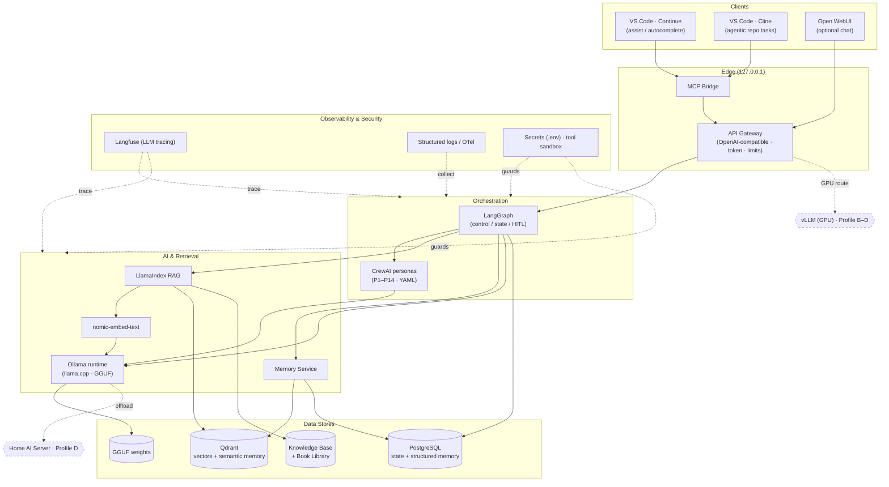

# Phase 06 — Technology Selection

> Comparing open-source technologies for each platform layer and committing to **one complete
> reference architecture** for PAIEP — optimized for the **CPU-only primary machine** ("A+" hybrid)
> and scalable across Profiles A–D.
>
> **Phase status:** Drafted · **Author role:** Principal Software Engineer / MLOps / DevOps ·
> **Date:** 2026-07-19

**Context (read first):**
[`.github/copilot-instructions.md`](../../.github/copilot-instructions.md) ·
[`docs/phases/01-project-vision.md`](01-project-vision.md) ·
[`docs/phases/02-requirements-analysis.md`](02-requirements-analysis.md) ·
[`docs/phases/03-market-research.md`](03-market-research.md) ·
[`docs/phases/04-feasibility-study.md`](04-feasibility-study.md) ·
[`docs/phases/05-enterprise-architecture.md`](05-enterprise-architecture.md) ·
[`docs/setup/environment.md`](../setup/environment.md) ·
[`docs/adr/0003-build-vs-adopt.md`](../adr/0003-build-vs-adopt.md) ·
[`docs/adr/0004-default-model-selection.md`](../adr/0004-default-model-selection.md)

---

## 1. How to Read This Document

- This phase turns the [Phase 03](03-market-research.md) landscape survey into **concrete choices**,
  honoring [ADR 0003](../adr/0003-build-vs-adopt.md) (**integrate building blocks**, don't build engines).
- **One comparison table per layer**; the design-discipline attributes (*Why · Benefits · Drawbacks ·
  Alternatives · Complexity · Cost · Hardware · Scalability*) are captured compactly in table columns,
  then a focused **design-discipline block for the chosen winner** follows each table.
- Selection is scored against the **MoSCoW Musts** ([Phase 02 §5](02-requirements-analysis.md)) with
  fixed weights (below). Ties break toward **permissive license**, **CPU-friendliness**, and **active maintenance**.
- Still design-only (CON-006). Concrete versions/tags are pinned in the implementation milestones (Phase 10+).
- Legend: **✓ verified** in Phase 03 (2026-07-19); **⚠** = re-verify version/license at pinning time.

### Selection criteria & weights

| Criterion | Weight | Rationale |
|-----------|:------:|-----------|
| Offline capability | 5 | NFR-010/011 — hard requirement |
| CPU-friendliness (primary machine) | 5 | CON-001 — the binding constraint |
| Permissive license (MIT/Apache/BSD) | 4 | CON-003, NFR-041 |
| Modularity / swappability | 4 | NFR-023/024 |
| Community health / maintenance | 3 | Longevity, avoid maintenance-mode (Phase 03) |
| Ecosystem / integrations | 3 | Speed of integration |
| Operational simplicity | 3 | Single operator (CON-007) |
| Future scalability (Profiles B–D) | 2 | Growth path |

> Scores below are **directional** (◐ partial, ● strong, ○ weak) — deliberate qualitative judgments
> from Phases 03–05, to be confirmed by the **M1 spike** (Phase 10). No benchmark numbers are invented.

---

## 2. Layer 1 — LLM Runtime / Serving

| Option | License | Offline | CPU | Modular | Community | Hardware | Scalability | Notes |
|--------|---------|:------:|:---:|:------:|:---------:|----------|-------------|-------|
| **Ollama** ✓ | MIT | ● | ● | ● | ● (~176k) | CPU-first, great UX | GPU when present | OpenAI-compatible API; model registry; wraps llama.cpp |
| **llama.cpp** ✓ | MIT | ● | ● | ◐ | ● (~121k) | CPU-first + many backends | Manual tuning | Lower-level engine under Ollama; direct use for tuning |
| **LocalAI** ✓ | MIT | ● | ● | ● | ◐ (~48k) | CPU/NVIDIA/AMD/Intel | Broad | 60+ backends; heavier/broader than Ollama |
| **vLLM** ✓ | Apache-2.0 | ● | ○ | ◐ | ● (~87k) | **GPU-centric** | Excellent (GPU) | Poor fit now (CPU-only); future Profile B–D |

**Winner: Ollama** (with **llama.cpp** as its underlying engine, available for direct tuning).

- **Why:** Best CPU UX, MIT-licensed, OpenAI-compatible API (the model-agnostic seam from
  [Phase 05 §2.2](05-enterprise-architecture.md#2-view-1--logical-architecture)), trivial model
  management, huge ecosystem — exactly the "wrap a proven engine" pattern ([Phase 03 §8](03-market-research.md)).
- **Benefits:** One command to pull/run GGUF models; hot-swap models via config (O2/FR-002); first-class
  in Continue/Cline/Open WebUI; runs the [ADR 0004](../adr/0004-default-model-selection.md) defaults directly.
- **Drawbacks:** Abstraction hides some llama.cpp knobs; single-node; concurrency is modest on CPU.
- **Alternatives:** LocalAI (broader but heavier) kept as a drop-in alternative; **vLLM** adopted later
  for GPU throughput on Profiles B–D.
- **Complexity:** Low. **Cost:** $0. **Hardware:** CPU-first; RAM is the budget (7–8B Q4_K_M).
- **Future scalability:** Swap/append a **vLLM** service behind the same gateway on GPU/home-server
  without changing clients ([ADR 0100](../adr/0100-gpu-and-reuse-strategy.md)).

---

## 3. Layer 2 — Agent Framework

| Option | License | Offline | CPU | Modular | Community | Maintenance | Notes |
|--------|---------|:------:|:---:|:------:|:---------:|-------------|-------|
| **LangGraph** ✓ | MIT | ● | ● | ● | ● (~38k) | Active | Stateful graphs, durable exec, HITL, memory; works without LangChain |
| **CrewAI** ✓ | MIT | ● | ● | ● | ● (~56k) | Active | Declarative roles/goals/tools (YAML); maps to personas |
| **AutoGen** ✓ | MIT | ● | ● | ◐ | ● (~60k) | ⚠ **Maintenance mode** | Successor = MS Agent Framework; adopt-with-caution |
| **Semantic Kernel** ⚠ | MIT | ● | ● | ◐ | ● | Active | .NET-first; heavier for a Python-local stack |

**Winner: LangGraph** (control/state) **+ CrewAI** (ergonomic persona roles) — a layered pair.

- **Why:** [Phase 03 §8](03-market-research.md) established "separate orchestration control from
  ergonomics." LangGraph gives explicit, debuggable, stateful control (supervisor pattern in
  [Phase 05 §9](05-enterprise-architecture.md#9-view-8--agent-collaboration-high-level)); CrewAI gives
  declarative persona definitions (FR-030) that read like config, not code.
- **Benefits:** MIT; model-agnostic (works over Ollama's OpenAI API); bounded, inspectable agent chains
  (protects CPU interactivity, NFR-004); YAML persona configs (FR-030/031/033).
- **Drawbacks:** Two libraries to learn; overlap between them must be scoped (LangGraph owns control;
  CrewAI owns persona ergonomics) to avoid duplication.
- **Alternatives:** **AutoGen rejected as a foundation** (maintenance mode — real risk per Phase 03);
  Semantic Kernel rejected (.NET-first). LlamaIndex agents used only for RAG-centric flows (Layer 3).
- **Complexity:** Moderate. **Cost:** $0. **Hardware:** framework overhead negligible; latency is model-bound.
- **Future scalability:** Same graphs run more agents concurrently on GPU/Profile-D; HITL supports safe autonomy growth.

---

## 4. Layer 3 — RAG Orchestration

| Option | License | Offline | CPU | Modular | Community | Notes |
|--------|---------|:------:|:---:|:------:|:---------:|-------|
| **LlamaIndex** ✓ | MIT | ● | ● | ● | ● (~51k) | Ingestion/index/retrieval; Ollama + local embeds; on-disk persist; many vector stores |
| **LangChain** ⚠ | MIT | ● | ● | ◐ | ● (very large) | Broad but looser/heavier; pairs with LangGraph |
| **Haystack** ⚠ | Apache-2.0 | ● | ● | ● | ● | Production pipeline flavor; enterprise-search leaning |
| **txtai** ⚠ | Apache-2.0 | ● | ● | ● | ◐ | Minimal embeddings-DB + RAG in one lib; very light |

**Winner: LlamaIndex** (with **txtai** noted as a minimal-footprint fallback).

- **Why:** Most complete, MIT-licensed RAG toolkit with first-class Ollama + local embeddings and
  on-disk persistence — proven offline RAG on CPU ([Phase 03 §4/§8](03-market-research.md)); realizes the
  [Phase 05 §7](05-enterprise-architecture.md#7-view-6--knowledge-architecture) knowledge pipeline (FR-020–025).
- **Benefits:** Pluggable vector stores (keeps Layer 5 swappable), rich loaders (PDF/EPUB/code),
  hybrid retrieval, citations for grounding (FR-022).
- **Drawbacks:** Broad surface area; must keep the integration thin to preserve modularity (NFR-023).
- **Alternatives:** **txtai** for an ultra-light build; LangChain retrieval only if already pulling LangGraph;
  Haystack if pipeline-centric needs emerge.
- **Complexity:** Low–moderate. **Cost:** $0. **Hardware:** embeddings run on CPU; ingestion is the CPU spike.
- **Future scalability:** Re-embed/ingest jobs can offload to a GPU/home server; multiple indices coexist.

---

## 5. Layer 4 — Embeddings

| Option | Dim ⚠ | License ⚠ | CPU | Notes |
|--------|:-----:|-----------|:---:|-------|
| **nomic-embed-text** | 768 | Apache-2.0 | ● | Long context, strong general retrieval; first-class in Ollama |
| bge-small / bge-base | 384/768 | MIT | ● | Excellent quality/size; multilingual variants |
| mxbai-embed-large | 1024 | Apache-2.0 | ◐ | Higher quality; use when quality > speed |
| all-MiniLM-L6-v2 | 384 | Apache-2.0 | ● | Tiny, very fast baseline / fallback |

**Winner: nomic-embed-text** (default), with **bge-small** as the light alternative.

- **Why:** Confirms [ADR 0004](../adr/0004-default-model-selection.md) and
  [models/embedding-models.md](../../models/embedding-models.md): fast on CPU, good quality, one-command via Ollama.
- **Benefits:** Runs on the **same runtime** as the LLMs (one less dependency); Apache-2.0; long context.
- **Drawbacks:** Embedding model is **fixed per index** — changing it forces a full re-embed
  ([Phase 05 §7.2](05-enterprise-architecture.md#7-view-6--knowledge-architecture)).
- **Alternatives:** bge-small (smaller/faster), mxbai-embed-large (quality-first, more storage), MiniLM (fallback).
- **Complexity:** Low. **Cost:** $0. **Hardware:** comfortable on CPU.
- **Future scalability:** Higher-dim models (mxbai) become practical on GPU; record model+dim in the index catalog.

---

## 6. Layer 5 — Vector Database

| Option | License | Offline | CPU | Modular | Deploy | Notes |
|--------|---------|:------:|:---:|:------:|--------|-------|
| **Qdrant** ⚠ | Apache-2.0 | ● | ● | ● | Single container | Rust; fast; payload filtering (scope/tags); great fit for metadata-rich RAG + memory |
| **Chroma** ⚠ | Apache-2.0 | ● | ● | ● | Embedded/container | Simplest DX; great to start; scaling story weaker |
| **pgvector** ⚠ | PostgreSQL (permissive) | ● | ● | ● | Postgres extension | Reuses the metadata DB; one engine for vectors + relational |
| **Milvus** ⚠ | Apache-2.0 | ● | ◐ | ◐ | Multi-service | Powerful at scale; heavy for one laptop |
| **Weaviate** ⚠ | BSD-3 | ● | ◐ | ● | Single container | Feature-rich; more resource-hungry |

**Winner: Qdrant** (primary), with **pgvector** as the consolidation alternative.

- **Why:** Apache-2.0, single lightweight container, strong **payload filtering** (needed for
  scope/tag filtering in RAG and semantic **memory** — [Phase 05 §6/§7](05-enterprise-architecture.md)),
  and first-class LlamaIndex support. Efficient on CPU/RAM.
- **Benefits:** Serves **both** RAG vectors and semantic memory; metadata filters enable global/project
  memory scope (FR-012); simple ops.
- **Drawbacks:** A second data engine alongside Postgres (metadata). Mitigated by clear roles (Qdrant =
  vectors, Postgres = relational/state).
- **Alternatives:** **pgvector** if we prefer **one** engine (fewer moving parts, slightly less vector-
  specialized); **Chroma** for the very first spike; Milvus/Weaviate deferred (too heavy now).
- **Complexity:** Low. **Cost:** $0. **Hardware:** modest RAM; index size scales with dim × chunks.
- **Future scalability:** Qdrant scales to a server/cluster on Profile D; pgvector scales with Postgres.

---

## 7. Layer 6 — Memory (short & long term)

| Approach | Storage | Offline | Notes |
|----------|---------|:------:|-------|
| **Postgres (state) + Qdrant (semantic)** | relational + vector | ● | Facts/prefs in SQL; semantic recall via embeddings; user CRUD (FR-013) |
| SQLite (embedded) | file | ● | Zero-service; great for Profile A; less concurrency |
| Redis | in-memory | ● | Fast session cache; not durable by default |
| Mem0 / framework memory ⚠ | library | ● | Higher-level memory abstraction; adds a dependency |

**Winner: Postgres (structured memory + state) + Qdrant (semantic recall)**, with a **Redis** session
cache optional; **SQLite** as the Profile-A lightweight substitute.

- **Why:** Directly implements the [Phase 05](05-enterprise-architecture.md) Memory Service: durable
  facts/preferences and run state in Postgres, semantic recall via Qdrant embeddings, all local (O3,
  FR-010–014). Reuses engines already chosen (no new dependency).
- **Benefits:** Durable + queryable + user-editable (FR-013); scope (global/project) via Postgres columns
  + Qdrant payload filters (FR-012); async memory updates keep latency low
  ([Phase 05 §8](05-enterprise-architecture.md#8-view-7--data-flow-request--response--memory)).
- **Drawbacks:** Two stores to keep consistent; needs a small schema + retention policy.
- **Alternatives:** SQLite-only (simpler, single-user friendly — Profile A default); Mem0 (convenient but
  another dependency — revisit if it saves real work); Redis for fast session state only.
- **Complexity:** Moderate (schema + recall logic). **Cost:** $0. **Hardware:** light.
- **Future scalability:** Same design scales to a server; retention/summarization strategies added in **Phase 08 / M5**.

> Memory **scope** (global vs per-project) and summarization strategy are finalized in **Phase 08 / M5**.

---

## 8. Layer 7 — Workflow Orchestration

| Option | License | Weight | Offline | Notes |
|--------|---------|--------|:------:|-------|
| **None now (LangGraph handles agent flows)** | — | none | ● | Agent orchestration ≠ heavyweight job orchestration; avoid premature infra |
| Prefect ⚠ | Apache-2.0 | medium | ● | Pythonic flows; good if scheduled data jobs appear |
| n8n ⚠ | Sustainable-use ⚠ | low-med | ● | Visual automation; license terms need review |
| Temporal ⚠ | MIT | heavy | ● | Durable workflows at scale; overkill for one laptop |
| Airflow ⚠ | Apache-2.0 | heavy | ● | Batch DAG scheduler; too heavy for interactive AI |

**Winner: none for now** — agent/task flows run in **LangGraph**; revisit **Prefect** when scheduled
batch jobs (bulk ingestion, periodic re-index, benchmark runs) become real.

- **Why:** [Phase 05](05-enterprise-architecture.md) needs *agent* orchestration (LangGraph), not a
  distributed *job* scheduler. Adding Temporal/Airflow now is over-engineering for a single-user CPU
  laptop (guards the "avoid over-engineering" risk in Phase 05 §12).
- **Benefits:** Zero extra infra/RAM; fewer moving parts (CON-007); nothing to maintain.
- **Drawbacks:** Scheduled/durable batch jobs need a solution later.
- **Alternatives:** **Prefect** is the lightweight front-runner when needed (Pythonic, Apache-2.0);
  Temporal/Airflow only if scale demands; **n8n** flagged for license review.
- **Complexity:** Zero now. **Cost:** $0. **Hardware:** none.
- **Future scalability:** Introduce Prefect on Profile D for scheduled ingestion/benchmarks without touching agent flows.

---

## 9. Layer 8 — Monitoring / Metrics

| Option | License | Offline | Weight | Notes |
|--------|---------|:------:|--------|-------|
| **Prometheus + Grafana** | Apache-2.0 / AGPL(Grafana) ⚠ | ● | medium | Standard metrics + dashboards; self-hosted |
| **Langfuse** ⚠ | MIT (core) ⚠ | ● | low-med | **LLM-native** tracing (prompts, tokens, latency, evals) |
| Netdata ⚠ | GPL | ● | low | Turnkey host metrics; less LLM-aware |

**Winner: Langfuse** for **LLM/agent tracing** + optional **Prometheus/Grafana** for system metrics.

- **Why:** The most valuable signals here are **LLM-native** (prompt/response traces, tokens, latency,
  eval scores) — Langfuse targets exactly this and is self-hostable/offline (O8, FR-066; feeds Phase 11
  benchmarks). Prometheus/Grafana cover host/container metrics when needed.
- **Benefits:** Debug agent chains and RAG grounding; latency visibility on the CPU constraint (NFR-001);
  MIT core; integrates with LangGraph/LlamaIndex.
- **Drawbacks:** Two systems if both adopted; keep monitoring **optional/off on Profile A** to save RAM.
- **Alternatives:** Prometheus/Grafana only (no LLM tracing); Netdata for quick host metrics.
- **Complexity:** Low–moderate. **Cost:** $0 self-hosted (verify Grafana AGPL / Langfuse terms ⚠).
- **Future scalability:** Central observability on Profile D; retain traces for evaluation over time.

---

## 10. Layer 9 — Logging

| Option | License | Offline | Notes |
|--------|---------|:------:|-------|
| **OpenTelemetry (SDK/collector)** | Apache-2.0 | ● | Vendor-neutral traces/logs/metrics; future-proof standard |
| **Loki** | AGPL ⚠ | ● | Log aggregation; pairs with Grafana |
| Plain structured JSON logs (stdout) | — | ● | Docker-native; simplest; grep-able |

**Winner: structured JSON logs (stdout) as the baseline → OpenTelemetry** as the instrumentation
standard; **Loki** optional when log volume warrants aggregation.

- **Why:** On one laptop, Docker-captured **structured stdout logs** are the pragmatic default (zero
  infra); **OpenTelemetry** is the neutral standard so we can add Loki/backends later without re-instrumenting.
- **Benefits:** Zero-cost start; **redaction-friendly** (supports the no-secrets-in-logs rule, NFR-022,
  [ADR 0006](../adr/0006-security-model.md)); portable to any backend.
- **Drawbacks:** Raw stdout lacks search/retention until Loki (or similar) is added.
- **Alternatives:** Loki+Grafana for aggregation (AGPL ⚠); OTel collector when tracing matures.
- **Complexity:** Low. **Cost:** $0. **Hardware:** negligible.
- **Future scalability:** Ship OTel → Loki/collector on Profile D for centralized, retained logs.

---

## 11. Layer 10 — Security (secrets, auth, sandboxing)

| Concern | Choice | Notes |
|---------|--------|-------|
| Secrets | **`.env` + Docker secrets**, git-ignored | No secrets in VCS/logs/prompts (NFR-022) |
| Local auth | **Gateway bearer token** (optional on loopback; **required on Profile D**) | [ADR 0006](../adr/0006-security-model.md) |
| Network | **`127.0.0.1` bindings + internal-only backend network** | [ADR 0005](../adr/0005-container-topology.md) |
| Tool sandboxing | **Per-persona allow-list, path-scoped FS, shell default-deny** | NFR-021, FR-034 |
| Content safety | **Treat retrieved content as data** (OWASP LLM01) | Prompt-injection mitigation |
| Secret scanning | **gitleaks / pre-commit** ⚠ | Prevent accidental commits |

**Winner: the [ADR 0006](../adr/0006-security-model.md) model** — local-first data protection +
least-privilege tools — implemented with `.env`/Docker secrets, a gateway token, loopback bindings, and
a sandboxed Tool Runtime.

- **Why:** Matches the actual threat model (exfiltration, over-broad tools, prompt injection) for a
  single-user offline machine, not perimeter security.
- **Benefits:** Contains agent mistakes; preserves offline/privacy (NFR-010/011/020); auditable.
- **Drawbacks:** Some UX friction (confirmations, scoping); policy config per persona (Phase 07).
- **Alternatives:** Full secrets manager (Vault) — over-engineered now; VM/gVisor per tool — deferred.
- **Complexity:** Moderate. **Cost:** $0. **Hardware:** negligible.
- **Future scalability:** Profile-D adds token + subnet restriction + TLS; Vault only if multi-node grows.

---

## 12. Layer 11 — UI

| Option | License | Offline | Notes |
|--------|---------|:------:|-------|
| **Open WebUI** ⚠ | BSD-3 (branding terms ⚠) | ● | Feature-rich chat + light RAG; Ollama/OpenAI backends; pipelines/tools |
| AnythingLLM ⚠ | MIT | ● | Turnkey workspaces + RAG + agents; more opinionated |
| Custom UI | — | ● | Full control; **build cost** conflicts with "integrate, don't build" |

**Winner: Open WebUI** as the optional chat front-end (VS Code remains the primary client).

- **Why:** [Phase 05](05-enterprise-architecture.md) puts VS Code first (O6); a chat UI is a convenience,
  not the core. Open WebUI is the most capable open front-end that speaks the OpenAI/Ollama API and
  slots behind the gateway with no lock-in.
- **Benefits:** Immediate chat + light RAG UX; optional (drop it on Profile A); no bespoke build.
- **Drawbacks:** ⚠ BSD-3 **branding terms** to review; another container if enabled.
- **Alternatives:** AnythingLLM (turnkey but opinionated — kept as reference); custom UI rejected
  (build cost violates [ADR 0003](../adr/0003-build-vs-adopt.md)).
- **Complexity:** Low (single container). **Cost:** $0 (verify branding terms ⚠). **Hardware:** light.
- **Future scalability:** Same UI serves the Profile-D backend; can be disabled without affecting the API.

---

## 13. Layer 12 — VS Code Integration

| Option | License | Offline | Notes |
|--------|---------|:------:|-------|
| **Continue** ⚠ | Apache-2.0 | ● | Mature AI code assistant; local models via Ollama; rules, MCP, config |
| **Cline** ⚠ | Apache-2.0 | ● | Agentic multi-file/whole-repo; tools, MCP, plan/act |
| Roo Code ⚠ | Apache-2.0 | ● | Cline-derived; custom modes; overlaps Cline |
| **MCP** ✓ (protocol) | open spec | ● | Standard tool/resource bridge editor ↔ backend |

**Winner: Continue** (day-to-day assist/autocomplete) **+ Cline** (agentic repo tasks), both bridged via
**MCP** — no bespoke extension.

- **Why:** [Phase 03 §8](03-market-research.md) — reuse an existing client (saves building an extension,
  FR-060). Continue covers inline assist; Cline covers agentic multi-file work (FR-025/032); **MCP** is the
  standard bridge ([Phase 05 §2](05-enterprise-architecture.md), FR-061) exposing backend tools/resources.
- **Benefits:** Both Apache-2.0, offline via Ollama, MCP-capable; complementary strengths; zero build cost.
- **Drawbacks:** Two extensions to configure; overlap with Roo Code (pick Cline).
- **Alternatives:** Roo Code (redundant with Cline); custom extension rejected (build cost); Tabby only if
  a dedicated autocomplete server is later desired.
- **Complexity:** Low (config + MCP wiring). **Cost:** $0. **Hardware:** follows the model runtime.
- **Future scalability:** Same clients point at a Profile-D backend over the network transparently.

---

## 14. Consolidated Reference Architecture

The chosen stack, end to end (see [ADR 0007](../adr/0007-reference-stack.md)). Optional/future edges are dashed.

### 14.1 The stack at a glance

| Layer | Winner | Alternative / fallback | Key reason |
|-------|--------|------------------------|-----------|
| LLM runtime | **Ollama** (+llama.cpp) | LocalAI; vLLM (GPU, future) | CPU-first, MIT, OpenAI API |
| Agent framework | **LangGraph + CrewAI** | — (AutoGen rejected) | Control + persona ergonomics |
| RAG | **LlamaIndex** | txtai; LangChain | Complete, MIT, local-first |
| Embeddings | **nomic-embed-text** | bge-small; mxbai | CPU-fast, Ollama-native |
| Vector DB | **Qdrant** | pgvector; Chroma | Payload filters, light, Apache-2.0 |
| Memory | **Postgres + Qdrant** | SQLite (Profile A) | Durable + semantic + editable |
| Workflow | **None now** | Prefect (when needed) | Avoid over-engineering |
| Monitoring | **Langfuse** (+Prom/Grafana) | Prom/Grafana only | LLM-native tracing |
| Logging | **JSON stdout → OTel** | Loki | Zero-cost start, portable |
| Security | **ADR 0006 model** | Vault (future) | Local-first + least privilege |
| UI | **Open WebUI** (optional) | AnythingLLM | Reuse, no build cost |
| VS Code | **Continue + Cline + MCP** | Roo Code | Reuse clients, FR-060/061 |

### 14.2 Licenses of record (⚠ re-verify at pinning)

| Component | License (⚠) | Watch item |
|-----------|-------------|-----------|
| Ollama, llama.cpp, LocalAI | MIT | — |
| LangGraph, CrewAI, LlamaIndex | MIT | — |
| Qdrant, vLLM, Prometheus, OTel, Haystack, txtai, Prefect | Apache-2.0 | — |
| pgvector / PostgreSQL | PostgreSQL license | permissive |
| Open WebUI | BSD-3 | **branding terms** ⚠ |
| Grafana, Loki | AGPL-3.0 | AGPL obligations ⚠ |
| Langfuse | MIT (core) | verify non-core terms ⚠ |
| Continue, Cline, Roo Code | Apache-2.0 | — |
| n8n | Sustainable-use license | **usage terms** ⚠ |

### 14.3 Per-profile stack deltas (A–D)

| Profile | Deltas from the reference stack |
|---------|--------------------------------|
| **A** (16 GB CPU) | SQLite instead of Postgres+Qdrant is acceptable; drop Open WebUI, Langfuse; smaller models. |
| **A+** (primary) | Full reference stack, CPU inference, loopback bindings. |
| **B** (GPU 12–16 GB) | Add **vLLM** (or GPU-enabled Ollama) behind the gateway; 14B models; enable Langfuse. |
| **C** (≥24 GB VRAM) | vLLM primary; 32B-class models; multiple resident personas. |
| **D** (home server) | Split via Compose override: inference (+Qdrant) on server; add Prefect for scheduled jobs; central logs/metrics; **required** gateway token + subnet + TLS. |

---

## 15. Assumptions

- Star counts/versions reflect **2026-07-19**; **families** are stable bets even as versions turn over.
- "Offline ✅" for frameworks assumes pairing with local models + local embeddings (per Phase 03).
- Scores (●/◐/○) are deliberate qualitative judgments to be **confirmed by the M1 spike** (Phase 10).
- Two data engines (Qdrant + Postgres) are acceptable on the 32 GB machine; Profile A may consolidate to SQLite.
- Concrete versions/tags/SPDX IDs are pinned in the implementation milestones (Phase 10+).

---

## 16. Risks

| Risk | Impact | Mitigation |
|------|--------|------------|
| ⚠ License surprises (Open WebUI branding, Grafana/Loki AGPL, n8n terms). | Adoption blocked/rework. | Re-verify SPDX at pinning; prefer MIT/Apache; alternatives listed per layer. |
| Two agent libs (LangGraph+CrewAI) overlap. | Confusion, duplication. | Strict role split: LangGraph=control, CrewAI=persona ergonomics. |
| Two data stores to keep consistent. | Sync bugs. | Clear ownership (Qdrant=vectors, PG=relational); or consolidate to pgvector. |
| CPU latency limits multi-agent chains. | Poor UX. | Bounded chains, concurrency limits (NFR-004); GPU/Profile-D path (ADR 0100). |
| Fast OSS churn dates choices. | Stale stack. | Adapters + OpenAI-API seam (NFR-024); re-verify at M1/Phase 10. |
| Over-adopting monitoring on a laptop. | RAM pressure. | Keep Langfuse/Grafana optional; off on Profile A. |

---

## 17. Future Improvements

- Run the **M1 integration spike** (Ollama + LlamaIndex + Qdrant + Continue) to validate the stack (Phase 10).
- Add **vLLM** behind the gateway for GPU throughput (Profiles B–D, [ADR 0100](../adr/0100-gpu-and-reuse-strategy.md)).
- Introduce **Prefect** for scheduled ingestion/re-index/benchmarks when batch jobs appear.
- Finalize **memory scope + retention/summarization** (Phase 08 / M5).
- Record an SPDX **licenses-of-record** file at first pin; add **gitleaks** pre-commit.
- Evaluate **speculative decoding** (draft + target) to improve CPU throughput (Phase 04 §9).

---

## 18. References

- Internal: [Phase 01](01-project-vision.md) · [Phase 02](02-requirements-analysis.md) ·
  [Phase 03](03-market-research.md) · [Phase 04](04-feasibility-study.md) ·
  [Phase 05](05-enterprise-architecture.md) · [environment.md](../setup/environment.md) ·
  [models/embedding-models.md](../../models/embedding-models.md)
- ADRs: [0003](../adr/0003-build-vs-adopt.md) · [0004](../adr/0004-default-model-selection.md) ·
  [0005](../adr/0005-container-topology.md) · [0006](../adr/0006-security-model.md) ·
  [0007 (this phase)](../adr/0007-reference-stack.md) · [0100](../adr/0100-gpu-and-reuse-strategy.md)
- Diagrams index: [`architecture/README.md`](../../architecture/README.md)
- Project repos (verify at pinning): Ollama · llama.cpp · LocalAI · vLLM · LangGraph · CrewAI ·
  LlamaIndex · txtai · Qdrant · pgvector · Chroma · PostgreSQL · Prometheus · Grafana · Langfuse ·
  OpenTelemetry · Loki · Open WebUI · AnythingLLM · Continue · Cline · Roo Code · MCP
  (URLs listed in [Phase 03 §13](03-market-research.md)).
- Security: OWASP Top 10 & OWASP Top 10 for LLM Applications (LLM01 Prompt Injection) — verify current editions.

---

> **Phase 06 complete** — see the chat summary, then **STOP** for approval before Phase 07.
