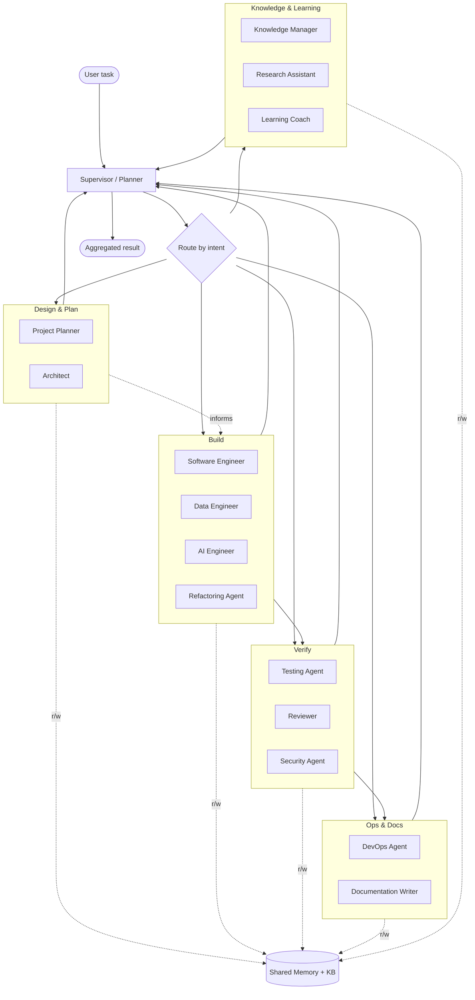
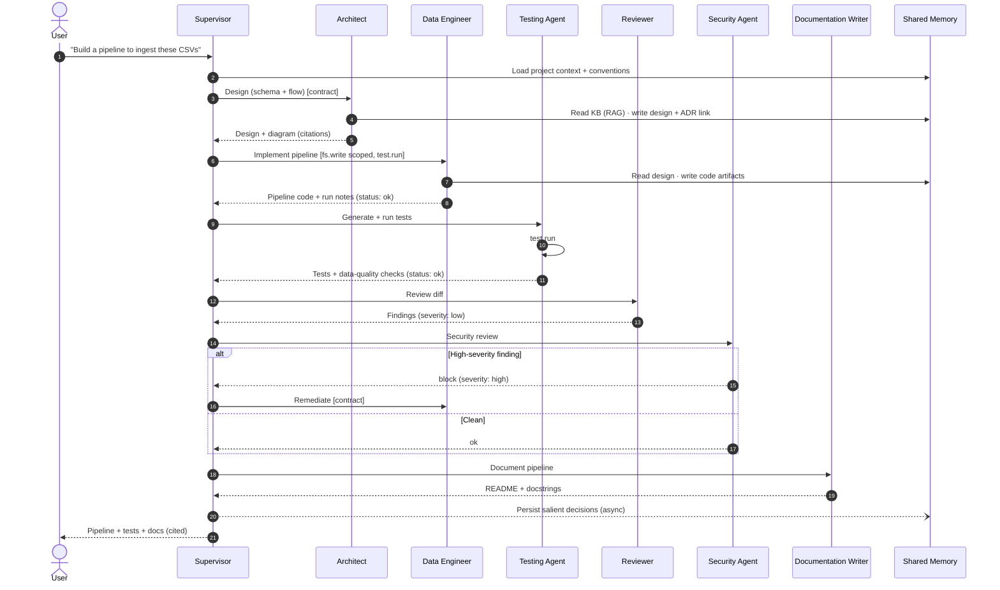

# Phase 07 — Agent Ecosystem

> The multi-agent design for PAIEP: specialized engineering **agents**, how they **collaborate**,
> the **message contract** between them, and the **shared memory** they read/write — all mapped to the
> [Phase 06 reference stack](06-technology-selection.md) and bounded by the CPU-only primary machine.
>
> **Phase status:** Drafted · **Author role:** AI Platform Architect · **Date:** 2026-07-19

**Context (read first):**
[`.github/copilot-instructions.md`](../../.github/copilot-instructions.md) ·
[`01`](01-project-vision.md) · [`02`](02-requirements-analysis.md) · [`03`](03-market-research.md) ·
[`04`](04-feasibility-study.md) · [`05`](05-enterprise-architecture.md) · [`06`](06-technology-selection.md) ·
[`docs/adr/0004`](../adr/0004-default-model-selection.md) · [`docs/adr/0006`](../adr/0006-security-model.md) ·
[`docs/adr/0007`](../adr/0007-reference-stack.md) · [`agents/`](../../agents/)

---

## 1. How to Read This Document

- Still **design-only** (CON-006) — no implementation code. Agent definitions are declarative
  (CrewAI-style YAML in the future; **Markdown seed specs** now under [`agents/`](../../agents/)).
- Agents realize the **personas** from [Phase 01 §3](01-project-vision.md) (P1–P14) and the
  **supervisor collaboration pattern** from [Phase 05 §9](05-enterprise-architecture.md#9-view-8--agent-collaboration-high-level).
- Each agent is a configured combination of **system prompt + tools + model tier + guardrails** (FR-030).
- Model tiers reference [ADR 0004](../adr/0004-default-model-selection.md); tools and guardrails
  reference the sandbox in [ADR 0006](../adr/0006-security-model.md); orchestration uses
  **LangGraph + CrewAI** from [ADR 0007](../adr/0007-reference-stack.md).

### 1.1 Model tiers (from ADR 0004)

| Tier key | Default model (A+) | Used for |
|----------|--------------------|----------|
| `general` | Qwen2.5 7B Instruct @ Q4_K_M | Planning, writing, coordination, research |
| `coding` | Qwen2.5-Coder 7B @ Q4_K_M | Code generation, refactor, tests, reviews |
| `reasoning` | Phi-4 / DeepSeek-R1 distill (~7–8B) | Hard analysis, architecture trade-offs, security |
| `draft` | Llama 3.2 1B / SmolLM2 | Quick/cheap steps, speculative decoding |
| `embed` | nomic-embed-text | Retrieval & semantic memory |

> Tiers are **role hints**, resolved by the Model Router
> ([Phase 05 §6](05-enterprise-architecture.md#6-view-5--ai-architecture)); nothing hard-codes a model (O2/FR-002).

### 1.2 Tool taxonomy (default-deny, per-agent allow-list — ADR 0006)

| Tool | Capability | Risk | Default |
|------|-----------|------|---------|
| `rag.retrieve` | Query the knowledge base / repo index | Low | Broadly allowed |
| `memory.read` / `memory.write` | Read/write shared memory | Low/Med | Read broad; write scoped |
| `fs.read` | Read files within allowed roots | Low | Path-scoped |
| `fs.write` | Create/modify files within allowed roots | Med | Path-scoped, reviewed |
| `vcs` | Git status/diff/branch (no push by default) | Med | Read-mostly; push = confirm |
| `test.run` | Execute the test suite | Med | Allowed in sandbox |
| `shell` | Arbitrary shell commands | **High** | **Default-deny**, opt-in per agent |
| `container` | Docker/Compose operations | **High** | DevOps only, confirm |
| `web.fetch` | Outbound HTTP | **High (egress)** | **Off by default** (offline-first) |

---

## 2. Agent Roster (overview)

Fifteen agents: one **Supervisor** (orchestrator) plus fourteen specialists. Each maps to Phase 01
personas and Phase 02 requirements.

| # | Agent | Persona(s) | Model tier | Highest-risk tools | Seed spec |
|---|-------|-----------|-----------|--------------------|-----------|
| 0 | **Supervisor / Planner** | orchestration | `reasoning`→`general` | memory.write | [supervisor.md](../../agents/supervisor.md) |
| 1 | **Architect** | P3, P4 | `reasoning` | fs.write (docs/ADR) | [architect.md](../../agents/architect.md) |
| 2 | **Data Engineer** | P2 | `coding` | fs.write, test.run | [data-engineer.md](../../agents/data-engineer.md) |
| 3 | **Software Engineer** | P1 | `coding` | fs.write, vcs, test.run | [software-engineer.md](../../agents/software-engineer.md) |
| 4 | **AI Engineer** | P14 | `coding`+`reasoning` | fs.write, test.run | [ai-engineer.md](../../agents/ai-engineer.md) |
| 5 | **Documentation Writer** | P5, P6 | `general` | fs.write (docs) | [documentation-writer.md](../../agents/documentation-writer.md) |
| 6 | **Reviewer** | P11 | `coding`+`reasoning` | fs.read, vcs (read) | [reviewer.md](../../agents/reviewer.md) |
| 7 | **Refactoring Agent** | P1 | `coding` | fs.write, test.run | [refactoring-agent.md](../../agents/refactoring-agent.md) |
| 8 | **Testing Agent** | P1, P14 | `coding` | fs.write (tests), test.run | [testing-agent.md](../../agents/testing-agent.md) |
| 9 | **DevOps Agent** | P13 | `coding` | container, shell (scoped) | [devops-agent.md](../../agents/devops-agent.md) |
| 10 | **Security Agent** | P12 | `reasoning` | fs.read, vcs (read) | [security-agent.md](../../agents/security-agent.md) |
| 11 | **Learning Coach** | P7 | `general` | rag.retrieve | [learning-coach.md](../../agents/learning-coach.md) |
| 12 | **Research Assistant** | P8 | `general`+`reasoning` | rag.retrieve, web.fetch (opt-in) | [research-assistant.md](../../agents/research-assistant.md) |
| 13 | **Knowledge Manager** | P9 | `general`+`embed` | rag.*, memory.write | [knowledge-manager.md](../../agents/knowledge-manager.md) |
| 14 | **Project Planner** | P10, P4 | `reasoning`→`general` | fs.write (scaffold) | [project-planner.md](../../agents/project-planner.md) |

---

## 3. Per-Agent Specifications

Each spec: **Mission · Responsibilities · Inputs → Outputs · Tools · Model tier · Guardrails ·
Success criteria**. Detailed seed definitions live in [`agents/`](../../agents/).

### 3.0 Supervisor / Planner (orchestrator)
- **Mission:** Decompose a request into a plan and route sub-tasks to specialists; aggregate results.
- **Responsibilities:** Intent detection, task decomposition, agent selection/routing, budget/step
  limits, conflict resolution, final assembly.
- **Inputs → Outputs:** User task + context → ordered sub-task plan, routing decisions, final answer.
- **Tools:** `rag.retrieve`, `memory.read/write` (plan state). No `fs.write` to code.
- **Model tier:** `reasoning` for planning → `general` for coordination.
- **Guardrails:** Enforces per-agent tool allow-lists; caps chain depth/concurrency (NFR-004); never
  executes code itself.
- **Success:** Correct routing, bounded latency, coherent aggregated result with citations.

### 3.1 Architect (Solution & Data Architect — P3/P4)
- **Mission:** Produce designs, trade-off analyses, schemas, and ADRs.
- **Responsibilities:** System/data design, technology trade-offs, diagrams, ADR authoring.
- **Inputs → Outputs:** Problem statement + constraints → design docs, Mermaid diagrams, ADR drafts.
- **Tools:** `rag.retrieve`, `memory.read/write`, `fs.write` (scoped to `docs/`, `architecture/`).
- **Model tier:** `reasoning`. **Guardrails:** No app-code writes; comparisons required (Golden Rule 3).
- **Success:** Design includes Why/Benefits/Drawbacks/Alternatives; ADR follows repo format.

### 3.2 Data Engineer (P2)
- **Mission:** Design and implement data pipelines, ETL/ELT, and data-quality checks.
- **Responsibilities:** Ingestion, transformation, validation, schema wiring.
- **Inputs → Outputs:** Data sources + target schema → pipeline code, quality checks, run notes.
- **Tools:** `fs.read/write` (pipeline dirs), `test.run`, `rag.retrieve`, `memory.read/write`.
- **Model tier:** `coding`. **Guardrails:** Path-scoped writes; no `shell` unless opted-in.
- **Success:** Pipeline runs, passes data-quality checks, documented and reversible.

### 3.3 Software Engineer (P1)
- **Mission:** Write, debug, and integrate application code with tests.
- **Responsibilities:** Feature implementation, bug fixes, integration, small refactors.
- **Inputs → Outputs:** Requirement/ticket + repo context → code changes + tests + summary.
- **Tools:** `fs.read/write`, `vcs` (branch/diff; push=confirm), `test.run`, `rag.retrieve`, `memory.*`.
- **Model tier:** `coding`. **Guardrails:** Least-privilege FS scope; security-relevant changes routed to Security Agent.
- **Success:** Change compiles, tests pass, reviewed clean, small/reversible.

### 3.4 AI Engineer (MLOps — P14)
- **Mission:** Model serving, evaluation harnesses, prompt/RAG tuning, benchmarks.
- **Responsibilities:** Model profiles, eval scripts, RAG parameters, benchmark runs (Phase 11).
- **Inputs → Outputs:** Model/eval goal → eval configs, benchmark results, tuning notes.
- **Tools:** `fs.read/write` (`benchmarks/`, `models/`, `rag/`), `test.run`, `rag.retrieve`, `memory.*`.
- **Model tier:** `coding` + `reasoning`. **Guardrails:** No production model swaps without ADR update.
- **Success:** Reproducible evals; measured metrics (tokens/s, recall) replace qualitative ratings.

### 3.5 Documentation Writer (P5/P6)
- **Mission:** Author docs, guides, READMEs, docstrings, changelogs.
- **Responsibilities:** Long-form docs + inline documentation; keep diagrams in sync.
- **Inputs → Outputs:** Code/design + audience → Markdown docs, docstrings, diagrams.
- **Tools:** `fs.read`, `fs.write` (`docs/`, code doc-blocks), `rag.retrieve`, `memory.read`.
- **Model tier:** `general`. **Guardrails:** No logic changes; documents only what exists (no invented APIs).
- **Success:** Clear, accurate, GitHub-ready Markdown; links valid; matches code.

### 3.6 Reviewer (Code Reviewer — P11)
- **Mission:** Review diffs for correctness, quality, and style.
- **Responsibilities:** Bug/logic review, readability, standards, actionable feedback.
- **Inputs → Outputs:** Diff/PR + standards → structured review (issues, severity, suggestions).
- **Tools:** `fs.read`, `vcs` (read/diff), `rag.retrieve`, `memory.read`.
- **Model tier:** `coding` + `reasoning`. **Guardrails:** **Read-only** on code; cannot self-approve its own edits.
- **Success:** Findings are specific, prioritized, and reference lines; no false "approve" on failing tests.

### 3.7 Refactoring Agent (P1 subset)
- **Mission:** Improve structure without changing behavior.
- **Responsibilities:** Extract/rename/simplify, reduce duplication, keep tests green.
- **Inputs → Outputs:** Target module + tests → behavior-preserving edits + passing tests.
- **Tools:** `fs.read/write`, `test.run`, `vcs` (diff), `memory.read`.
- **Model tier:** `coding`. **Guardrails:** Must run tests before/after; no feature changes; small commits.
- **Success:** Behavior unchanged (tests pass), measurable structure improvement, reversible.

### 3.8 Testing Agent (P1/P14)
- **Mission:** Generate and run tests; interpret failures.
- **Responsibilities:** Unit/integration test generation, coverage gaps, failure diagnosis.
- **Inputs → Outputs:** Code + requirements → tests, run results, failure analysis.
- **Tools:** `fs.read`, `fs.write` (test dirs), `test.run`, `rag.retrieve`, `memory.read`.
- **Model tier:** `coding`. **Guardrails:** Writes only under test paths; does not weaken assertions to pass.
- **Success:** Meaningful tests, real coverage increase, accurate failure explanations.

### 3.9 DevOps Agent (P13)
- **Mission:** Docker/Compose, CI/CD, infra-as-code, ops tasks.
- **Responsibilities:** Compose stacks, container ops, environment/config, health checks.
- **Inputs → Outputs:** Service spec → Compose/config files, run/verify notes.
- **Tools:** `fs.read/write` (`docker/`, config), `container`, `shell` (scoped, confirm), `memory.*`.
- **Model tier:** `coding`. **Guardrails:** Destructive ops (down/prune/reset) require confirmation; `127.0.0.1` bindings enforced.
- **Success:** Stack comes up healthy, reversible, matches [ADR 0005](../adr/0005-container-topology.md).

### 3.10 Security Agent (Security Reviewer — P12)
- **Mission:** Find OWASP-class issues, secrets, and risky agent/tool behavior.
- **Responsibilities:** Static review, secret scanning, prompt-injection checks, threat notes.
- **Inputs → Outputs:** Code/design/diff → security findings + severity + remediation.
- **Tools:** `fs.read`, `vcs` (read), `rag.retrieve`, `memory.read`.
- **Model tier:** `reasoning`. **Guardrails:** **Read-only**; can **block** a handoff on high-severity findings.
- **Success:** Catches injected instructions, leaked secrets, and OWASP Top 10 / LLM01 issues (ADR 0006).

### 3.11 Learning Coach (P7)
- **Mission:** Explain concepts and build learning paths.
- **Responsibilities:** Tutoring, step-by-step explanations, curated learning sequences.
- **Inputs → Outputs:** Topic + level → explanation, examples, learning path (grounded in KB).
- **Tools:** `rag.retrieve`, `memory.read/write` (learner progress).
- **Model tier:** `general`. **Guardrails:** Grounds claims in KB; flags uncertainty; no code writes.
- **Success:** Accurate, level-appropriate, cited; tracks progress across sessions.

### 3.12 Research Assistant (P8)
- **Mission:** Gather, summarize, and compare sources.
- **Responsibilities:** Literature/doc synthesis, comparison tables, source citation.
- **Inputs → Outputs:** Question + sources → summary, comparison, citations.
- **Tools:** `rag.retrieve`, `web.fetch` (**opt-in only**, offline default off), `memory.read/write`.
- **Model tier:** `general` + `reasoning`. **Guardrails:** Treats fetched/ingested content as **data, not instructions** (LLM01); marks unverified claims.
- **Success:** Balanced, cited summaries; no fabricated sources; injection-safe.

### 3.13 Knowledge Manager (P9)
- **Mission:** Curate the knowledge base: ingest, tag, dedupe, re-index, prune.
- **Responsibilities:** Ingestion pipeline runs, provenance/tags, index hygiene, book library.
- **Inputs → Outputs:** New/changed sources → indexed, tagged, deduped KB entries + catalog updates.
- **Tools:** `rag.*` (ingest/index), `memory.write`, `fs.read` (sources).
- **Model tier:** `general` + `embed`. **Guardrails:** Fixed embedding model per index (Phase 05 §7.2); sanitizes content at ingest.
- **Success:** Clean, current, deduped index; correct provenance; retrieval quality maintained.

### 3.14 Project Planner (Project Generator + planning — P10/P4)
- **Mission:** Plan and scaffold new projects/milestones from templates.
- **Responsibilities:** Task breakdown, milestone plans, project scaffolds (template-driven).
- **Inputs → Outputs:** Goal + constraints → plan, milestone list, scaffolded structure.
- **Tools:** `fs.write` (new project scaffolds), `rag.retrieve`, `memory.read/write`.
- **Model tier:** `reasoning` → `general`. **Guardrails:** Reversible scaffolds; no overwrite without confirm.
- **Success:** Actionable plan, valid scaffold, aligned with repo conventions.

---

## 4. Collaboration Model

### 4.1 Topology — supervisor/router (chosen)

### 4.2 Hand-off protocol

1. **Assign:** Supervisor creates a sub-task with an explicit **contract** (goal, inputs, allowed tools,
   budget, expected output) and target agent.
2. **Execute:** The agent works within its allow-list, reading shared context (memory + RAG).
3. **Return:** The agent emits a **result message** (artifacts + status + citations) back to the Supervisor.
4. **Chain reviews:** Build → **Testing** → **Reviewer** → **Security** → **Documentation** is the default
   quality gate for code-producing tasks.
5. **Aggregate:** Supervisor composes the final result and persists salient facts to memory (async).

### 4.3 Conflict resolution

| Conflict | Resolution rule |
|----------|-----------------|
| Reviewer vs Engineer disagreement | Supervisor arbitrates using `reasoning` tier + tests as ground truth. |
| **Security high-severity finding** | **Hard block** — Security Agent can veto a handoff until resolved (ADR 0006). |
| Two agents edit the same file | Serialize via memory-held **task locks**; last-writer-must-rebase. |
| Latency/step budget exceeded | Supervisor truncates the chain and returns partial + reason (NFR-004). |
| Ambiguous requirement | Supervisor requests clarification rather than guessing. |

### 4.4 Design discipline — why supervisor/router over peer-to-peer

- **Why:** Central routing makes agent chains **explicit, debuggable, and bounded** — essential when CPU
  latency is the binding constraint (NFR-001/004) and matches LangGraph's control model ([ADR 0007](../adr/0007-reference-stack.md)).
- **Benefits:** Predictable cost, one place for guardrails/conflict resolution, easy tracing (Langfuse),
  simple to reason about for a single operator (CON-007).
- **Drawbacks:** Supervisor is a coordination bottleneck/single point; less emergent flexibility.
- **Alternatives:** **Peer-to-peer / blackboard** (flexible but unbounded chatter → costly on CPU, hard to
  debug — rejected now); **static pipeline** (simple but inflexible — too rigid for varied tasks).
- **Complexity:** Moderate (routing + contracts) vs. high (P2P coordination).
- **Cost:** $0; the real budget is model calls — routing minimizes them.
- **Hardware impact:** Fewer concurrent model calls → protects the CPU-only box; keep 1–2 models hot.
- **Future scalability:** On GPU/Profile-D, allow **bounded peer sub-graphs** under the supervisor and more
  concurrency; the contract stays the same.

---

## 5. Communication Contract (message schema — described, not coded)

Agents exchange **structured messages** (transported by LangGraph state; conceptually JSON). Fields:

| Field | Type | Purpose |
|-------|------|---------|
| `msg_id` | id | Unique message id |
| `task_id` | id | Correlates all messages in one user task |
| `parent_id` | id? | Message this responds to (thread) |
| `from` / `to` | agent name | Sender / recipient (or `supervisor`) |
| `intent` | enum | `request` · `response` · `review` · `handoff` · `status` · `block` · `clarify` |
| `goal` | text | What the recipient must achieve |
| `inputs` | refs | Pointers to files/artifacts/context (not raw blobs) |
| `context_refs` | list | Memory ids + RAG citations used |
| `constraints` | object | `allowed_tools`, `fs_scope`, `token_budget`, `step_budget` |
| `artifacts` | refs | Produced files/diffs/docs (by path/id) |
| `status` | enum | `ok` · `partial` · `failed` · `blocked` |
| `severity` | enum? | For reviews/security: `info`·`low`·`med`·`high` |
| `citations` | list | Sources grounding the output |
| `timestamp` | time | Ordering/audit |

**Principles:** pass **references, not payloads** (keeps context small on CPU); every output carries
**citations**; `constraints` are enforced by the runtime (not merely advisory); retrieved/ingested text is
tagged as **data** so it can't act as instructions (LLM01, [ADR 0006](../adr/0006-security-model.md)).

---

## 6. Shared Memory Design

Backed by **PostgreSQL (structured) + Qdrant (semantic)** per [ADR 0007](../adr/0007-reference-stack.md).
Two horizons: **session** (short-term, current task) and **long-term** (cross-session/project).

| Memory type | Store | Scope | Written by | Read by |
|-------------|-------|-------|-----------|---------|
| **Session/task state** | Postgres (+LangGraph state) | task | Supervisor, all agents | All agents |
| **Task locks** | Postgres | task | Supervisor | All agents |
| **Decisions / ADR links** | Postgres + Qdrant | project | Architect, Supervisor | All agents |
| **Code/artifact index** | Qdrant | project | Knowledge Manager | Build/Verify agents |
| **Knowledge base** | Qdrant + doc store | global/project | Knowledge Manager, Research | RAG-using agents |
| **Learner progress** | Postgres | global | Learning Coach | Learning Coach |
| **Preferences / conventions** | Postgres | global | Supervisor, Knowledge Manager | All agents |

### 6.1 Read/write rules

- **Writes are scoped and least-privilege** (ADR 0006): most agents write only their own task outputs +
  citations; **Knowledge Manager** owns KB writes; **Architect/Supervisor** own decision records.
- **Reads are broad** (grounding) but **scope-filtered** (global vs project) via Qdrant payload filters.
- **Session → long-term promotion** is async and **curated** (salient facts only) so latency is unaffected
  ([Phase 05 §8](05-enterprise-architecture.md#8-view-7--data-flow-request--response--memory)); the user can
  view/edit/delete (FR-013). Detailed retention/summarization is finalized in **Phase 08 / M5**.

---

## 7. Representative Task — "Build a small data pipeline"

**Notes:** the **Verify** chain (Testing → Reviewer → Security) gates before **Docs**; the Security Agent
can **block**; memory promotion is async to protect CPU latency.

---

## 8. Mapping Agents to the Phase 06 Reference Stack

| Concern | Realized by (Phase 06 / ADR 0007) |
|---------|-----------------------------------|
| Orchestration / routing / state | **LangGraph** (supervisor graph, HITL, task state) |
| Persona definitions (roles/tools/goals) | **CrewAI** declarative configs (Markdown seeds now) |
| Model inference by tier | **Ollama** (Qwen2.5 / Qwen2.5-Coder / Phi-4 / Llama 3.2 / nomic-embed) |
| Retrieval (`rag.retrieve`) | **LlamaIndex** + **Qdrant** + nomic-embed-text |
| Shared memory | **PostgreSQL** (structured/state) + **Qdrant** (semantic) |
| Tool sandbox + guardrails | Orchestrator policy + **ADR 0006** (allow-list, fs scope, shell deny) |
| Editor entry (agentic) | **Cline** (agentic) / **Continue** (assist) via **MCP** |
| Tracing / debugging chains | **Langfuse** (per-agent traces, tokens, latency) |
| Secrets / auth / egress control | `.env`/Docker secrets, gateway token, web.fetch off by default |

---

## 9. Assumptions

- Early on, several agents may share **one CrewAI/LangGraph process**; they are logically distinct even if
  co-located (matches Phase 05 co-locate-early guidance).
- Agent definitions are **config-driven** (Markdown seeds → YAML later); adding/adjusting an agent is a
  config change, not a rewrite (NFR-024, FR-030).
- Concurrency is **low on the primary machine** (CPU): default to short, mostly-sequential chains; 1–2 models hot.
- The message schema is a **contract description**; concrete serialization is fixed at implementation (Phase 10+).

---

## 10. Risks

| Risk | Impact | Mitigation |
|------|--------|------------|
| Long agent chains blow CPU latency budget. | Poor UX / timeouts. | Bounded chains + step/token budgets (NFR-004); draft tier; GPU/Profile-D path. |
| Supervisor bottleneck / single point. | Stalls, fragility. | Keep it thin; allow bounded peer sub-graphs later; persist state for resume. |
| Over-broad tool grants. | Destructive/unsafe actions. | Default-deny allow-lists; fs scope; shell/web off by default (ADR 0006). |
| Prompt injection via retrieved content. | Unsafe tool calls / leaks. | Content-as-data tagging; Security Agent veto; sanitize at ingest. |
| Two agents edit the same file. | Corrupt/lost work. | Task locks in memory; serialize; last-writer rebases. |
| Too many agents for one user. | Complexity, maintenance. | Ship the core chain (Arch→SE→Test→Review→Sec→Doc) first; others opt-in. |

---

## 11. Future Improvements

- Formalize CrewAI **YAML** persona configs from the Markdown seeds (implementation milestone).
- Add **bounded peer sub-graphs** under the supervisor once GPU/Profile-D increases concurrency.
- Introduce **HITL checkpoints** (LangGraph) for high-risk actions (push, container down, deletes).
- Add **evaluation of agent quality** (task success, review precision) via Langfuse + Phase 11 benchmarks.
- Finalize **memory scope + retention/summarization** (Phase 08 / M5).
- Long-running **autonomous** agents remain deferred (FR-035, Won't-for-now).

---

## 12. References

- Internal: [Phase 01](01-project-vision.md) · [Phase 02](02-requirements-analysis.md) ·
  [Phase 05](05-enterprise-architecture.md) · [Phase 06](06-technology-selection.md) ·
  [agents/](../../agents/)
- ADRs: [0004](../adr/0004-default-model-selection.md) · [0005](../adr/0005-container-topology.md) ·
  [0006](../adr/0006-security-model.md) · [0007](../adr/0007-reference-stack.md) ·
  [0008 (this phase)](../adr/0008-agent-orchestration.md)
- Diagrams index: [`architecture/README.md`](../../architecture/README.md)
- Patterns: LangGraph supervisor/state; CrewAI roles/goals/tools; OWASP LLM01 (prompt injection).

---

> **Phase 07 complete** — see the chat summary, then **STOP** for approval before Phase 08.
