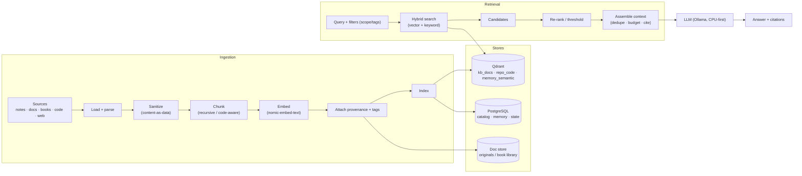
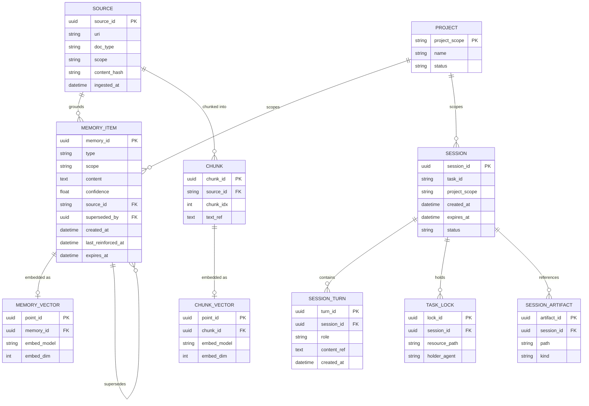

# Phase 08 — Knowledge & Memory Architecture

> How PAIEP **stores, retrieves, and remembers**: the RAG pipeline, vector database schema, long-term
> and session memory, knowledge base, notes, book library, repo indexing, and the Markdown store — all
> on the [Phase 06 reference stack](06-technology-selection.md) and sized for the CPU-only machine.
>
> **Phase status:** Drafted · **Author role:** Knowledge Management Expert / Data Architect ·
> **Date:** 2026-07-19

**Context (read first):**
[`.github/copilot-instructions.md`](../../.github/copilot-instructions.md) ·
[`01`](01-project-vision.md) · [`02`](02-requirements-analysis.md) · [`04`](04-feasibility-study.md) ·
[`05`](05-enterprise-architecture.md) · [`06`](06-technology-selection.md) · [`07`](07-agent-ecosystem.md) ·
[`docs/adr/0004`](../adr/0004-default-model-selection.md) · [`docs/adr/0006`](../adr/0006-security-model.md) ·
[`docs/adr/0007`](../adr/0007-reference-stack.md) ·
[`rag/`](../../rag/) · [`memory/`](../../memory/) · [`knowledge/`](../../knowledge/)

---

## 1. How to Read This Document

- **Design-only** (CON-006). Concrete schemas/params are illustrative; pinned in Phase 10+.
- Builds directly on the [Phase 05 §7 Knowledge Architecture](05-enterprise-architecture.md#7-view-6--knowledge-architecture)
  and the stack from [ADR 0007](../adr/0007-reference-stack.md): **LlamaIndex** (RAG) · **Qdrant**
  (vectors + semantic memory) · **PostgreSQL** (structured memory/state) · **nomic-embed-text** (embeddings).
- Nine subsystems (§3–§11), two diagrams (§12), option comparisons with design discipline (§13),
  per-profile sizing (§14).
- Requirement keys (FR/NFR), personas (P9 Knowledge Manager, P8 Research), and Phase 04 embedding
  guidance are traced throughout.

### 1.1 Design goals for this layer

| Goal | Source | Expression here |
|------|--------|-----------------|
| Grounded answers with citations | FR-022, P8 | Retrieval returns source chunks; answers cite them |
| Persistent recall across sessions/projects | FR-010–014, O3 | Session + long-term memory with scope |
| Offline, local, private | NFR-010/020 | All stores local; ingested content sanitized (LLM01) |
| Model-agnostic, swappable | NFR-023/024 | Embeddings/vector-store behind LlamaIndex interfaces |
| CPU-friendly | CON-001 | Small embeddings, bounded top-k, lazy re-rank |

---

## 2. Storage Map (what lives where)

| Data | Store | Engine | Why |
|------|-------|--------|-----|
| Source documents / book library | Document store (files) | Filesystem volume (`paiep_kb`) | Originals, re-ingestable, high backup priority |
| Chunk embeddings (KB + repo) | Vector collections | **Qdrant** | ANN search + payload filtering |
| Semantic memory embeddings | Vector collection | **Qdrant** | Semantic recall of memories |
| Structured memory + state | Relational tables | **PostgreSQL** | Facts, prefs, scope, run state, locks |
| Ingestion catalog / provenance | Relational tables | **PostgreSQL** | Track sources, versions, embed model per index |
| Markdown knowledge store | Files + index | Filesystem + Qdrant | Human-editable notes, linkable, git-friendly |

> **Two engines, clear ownership:** Qdrant = vectors; Postgres = relational/state. On Profile A this may
> consolidate to **SQLite + pgvector-style** or a single embedded store (see §14).

---

## 3. Subsystem 1 — RAG Pipeline

End-to-end: **ingestion → chunking → embedding → indexing → retrieval → re-ranking → context assembly.**

### 3.1 Stages

| Stage | What happens | Key choices | Owner (Phase 07) |
|-------|--------------|-------------|------------------|
| **Ingest** | Load/parse sources; sanitize; attach provenance + tags | Loader per type; content-as-data (LLM01) | Knowledge Manager |
| **Chunk** | Split into retrievable units | Strategy + size/overlap (§3.2) | Knowledge Manager |
| **Embed** | Vectorize chunks | Fixed model per index (nomic-embed-text) | Knowledge Manager |
| **Index** | Store vectors + metadata | Qdrant collection + payload | Knowledge Manager |
| **Retrieve** | Query → candidate chunks | Hybrid (vector + keyword), top-k, filters | RAG-using agents |
| **Re-rank** | Reorder/prune candidates | Score threshold; optional cross-encoder | RAG-using agents |
| **Assemble** | Build grounded prompt | Budget-aware; dedupe; cite sources | Orchestrator/agent |

### 3.2 Chunking strategy (comparison)

| Strategy | Why | Benefits | Drawbacks | Complexity | CPU cost | Best for |
|----------|-----|----------|-----------|:---------:|:--------:|----------|
| Fixed-size + overlap | Simple baseline | Predictable, fast | Splits mid-idea; context bleed | Low | Low | First pass / uniform text |
| **Recursive/structural** (headings→paras→sentences) | Respects document structure | Coherent chunks; good recall | Needs per-format rules | Med | Low | **Default for docs/Markdown/books** |
| Semantic (embedding-boundary) | Cohesion by meaning | Best coherence | Extra embedding passes at ingest | High | Med-High | High-value corpora when patient |
| Code-aware (by symbol/AST) | Code has structure | Retrieves whole functions/classes | Language-specific parsers | Med | Low | **Repo indexing (§10)** |

**Choice:** **recursive/structural** as the default (size ~512–1024 tokens, ~10–15% overlap — tune in M1),
**code-aware** for repos. Semantic chunking reserved for high-value corpora (offload to GPU/Profile-D).

- **Why:** Best recall-vs-cost balance on CPU; keeps chunks coherent for grounding (FR-022).
- **Alternatives:** fixed-size (fallback), semantic (quality-first, expensive).
- **Hardware impact:** chunking is cheap; the embedding pass dominates ingest CPU.
- **Future scalability:** semantic chunking + larger overlap become practical with GPU.

### 3.3 Retrieval strategy (comparison)

| Strategy | Benefits | Drawbacks | CPU cost | Notes |
|----------|----------|-----------|:--------:|-------|
| Pure vector (ANN) | Semantic matches | Misses exact terms/IDs | Low | Baseline |
| Keyword / BM25 | Exact terms, code symbols | No semantics | Low | Complements vectors |
| **Hybrid (vector + keyword)** | Best recall, both worlds | Fusion tuning needed | Low-Med | **Default** |
| + **Re-ranking** (cross-encoder) | Higher precision | Extra model pass | Med-High | Optional; small re-ranker or skip on Profile A |
| Multi-query / HyDE | Better recall on vague queries | More LLM calls (latency) | Med-High | Opt-in for hard queries |

**Choice:** **hybrid retrieval** (vector + keyword fusion) with **top-k small (e.g., 4–8)**, an optional
**lightweight re-ranker** enabled when quality matters and latency allows. Multi-query/HyDE opt-in only.

- **Why:** Hybrid catches both semantics and exact tokens (crucial for code/IDs, FR-025) at low CPU cost.
- **Drawbacks:** fusion weights and thresholds need tuning (M1).
- **Future scalability:** cross-encoder re-ranking always-on with GPU; larger top-k on Profile B–D.

### 3.4 Context assembly

- Budget-aware selection within the model's context window (KV-cache conscious on CPU — Phase 04 §2).
- **Deduplicate** overlapping chunks; keep **provenance** so answers can **cite** sources (FR-022).
- Retrieved text is inserted as **data, delimited from instructions** (LLM01, [ADR 0006](../adr/0006-security-model.md)).

---

## 4. Subsystem 2 — Vector Database (Qdrant)

### 4.1 Collections

| Collection | Contents | Embedding model | Distance | Notes |
|-----------|----------|-----------------|----------|-------|
| `kb_docs` | Notes, docs, book chunks | nomic-embed-text (768) | Cosine | General knowledge base |
| `repo_code` | Code/doc chunks per repo | nomic-embed-text (768) | Cosine | Repo-aware retrieval (§10) |
| `memory_semantic` | Long-term memory embeddings | nomic-embed-text (768) | Cosine | Semantic recall of memories |

> **One embedding model per collection** (recorded in the catalog). Changing it = re-embed that
> collection ([Phase 05 §7.2](05-enterprise-architecture.md#7-view-6--knowledge-architecture)).

### 4.2 Payload (metadata) schema — per point

| Field | Type | Purpose / filtering |
|-------|------|---------------------|
| `id` | uuid | Point id |
| `source_id` | id | FK to catalog (provenance) |
| `scope` | enum | `global` · `project:<name>` — scope filtering (FR-012) |
| `doc_type` | enum | `note` · `doc` · `book` · `code` · `web` |
| `path` / `uri` | text | Origin location for citation |
| `title` | text | Display / citation |
| `tags` | string[] | Curation, topical filtering |
| `lang` | text | For code/language filtering |
| `symbol` | text? | Code symbol name (repo collection) |
| `chunk_idx` | int | Order within source |
| `created_at` / `content_hash` | time / hash | Incremental re-ingest + dedupe |
| `embed_model` / `embed_dim` | text / int | Consistency guard |

### 4.3 Filtering & hybrid search

- **Payload filters** narrow ANN by `scope`, `doc_type`, `tags`, `lang`, `path` (e.g., "search only this
  project's code"). Powers global-vs-project memory/knowledge separation (FR-012).
- **Hybrid:** combine Qdrant vector search with a keyword/BM25 signal (via LlamaIndex), fuse scores,
  then optional re-rank (§3.3).

### 4.4 Design discipline — Qdrant (recap + depth)

- **Why:** Apache-2.0, single light container, **rich payload filtering** (needed for scope/tags), strong
  LlamaIndex support ([Phase 06 §6](06-technology-selection.md)). Serves KB **and** semantic memory.
- **Benefits:** one vector engine for all collections; on-disk persistence; snapshots for backup.
- **Drawbacks:** second data engine beside Postgres; RAM grows with vectors (see §14 sizing).
- **Alternatives:** **pgvector** (consolidate into Postgres — Profile A / simplicity), **Chroma** (spike),
  Milvus/Weaviate (heavy — deferred).
- **Complexity:** Low. **Cost:** $0. **Hardware:** RAM ≈ vectors × dim × 4 bytes + index overhead.
- **Future scalability:** Qdrant runs on the Profile-D server; quantized vectors / on-disk payloads scale further.

---

## 5. Subsystem 3 — Long-Term Memory

**What persists (cross-session/project):** durable facts, user **preferences/conventions**, project
**decisions** (with ADR links), learned **entities/relationships**, learner **progress**, and salient
**task summaries** — not raw transcripts.

### 5.1 Structure (dual-store)

- **Structured** (Postgres `memory_item`): the canonical record (type, scope, text, source, confidence,
  timestamps) — queryable, **user-editable/deletable** (FR-013).
- **Semantic** (Qdrant `memory_semantic`): an embedding of each memory's text for **semantic recall**;
  points reference the Postgres `memory_id`.

### 5.2 Consolidation / summarization

| Step | Rule |
|------|------|
| **Capture** | After a task, the Supervisor proposes salient facts (async — never blocks response, Phase 05 §8). |
| **Deduplicate** | `content_hash` + semantic similarity threshold; merge near-duplicates. |
| **Summarize** | Periodically compress many low-level items into higher-level summaries (keep links to sources). |
| **Promote** | Session → long-term only if salient/confirmed (avoids memory bloat). |
| **Confidence** | Each item carries a confidence + last-reinforced timestamp; reinforced on reuse. |

### 5.3 Forgetting policy

| Policy | Trigger | Action |
|--------|---------|--------|
| **Decay** | Low confidence + long unused | Demote/archive (not surfaced by default) |
| **TTL (optional)** | `expires_at` on ephemeral facts | Auto-expire |
| **Supersede** | Newer fact contradicts older | Mark old `superseded_by`, keep history |
| **User delete** | Explicit request (FR-013) | Hard-delete record + vector |
| **Scope prune** | Project archived | Archive that project's memory scope |

- **Why a forgetting policy:** unbounded memory hurts recall precision and RAM; curation keeps recall sharp.
- **Privacy:** user can view/edit/delete anything (FR-013, NFR-020); deletes cascade to Qdrant.

---

## 6. Subsystem 4 — Session Memory

- **Scope:** a single conversation/task (`task_id`), including the working plan, intermediate artifacts’
  references, tool results, and **task locks** ([Phase 07 §6](07-agent-ecosystem.md#6-shared-memory-design)).
- **Lifecycle:** created at task start → held in LangGraph state + Postgres (`session_*`) → summarized at
  task end → **promoted** (curated) to long-term, then session rows **evicted**.
- **Eviction:** on task completion, on TTL for abandoned sessions, or under a size cap (keep most-recent /
  most-relevant turns; older turns summarized). Protects the CPU context budget (NFR-001/004).

| Aspect | Session | Long-term |
|--------|---------|-----------|
| Horizon | current task | across sessions/projects |
| Store | LangGraph state + Postgres `session_*` | Postgres `memory_item` + Qdrant |
| Lifetime | task duration + TTL | until superseded/decayed/deleted |
| Recall | full recent context | semantic + filtered |

---

## 7. Subsystem 5 — Knowledge Base (structure & taxonomy)

```text
knowledge/
  notes/            # personal notes (Markdown)
  references/       # curated external refs, summaries
  books/            # book-derived notes + library index (originals under paiep_kb volume)
  domains/          # topical folders (e.g., ai/, data-eng/, devops/)
  index.md          # top-level catalog / entry point
```

- **Taxonomy:** primary axis = **domain** (folders); secondary axis = **tags** (in front-matter) for
  cross-cutting topics. Every item has front-matter: `title`, `tags`, `source`, `scope`, `created`, `updated`.
- **Provenance:** each ingested item records where it came from (catalog in Postgres) for citation and
  incremental re-ingest (FR-024).
- **Curation** (P9 Knowledge Manager): tag, dedupe, re-index, prune stale (FR-023).

---

## 8. Subsystem 6 — Personal Notes (capture & linking)

- **Capture:** plain **Markdown** files with YAML front-matter; quick-capture into `knowledge/notes/`.
- **Linking:** wiki-style relative links `[[note-title]]` / standard Markdown links; backlinks derived at
  index time; tags connect notes across domains.
- **Indexing:** notes are ingested into `kb_docs` (recursive chunking) so they’re retrievable via RAG.
- **Why Markdown:** git-friendly, human-editable, offline, tool-agnostic (NFR-023) — no proprietary format.

---

## 9. Subsystem 7 — Book Library (PDFs/EPUBs)

### 9.1 Ingestion

- **Loaders:** PDF/EPUB parsers → text (+ structure: chapters/headings) → recursive chunking → embed → `kb_docs`
  (with `doc_type=book`, `title`, chapter in payload).
- **Originals** stored under the `paiep_kb` volume (high backup priority); derived chunks/notes in `knowledge/books/`.

### 9.2 Licensing / ownership caveats ⚠

| Caveat | Guidance |
|--------|----------|
| **Ownership** | Ingest only books you **own or are licensed** to use; this is a **personal**, offline library (single operator, CON-007). |
| **No redistribution** | Do not commit copyrighted book text to the repo; keep originals/derived full-text in the **local volume**, git-ignored. |
| **Repo hygiene** | `knowledge/books/` holds **your own notes/summaries + an index**, not copyrighted full text. |
| **Attribution** | Retain source metadata for citation. |

> These caveats protect against committing copyrighted content and keep the platform offline/private.

### 9.3 Index design

- Book chunks live in `kb_docs` with book-specific payload (`title`, `chapter`, `page?`) enabling
  **book-scoped** retrieval and precise citations.

---

## 10. Subsystem 8 — Git Repository Indexing (repo-aware retrieval)

- **Goal:** retrieve relevant **code** by symbol, file, and semantics for coding agents (FR-025, P1/P11).
- **Pipeline:** walk repo (respect `.gitignore`) → **code-aware chunking** (by function/class/symbol via AST
  where possible) → embed → `repo_code` collection with payload (`path`, `lang`, `symbol`, `chunk_idx`).
- **Hybrid retrieval:** keyword/symbol match (exact identifiers) **+** vector semantics — hybrid is
  essential for code (§3.3).
- **Incremental updates:** re-index changed files by `content_hash`; delete points for removed files (FR-024).
- **Symbols map (optional):** a lightweight symbol/definition table in Postgres for jump-to-definition-style
  lookups, complementing embeddings.
- **Per-repo scope:** `scope=project:<repo>` keeps repos isolated but searchable together when desired (O7).

---

## 11. Subsystem 9 — Markdown Knowledge Store (conventions & linking)

| Convention | Rule |
|-----------|------|
| Format | Markdown + YAML front-matter (`title`, `tags`, `source`, `scope`, `created`, `updated`) |
| Location | `knowledge/` (domain folders); repo docs stay in `docs/` |
| Linking | Relative Markdown links; wiki-links `[[...]]`; tags for cross-links |
| IDs | Stable slugs (kebab-case filenames) so links don’t break |
| Diagrams | Mermaid inline (validated), consistent with repo style |
| Ingestion | Indexed into `kb_docs`; front-matter → payload (tags/scope/type) |
| Backup | High priority (`paiep_kb` + git for non-sensitive notes) |

- **Why:** a durable, portable, offline knowledge substrate that is equally readable by humans, git, and
  the RAG pipeline — no lock-in (NFR-023/025).

---

## 12. Diagrams

### 12.1 RAG data-flow



### 12.2 Memory schema (session vs long-term)



---

## 13. Consolidated Option Comparison (chunking · embedding · vector store)

| Dimension | Chosen | Why (short) | Alternatives |
|-----------|--------|-------------|--------------|
| **Chunking** | Recursive/structural (+ code-aware for repos) | Coherent, cheap on CPU, good recall | Fixed-size (fallback), semantic (GPU/future) |
| **Embedding** | nomic-embed-text (768) | CPU-fast, Ollama-native, Apache-2.0 ([ADR 0004](../adr/0004-default-model-selection.md)) | bge-small (lighter), mxbai-large (quality/GPU) |
| **Vector store** | Qdrant | Payload filtering, light, Apache-2.0 | pgvector (consolidate), Chroma (spike), Milvus/Weaviate (heavy) |
| **Retrieval** | Hybrid + optional re-rank | Semantics + exact tokens for code | Pure vector, BM25-only, multi-query/HyDE (opt-in) |
| **Memory store** | Postgres + Qdrant | Durable/editable + semantic recall | SQLite-only (Profile A), Mem0 (dependency) |

Full per-option design-discipline blocks are in [Phase 06 §2–§7](06-technology-selection.md); this phase
adds the **schema and strategy** depth. Decision recorded in [ADR 0009](../adr/0009-vector-store-and-memory.md).

---

## 14. Per-Profile Sizing Guidance (A–D)

Rough vector RAM ≈ `n_chunks × dim × 4 bytes` (float32) + index overhead (HNSW ~1.5–2×). At **dim 768**:
~**3 KB/chunk** raw; budget ~**5–6 KB/chunk** with index. So **100k chunks ≈ 0.5–0.6 GB**, **500k ≈ 2.5–3 GB**.

| Profile | Corpus target | Vector store | Memory store | Retrieval | Notes |
|---------|---------------|--------------|--------------|-----------|-------|
| **A** (16 GB CPU) | ≤ ~100k chunks | pgvector or Chroma (consolidate) | **SQLite** | vector or light hybrid; **no re-rank** | Minimize services; smaller top-k |
| **A+** (primary, 32 GB) | ~100k–500k chunks | **Qdrant** | **Postgres + Qdrant** | hybrid + **optional** re-rank | Default; keep embed model resident |
| **B** (GPU 12–16 GB) | ~1M+ chunks | Qdrant | Postgres + Qdrant | hybrid + always-on re-rank | Semantic chunking feasible; larger top-k |
| **C/D** (server) | multi-million | Qdrant (server/cluster) | Postgres + Qdrant | hybrid + cross-encoder | Central store; scheduled re-index (Prefect) |

**Guidance:** on CPU keep **top-k small (4–8)**, **dim 768**, re-rank off/light; use **quantized vectors**
and **on-disk payloads** in Qdrant if RAM tightens; re-embedding jobs offload to a GPU/home server.

---

## 15. Seed Design Notes

Seed Markdown notes accompany this phase:

- [`rag/README.md`](../../rag/README.md) — pipeline stages, chunking/retrieval defaults, tuning knobs for M1.
- [`memory/README.md`](../../memory/README.md) — session vs long-term, consolidation, forgetting policy.
- [`knowledge/README.md`](../../knowledge/README.md) — KB taxonomy, notes/book conventions, front-matter.

---

## 16. Assumptions

- `nomic-embed-text` @ **dim 768** is the default; final dim/model verified in **M1** (Phase 10).
- Chunk sizes/overlap and hybrid fusion weights are **starting points** to be tuned with measured recall (M1).
- Two engines (Qdrant + Postgres) are acceptable on the 32 GB machine; **Profile A consolidates** (SQLite/pgvector).
- Book library is **personal and owned**; no copyrighted full text is committed to the repo.
- Memory **scope** (global vs project) uses payload/columns; final retention policy tuned in **M5**.

---

## 17. Risks

| Risk | Impact | Mitigation |
|------|--------|------------|
| Vector index grows beyond RAM. | OOM / slow search. | Sizing (§14); quantized/on-disk vectors; prune stale (FR-023). |
| Changing embedding model silently breaks recall. | Wrong/empty results. | Record `embed_model`/`dim` per collection; migration = full re-embed. |
| Prompt injection via ingested docs/books/web. | Unsafe actions/leaks. | Content-as-data + sanitize at ingest (LLM01, ADR 0006). |
| Memory bloat / low-precision recall. | Noisy grounding. | Consolidation, dedupe, decay, forgetting policy (§5.3). |
| Committing copyrighted book text. | Legal/repo hygiene. | Originals in local volume, git-ignored; only own notes/index in repo (§9.2). |
| Re-rank cost hurts CPU latency. | Slow responses. | Re-rank optional/off on Profile A; small re-ranker; enable on GPU. |
| Two stores drift out of sync. | Dangling vectors. | Cascade deletes; catalog as source of truth; periodic reconciliation. |

---

## 18. Future Improvements

- Add a **cross-encoder re-ranker** always-on when GPU/Profile-D exists.
- Explore **semantic chunking** and **larger context** models as hardware grows.
- **Knowledge graph** layer over entities/relationships for structured recall (long-term).
- **Scheduled re-index / consolidation** jobs via Prefect (Profile D).
- **Memory summarization models** and confidence calibration; measure recall in Phase 11.
- **Symbol graph** for richer repo navigation (defs/refs) alongside embeddings.

---

## 19. References

- Internal: [Phase 04 §5 embeddings](04-feasibility-study.md) · [Phase 05 §7 knowledge](05-enterprise-architecture.md#7-view-6--knowledge-architecture) ·
  [Phase 06 §4–§7](06-technology-selection.md) · [Phase 07 §6 memory](07-agent-ecosystem.md#6-shared-memory-design) ·
  [models/embedding-models.md](../../models/embedding-models.md)
- ADRs: [0004](../adr/0004-default-model-selection.md) · [0006](../adr/0006-security-model.md) ·
  [0007](../adr/0007-reference-stack.md) · [0009 (this phase)](../adr/0009-vector-store-and-memory.md)
- Seed notes: [`rag/`](../../rag/) · [`memory/`](../../memory/) · [`knowledge/`](../../knowledge/)
- Patterns: LlamaIndex ingestion/retrieval; Qdrant payload filtering + hybrid search; OWASP LLM01.

---

> **Phase 08 complete** — see the chat summary, then **STOP** for approval before Phase 09.
