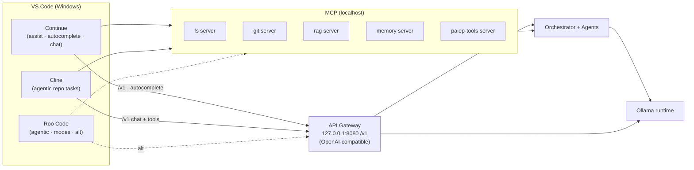
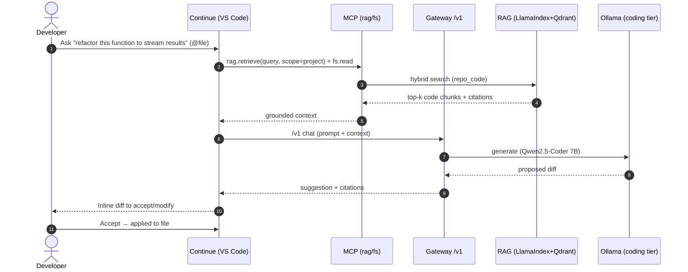
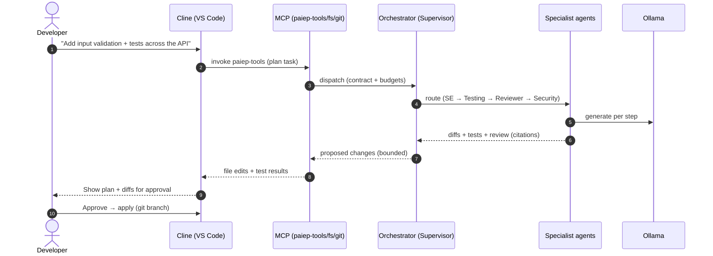

# Phase 09 — VS Code Integration

> The complete developer experience for using PAIEP inside VS Code: how **Continue**, **Cline**, and
> **Roo Code** connect to the local runtime and PAIEP services, which **MCP** servers to expose, how
> **GitHub Copilot** coexists, and the recommended **workspace configuration** — all offline-first and
> tuned for the CPU-only primary machine.
>
> **Phase status:** Drafted · **Author role:** Developer Experience Architect / Principal Software
> Engineer · **Date:** 2026-07-19

**Context (read first):**
[`.github/copilot-instructions.md`](../../.github/copilot-instructions.md) ·
[`01`](01-project-vision.md) · [`02`](02-requirements-analysis.md) · [`03`](03-market-research.md) ·
[`05`](05-enterprise-architecture.md) · [`06`](06-technology-selection.md) · [`07`](07-agent-ecosystem.md) ·
[`08`](08-knowledge-memory.md) ·
[`docs/adr/0006`](../adr/0006-security-model.md) · [`docs/adr/0007`](../adr/0007-reference-stack.md) ·
[`docs/adr/0008`](../adr/0008-agent-orchestration.md) · [`docs/setup/environment.md`](../setup/environment.md)

---

## 1. How to Read This Document

- **Design-only** (CON-006). Config snippets are **illustrative recommendations**, not committed files;
  they are finalized in the VS Code integration milestone (**M7**) in Phase 10+.
- Realizes objective **O6** (first-class VS Code) and **O7** (shared backend, many workspaces), using the
  clients selected in [Phase 06 §13](06-technology-selection.md): **Continue** + **Cline** (+ Roo Code as
  an alternative), bridged by **MCP**.
- The editor is a **thin client** to the shared backend from [Phase 05](05-enterprise-architecture.md):
  requests flow through the **gateway** (OpenAI-compatible) to the orchestrator/agents, RAG, and memory.
- Everything is **offline-capable** (NFR-010) and bound to **`127.0.0.1`** ([ADR 0005](../adr/0005-container-topology.md)).

### 1.1 What the editor connects to

| Backend surface | Endpoint (illustrative) | Used by |
|-----------------|-------------------------|---------|
| OpenAI-compatible chat/completions | `http://127.0.0.1:8080/v1` (gateway) | Continue, Cline, Roo Code, Copilot BYOK |
| Ollama-native API | `http://127.0.0.1:11434` (via gateway or direct) | Continue autocomplete |
| MCP servers | stdio / local socket | Continue, Cline, Roo Code |
| Backend health | `http://127.0.0.1:8080/health` | status checks |

---

## 2. Assistant Integrations

Three open, Apache-2.0, offline-capable clients ([Phase 03 §5](03-market-research.md)); each plays a
distinct role. All speak to the **local runtime** via the gateway's OpenAI-compatible API and consume
**MCP** servers for tools/context.

### 2.1 Role comparison

| Client | Primary role | Strength | Overlap | Verdict |
|--------|--------------|----------|---------|---------|
| **Continue** | Inline **assist + autocomplete** + chat | Fast day-to-day edits, tab completion, `@`-context | Chat overlaps Cline | **Adopt** — primary assist |
| **Cline** | **Agentic** multi-file / whole-repo tasks | Plan/act, tool use, MCP, repo-aware | Agentic overlaps Roo | **Adopt** — primary agent |
| **Roo Code** | Agentic with **custom modes** | Mode presets, Cline-derived | Overlaps Cline heavily | **Alternative** — pick if modes preferred |

### 2.2 How each connects



### 2.3 Design discipline — Continue (primary assist)
- **Why:** Mature, Apache-2.0, first-class Ollama/OpenAI support; best inline assist + **autocomplete**
  (the highest-frequency interaction) with `@file`/`@repo` context.
- **Benefits:** Low-latency edits; model config per role (chat vs. autocomplete → different tiers, ADR 0004);
  MCP-capable; offline.
- **Drawbacks:** Agentic multi-file flows weaker than Cline; chat overlaps Cline.
- **Alternatives:** Cline chat (heavier), Tabby (autocomplete-only server).
- **Complexity:** Low. **Cost:** $0. **Hardware:** autocomplete favors a small/**draft** model on CPU.
- **Future scalability:** Point autocomplete at a faster GPU endpoint (Profile B–D) transparently.

### 2.4 Design discipline — Cline (primary agent)
- **Why:** Best open **agentic** experience — plan/act across many files, tool use, MCP, repo-aware —
  maps to the Software/Refactoring/Testing agents ([Phase 07](07-agent-ecosystem.md), FR-025/032).
- **Benefits:** Whole-repo edits with human approval; MCP tools; offline via Ollama; Apache-2.0.
- **Drawbacks:** Token-hungry → **slow on CPU** for long chains; needs guardrails (approvals).
- **Alternatives:** Roo Code (custom modes), the PAIEP orchestrator directly via MCP.
- **Complexity:** Moderate. **Cost:** $0. **Hardware:** prefers 7B **coding** tier; bound chain length on CPU.
- **Future scalability:** Longer autonomous chains become practical with GPU/home-server concurrency.

### 2.5 Design discipline — Roo Code (alternative)
- **Why/Verdict:** Cline-derived with **custom modes**; strong, but **overlaps Cline**. Keep as an
  **alternative**, not a third concurrently-installed agent, to avoid confusion and RAM/config duplication.
- **Trade-off:** modes are ergonomic, but running Cline **and** Roo doubles agentic tooling with little gain.

> **Decision:** **Continue (assist) + Cline (agent)** as the default pair; **Roo Code** is a documented
> alternative to Cline. This mirrors [Phase 06 §13](06-technology-selection.md) and [ADR 0007](../adr/0007-reference-stack.md).

---

## 3. MCP (Model Context Protocol) Plan

MCP is the **standard bridge** exposing PAIEP's tools/resources to editor clients (FR-061,
[Phase 05 §2](05-enterprise-architecture.md)). Servers run locally (stdio/local socket), offline, and
enforce the [ADR 0006](../adr/0006-security-model.md) least-privilege model.

### 3.1 Servers to expose

| MCP server | Exposes | Backing service | Risk / guardrail |
|------------|---------|-----------------|------------------|
| **fs** | Read/write files within allowed roots | Tool Runtime | Path-scoped; write = review (ADR 0006) |
| **git** | status/diff/branch/log (no push by default) | Tool Runtime + `vcs` | Read-mostly; push = confirm |
| **rag** | `retrieve(query, filters)` over KB/repo | RAG (LlamaIndex+Qdrant) | Read-only; scope-filtered (Phase 08) |
| **memory** | read/write scoped memories | Memory Service (PG+Qdrant) | Write scoped; user-deletable (FR-013) |
| **paiep-tools** | persona/agent invocation, test.run, container (DevOps) | Orchestrator | Per-persona allow-list; shell/container opt-in |

### 3.2 How clients consume MCP
- Clients declare MCP servers in their config; tools appear to the model as callable functions.
- **Continue** uses MCP mainly for **context** (rag, git, fs read) + light tools.
- **Cline / Roo** use MCP for **actions** (fs write, git, test.run, paiep-tools) under approval.
- All MCP calls are **traced** (Langfuse) and **policy-checked** by the orchestrator before execution.

### 3.3 Design discipline — MCP as the bridge
- **Why:** One open standard decouples clients from PAIEP internals; any MCP-capable editor works (O6/NFR-024).
- **Benefits:** Reuse the same servers across Continue/Cline/Roo (and future clients); centralized guardrails;
  no bespoke per-client integration.
- **Drawbacks:** MCP is young/evolving; per-client support varies; another moving part.
- **Alternatives:** Client-specific plugins (lock-in), direct REST from clients (bypasses guardrails — rejected).
- **Complexity:** Moderate. **Cost:** $0. **Hardware:** negligible (thin servers).
- **Future scalability:** Same MCP servers serve a Profile-D backend over local transport; add servers without touching clients.

---

## 4. GitHub Copilot Coexistence

PAIEP and GitHub Copilot are **complementary**, not mutually exclusive. Copilot is a powerful **cloud**
assistant; PAIEP is the **local, private, offline** counterpart ([Phase 01](01-project-vision.md)).

### 4.1 When to use which

| Situation | Prefer | Why |
|-----------|--------|-----|
| Private/sensitive code or data | **PAIEP (local)** | Nothing leaves the device (NFR-010/020) |
| Offline / on a plane / no network | **PAIEP** | Works with network disabled |
| Zero-cost, unlimited local iteration | **PAIEP** | No per-token cost (O1) |
| Frontier-quality suggestions on public code | **Copilot** | Larger cloud models, strong completions |
| Multi-persona / RAG-grounded / memory tasks | **PAIEP** | Personas + KB + long-term memory (O3/O4/O5) |
| Quick everyday autocomplete when online | Either | User preference; can run both |

### 4.2 Avoiding conflicts

| Conflict area | Strategy |
|---------------|----------|
| **Autocomplete collision** (two inline providers) | Run **one inline completion provider at a time**: use Copilot **or** Continue autocomplete; toggle per workspace. |
| **Chat/agent overlap** | Copilot Chat for cloud; Continue/Cline for local — distinct commands/keybindings. |
| **Keybindings** | Assign non-overlapping shortcuts; document in `.vscode/keybindings` guidance. |
| **Copilot BYOK (optional)** | Copilot can point at the **local OpenAI endpoint** (`/v1`) where supported, unifying UX — verify current support ⚠. |
| **Privacy boundary** | Keep private repos on **PAIEP-only**; disable Copilot for those workspaces if required. |

### 4.3 Privacy considerations
- Copilot may transmit context to the cloud; **PAIEP never does** by default (offline-first).
- For sensitive workspaces, **disable Copilot** (`github.copilot.enable` per-language/workspace) and rely on
  PAIEP; document this per-repo (CON-004, NFR-020).
- This repo's own `.github/copilot-instructions.md` governs any AI agent working here (design-first, gated).

### 4.4 Design discipline — coexistence over replacement
- **Why:** They occupy different points on the privacy/cost/quality trade-off; forcing one loses value.
- **Benefits:** Best-of-both; graceful fallback (offline → PAIEP, hard public problem → Copilot).
- **Drawbacks:** Two systems to configure; potential UI overlap (mitigated in §4.2).
- **Alternatives:** PAIEP-only (loses frontier quality); Copilot-only (loses privacy/offline/cost — rejected as sole).
- **Complexity:** Low (config discipline). **Cost:** Copilot subscription optional; PAIEP $0.
- **Future scalability:** As local quality rises (GPU/Profile-D), the balance shifts further to PAIEP.

---

## 5. Workspace Configuration

Per-repo config is distributed via a **template/cookiecutter** (O7, M7). Illustrative layout:

```text
<repo>/
  .vscode/
    settings.json         # endpoints, inline-provider choice, formatters
    extensions.json       # recommended extensions
    mcp.json              # MCP server declarations (or client-specific)
  .continue/
    config.(yaml|json)    # models (chat/autocomplete tiers), context providers, MCP
  .clinerules / .roo/     # agent rules, allowed tools, approval policy (if used)
  .github/
    copilot-instructions.md   # repo-wide AI rules (design-first here)
    prompts/                  # phase/task prompt files
  AGENTS.md                   # optional: agent conventions for this repo
```

### 5.1 Recommended `.vscode/settings.json` (illustrative)

| Setting | Recommendation | Rationale |
|---------|----------------|-----------|
| Local endpoint | `http://127.0.0.1:8080/v1` | Route clients through the gateway |
| Inline provider | **one** of Copilot / Continue | Avoid autocomplete collision (§4.2) |
| Copilot enable | per-workspace (off for private repos) | Privacy boundary (NFR-020) |
| Telemetry | disabled where possible | Offline-first / privacy |
| Format on save | on (project formatter) | Consistency |

### 5.2 Recommended extensions (`extensions.json`)
- **Continue** (assist/autocomplete), **Cline** (agent) — core.
- Optional: **Roo Code** (alternative agent), Docker, GitLens, Markdown/Mermaid preview.
- Copilot / Copilot Chat — optional, per user (coexistence §4).

### 5.3 Prompt & instructions files
- `.github/copilot-instructions.md` — repo-wide rules (this project: design-first, gated phases).
- `.github/prompts/*.prompt.md` — runnable phase/task prompts (as in this repo).
- `AGENTS.md` (optional) — cross-tool agent conventions.
- Continue/Cline **rules** — per-client behavior + **allowed MCP tools** (mirror ADR 0006 allow-lists).

### 5.4 Per-repo conventions
- Point all clients at the **shared backend** (services run once, O7).
- Declare the **same MCP servers** across clients for consistent tools/context.
- Keep secrets in `.env` (git-ignored); never in settings/prompts (NFR-022).

---

## 6. End-to-End DX Flows

### 6.1 "Ask → local model + RAG → edit in editor" (assist)



### 6.2 "Agentic multi-file task" (Cline + orchestrator)



---

## 7. Per-Profile In-Editor Guidance (A–D)

| Profile | Autocomplete | Chat/assist | Agentic (Cline) | Notes |
|---------|--------------|-------------|-----------------|-------|
| **A** (16 GB CPU) | draft 1–3B or **off** | 3B chat | short chains only | Prefer Copilot autocomplete if online; keep local chains tiny |
| **A+** (primary, 32 GB) | 1–3B draft | **7B coding/general** | **bounded** multi-file | Default; one inline provider; approvals on for agents |
| **B** (GPU 12–16 GB) | 3–7B | 14B | longer chains | Snappier; enable re-rank/RAG freely |
| **C/D** (server) | 7B+ | 32B | concurrent agents | Point editor at LAN backend; near-cloud feel |

**Guidance:** on CPU keep **one inline completion provider**, a **small autocomplete model**, and **bounded
agent chains** (Phase 07/08); heavier agentic work is best after a GPU/home-server upgrade (ADR 0100).

---

## 8. Assumptions

- Continue/Cline/Roo remain actively maintained and MCP-capable; re-verify features/versions at M7.
- Copilot BYOK / local-endpoint support may change — **verify current capability ⚠** before relying on it.
- Config snippets are **recommendations**; exact files are produced by the template/cookiecutter (M7).
- The shared backend is reachable at `127.0.0.1` (single machine) or over LAN (Profile D).

---

## 9. Risks

| Risk | Impact | Mitigation |
|------|--------|------------|
| Two inline providers collide (Copilot + Continue). | Flicker, duplicate suggestions. | Enforce **one** inline provider per workspace (§4.2). |
| Agentic chains too slow on CPU. | Poor DX. | Bound chains; draft/coding tiers; GPU/Profile-D path. |
| MCP feature drift across clients. | Broken tools. | Pin versions; capability checks; keep servers standard. |
| Over-broad MCP tool grants. | Unsafe edits/actions. | ADR 0006 allow-lists; approvals; shell/container opt-in. |
| Accidental cloud leakage via Copilot on private repos. | Privacy breach. | Disable Copilot per sensitive workspace; document boundary. |
| Config drift across many workspaces. | Inconsistent DX. | Template/cookiecutter (M7); shared backend endpoints. |

---

## 10. Future Improvements

- Ship the **template repo / cookiecutter** for one-command workspace setup (M7).
- Build a small **custom MCP server** for PAIEP-specific tools (persona invoke, benchmark, memory admin).
- Add **status bar / health** integration showing backend + model state.
- Evaluate **Copilot BYOK** pointing at the local endpoint once support is confirmed.
- Revisit **Roo Code vs. Cline** after hands-on use; consolidate on one agent.
- Editor-side **latency dashboards** (Langfuse) for local model tuning (Phase 11).

---

## 11. References

- Internal: [Phase 01](01-project-vision.md) · [Phase 03 §5](03-market-research.md) ·
  [Phase 05](05-enterprise-architecture.md) · [Phase 06 §13](06-technology-selection.md) ·
  [Phase 07](07-agent-ecosystem.md) · [Phase 08](08-knowledge-memory.md) ·
  [environment.md](../setup/environment.md)
- ADRs: [0005](../adr/0005-container-topology.md) · [0006](../adr/0006-security-model.md) ·
  [0007](../adr/0007-reference-stack.md) · [0008](../adr/0008-agent-orchestration.md) ·
  [0010 (this phase)](../adr/0010-vscode-integration-strategy.md) · [0100](../adr/0100-gpu-and-reuse-strategy.md)
- Diagrams index: [`architecture/README.md`](../../architecture/README.md)
- External (verify at M7): Continue · Cline · Roo Code · Model Context Protocol · GitHub Copilot docs.

---

> **Phase 09 complete** — see the chat summary, then **STOP** for approval before Phase 10.
