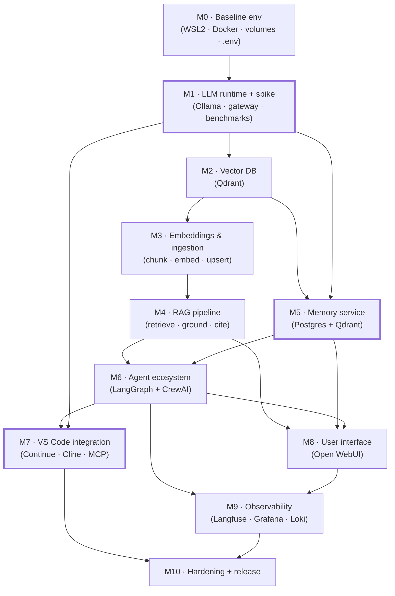

# Phase 10 — Implementation Roadmap

> The master delivery plan for **PAIEP**: the approved [Phase 06](06-technology-selection.md) reference
> architecture broken into **small, independent, testable, documented, reversible** milestones (M0–M9).
> This phase **plans** the build — **no milestone code is written until the roadmap is approved and a
> specific milestone is explicitly requested**.
>
> **Phase status:** Drafted · **Author role:** DevOps/MLOps Engineer + Principal Software Engineer ·
> **Date:** 2026-07-19

**Context (read first):**
[`.github/copilot-instructions.md`](../../.github/copilot-instructions.md) ·
[`01`](01-project-vision.md) · [`02`](02-requirements-analysis.md) · [`03`](03-market-research.md) ·
[`04`](04-feasibility-study.md) · [`05`](05-enterprise-architecture.md) · [`06`](06-technology-selection.md) ·
[`07`](07-agent-ecosystem.md) · [`08`](08-knowledge-memory.md) · [`09`](09-vscode-integration.md) ·
[`docs/setup/environment.md`](../setup/environment.md) ·
[`docs/adr/0005`](../adr/0005-container-topology.md) · [`docs/adr/0007`](../adr/0007-reference-stack.md) ·
[`implementation/`](../../implementation/)

---

## 1. How to Read This Document

- This is the **first code phase**, but it stays **design/plan-only** until approval
  ([ADR 0001](../adr/0001-design-first-gated-phases.md), CON-006). Milestone specs describe *what* to
  build and *how to prove it*, not committed code.
- Every milestone is **small, independent, testable, documented, and reversible** (Golden Rule 5). Each has
  its own spec file under [`implementation/`](../../implementation/) with a full validation and rollback plan.
- **Milestone numbering (M0–M10) matches the executable prompts** in
  [`.github/prompts/implementation/`](../../.github/prompts/implementation/) 1:1 and is **fixed by prior
  phases** — do not renumber: **M1** = LLM runtime + integration spike + benchmarks
  ([ADR 0007](../adr/0007-reference-stack.md), [ADR 0004](../adr/0004-default-model-selection.md));
  **M5** = memory service ([Phase 08](08-knowledge-memory.md), [Phase 06 §7](06-technology-selection.md));
  **M7** = VS Code integration + template/cookiecutter ([Phase 09](09-vscode-integration.md),
  [ADR 0010](../adr/0010-vscode-integration-strategy.md)).
- The target is the **approved reference stack** ([ADR 0007](../adr/0007-reference-stack.md)): Ollama +
  llama.cpp · LangGraph + CrewAI · LlamaIndex · nomic-embed-text · Qdrant · Postgres · Langfuse +
  Prometheus/Grafana · Continue + Cline + MCP · Open WebUI (optional), all on **loopback**
  ([ADR 0005](../adr/0005-container-topology.md)), offline-first, CPU-first.

---

## 2. Milestone Overview

| # | Milestone | Delivers | Anchor | Spec |
|---|-----------|----------|--------|------|
| **M0** | Baseline environment | WSL2 + Docker Compose skeleton, `.env`, volumes, health scaffold | — | [`M0-baseline.md`](../../implementation/M0-baseline.md) |
| **M1** | LLM runtime + spike | Ollama, default models, gateway, first CPU benchmarks, thin end-to-end spike | ADR 0004/0007 | [`M1-llm-runtime.md`](../../implementation/M1-llm-runtime.md) |
| **M2** | Vector database | Qdrant service, collections, payload-filter conventions | — | [`M2-vector-db.md`](../../implementation/M2-vector-db.md) |
| **M3** | Embeddings & ingestion | Embedding model + ingest→chunk→embed→upsert, idempotent, provenance | O4 | [`M3-embeddings-ingestion.md`](../../implementation/M3-embeddings-ingestion.md) |
| **M4** | RAG pipeline | LlamaIndex retrieve→(re-rank)→assemble→ground with citations | O4 | [`M4-rag-pipeline.md`](../../implementation/M4-rag-pipeline.md) |
| **M5** | Memory service | Postgres state + Qdrant semantic recall, scope, CRUD, retention | O3 | [`M5-memory.md`](../../implementation/M5-memory.md) |
| **M6** | Agent ecosystem | LangGraph orchestrator + CrewAI personas, supervisor, guardrails | O5 | [`M6-agents.md`](../../implementation/M6-agents.md) |
| **M7** | VS Code integration | Continue + Cline, MCP servers, template/cookiecutter | O6, O7 | [`M7-vscode-integration.md`](../../implementation/M7-vscode-integration.md) |
| **M8** | User interface | Local web UI (Open WebUI) wired to runtime/RAG/memory/agents | O6 | [`M8-ui.md`](../../implementation/M8-ui.md) |
| **M9** | Observability | Langfuse traces + optional Prometheus/Grafana/Loki, dashboards, alerts | O8 | [`M9-observability.md`](../../implementation/M9-observability.md) |
| **M10** | Hardening + release | Security, resource limits, backups, one-command bring-up, v1 release | O8, NFR-021 | [`M10-hardening-release.md`](../../implementation/M10-hardening-release.md) |

> **M1 is deliberately a thin vertical slice**, not just "install Ollama": it stands up the gateway and a
> minimal Ollama → LlamaIndex → Qdrant → Continue path to **validate the whole reference stack early**
> ([ADR 0007](../adr/0007-reference-stack.md)). M2–M4 then deepen each layer properly.

---

## 3. Dependency Graph

- **Critical path:** `M0 → M1 → M2 → M3 → M4 → M6 → M7 → M10`.
- **Parallelizable:** **M5** (memory) depends only on M1+M2, so it can proceed **concurrently with M3/M4**.
- **M9** (observability) can start incrementally after **M1** (basic health) but is only *complete* after
  **M6** (agent traces) and **M8** (UI signals).

---

## 4. Sequence (Gantt)

> Relative sequencing only — **no calendar estimates** (per repo rule "avoid time estimates"). Bar lengths
> are indicative effort weights, not commitments. Each milestone is gated: finish, validate, then proceed.

```mermaid
gantt
    title PAIEP Delivery Sequence (relative, gated)
    dateFormat  X
    axisFormat  M%s

    section Foundation
    M0 Baseline env         :m0, 0, 1
    M1 LLM runtime + spike   :m1, after m0, 2

    section Data & Retrieval
    M2 Vector DB            :m2, after m1, 1
    M3 Embeddings & ingest  :m3, after m2, 2
    M4 RAG pipeline         :m4, after m3, 2

    section Cognition
    M5 Memory service       :m5, after m2, 2
    M6 Agent ecosystem      :m6, after m4, 3

    section Experience & Ops
    M7 VS Code integration  :m7, after m6, 2
    M8 User interface       :m8, after m6, 2
    M9 Observability        :m9, after m8, 2
    M10 Hardening + release :m10, after m7, 2
```

---

## 5. Hardware Profile Mapping

What each [profile](../../README.md) can run. The **primary machine is the "A+" hybrid** (32 GB RAM,
CPU-only) — every milestone must be usable there.

| Milestone | A (16 GB CPU) | A+ primary (32 GB CPU) | B (GPU) | C (workstation) | D (home server) |
|-----------|:-------------:|:----------------------:|:-------:|:---------------:|:----------------:|
| M0 Baseline | ✅ | ✅ | ✅ | ✅ | ✅ |
| M1 LLM runtime | ✅ 7B Q4 | ✅ 7–8B Q4/Q5 | ✅ +GPU offload | ✅ larger models | ✅ vLLM option |
| M2 Vector DB | ✅ | ✅ | ✅ | ✅ | ✅ cluster-ready |
| M3 Embeddings & ingest | ◐ ingest slow | ✅ | ✅ faster embed | ✅ | ✅ offloaded/bulk |
| M4 RAG pipeline | ✅ small top-k | ✅ | ✅ faster query | ✅ | ✅ heavier re-rank |
| M5 Memory | ✅ SQLite substitute | ✅ Postgres | ✅ | ✅ | ✅ |
| M6 Agents | ◐ bound chains | ✅ bound chains | ✅ concurrent | ✅ | ✅ many agents |
| M7 VS Code | ✅ draft tier | ✅ | ✅ | ✅ | ✅ shared backend |
| M8 UI | ◐ optional | ✅ | ✅ | ✅ | ✅ multi-user (w/ M10) |
| M9 Observability | ◐ off by default | ✅ selective | ✅ | ✅ | ✅ central obs |
| M10 Hardening | ✅ | ✅ | ✅ | ✅ | ✅ + network hardening |

Legend: ✅ full · ◐ works with constraints (reduced corpus / disabled optional components / bound concurrency).

**Profile-specific defaults**
- **Profile A (16 GB):** disable Langfuse/Grafana by default; prefer **SQLite** over Postgres for memory
  ([Phase 06 §7](06-technology-selection.md)); single 7B Q4_K_M model; bound agent chain length.
- **A+ primary:** full stack, monitoring selective/optional; 7–8B Q4_K_M/Q5_K_M sweet spot; CPU-only.
- **Profiles B/C:** add GPU offload for inference/embeddings/ingestion; longer agent chains.
- **Profile D:** always-on shared backend, optional **vLLM** behind the gateway
  ([ADR 0100](../adr/0100-gpu-and-reuse-strategy.md)), **Prefect** for scheduled ingest/benchmarks
  ([Phase 06 §8](06-technology-selection.md)), central observability.

---

## 6. Cross-Cutting Delivery Rules

Applied to **every** milestone (they are the shared "definition of done"):

1. **Reversibility.** Each milestone adds services/files behind a Compose profile or a discrete module so it
   can be disabled/removed with a documented rollback ([§ per-milestone rollback](../../implementation/)).
2. **Loopback + offline.** All services bind to `127.0.0.1` only ([ADR 0005](../adr/0005-container-topology.md));
   no mandatory network egress (NFR-010/011). Verify with a network-off smoke test.
3. **Pinned versions.** Pin image tags / package versions at the start of a milestone; record them in the
   spec and in an ADR update. Re-verify licenses at pinning time ([ADR 0007](../adr/0007-reference-stack.md)).
4. **Config over code.** Model tiers, personas, endpoints, and scopes live in config/`.env`
   (git-ignored secrets, NFR-022), not hard-coded.
5. **Test before proceed.** A milestone is "done" only when its **validation checklist** passes and results
   are recorded under [`implementation/`](../../implementation/) (feeds Phase 11 benchmarks).
6. **Docs + ADR.** Update the relevant phase docs and add/append an ADR when a milestone locks a decision.

---

## 7. Testing Strategy (across milestones)

| Layer | What we test | How | Expected output |
|-------|--------------|-----|-----------------|
| Smoke | Service starts, health endpoint OK | `curl`/health checks in Compose | `200`/healthy status |
| Contract | OpenAI-compatible API shape | request/response schema checks against gateway | valid `chat/completions` payloads |
| Functional | Feature behavior (retrieve, recall, agent step) | scripted scenario per milestone | grounded answer / correct memory / bounded chain |
| Integration | Cross-service path | end-to-end scenario (spike expanded per milestone) | citation-backed answer through the full stack |
| Performance | CPU latency/throughput | tokens/s, first-token latency, recall@k (M1 baseline) | numbers recorded, no invented values |
| Regression | Prior milestones still pass | re-run earlier validation checklists | all green before proceeding |
| Offline | Works with network disabled | disable egress, re-run smoke/functional | full success offline |

---

## 8. Assumptions

- The **Phase 06 reference stack** ([ADR 0007](../adr/0007-reference-stack.md)) is approved and stable enough
  to target; version pinning happens per milestone.
- The primary machine matches [`environment.md`](../setup/environment.md) (WSL2 Ubuntu, 32 GB, CPU-only,
  Docker Desktop + Compose v2).
- A **single operator** builds and validates milestones sequentially (CON-007); no CI cluster is assumed.
- Model defaults follow [ADR 0004](../adr/0004-default-model-selection.md) (7–8B Q4_K_M) pending M1 benchmarks.

## 9. Risks & Mitigations

| Risk | Impact | Likelihood | Mitigation |
|------|--------|:----------:|------------|
| CPU latency makes agent chains sluggish | Poor UX (NFR-001/004) | High | Bound chain length; draft/coding tiers; measure in M1; GPU path (Profiles B–D) |
| Scope creep inside a milestone | Slips gating, over-engineering | Medium | Strict per-spec scope; defer extras to later milestones/ADRs |
| Version/license drift at pinning | Rework, compliance risk | Medium | Pin + re-verify licenses per milestone ([ADR 0007](../adr/0007-reference-stack.md)) |
| Two data stores (Qdrant + Postgres) drift out of sync | Memory/RAG inconsistency | Medium | Clear ownership (vectors vs. relational); consistency checks in M5 |
| RAM pressure (32 GB budget) with full stack | OOM / swapping | Medium | Compose profiles; disable optional services (M8 UI / M9 obs) on A/A+; resource limits (M10) |
| Re-embed cost when embedding model changes | Expensive rebuild | Low–Med | Record model+dim in index catalog (M2/M3); avoid changing default casually |
| MCP/client feature drift | Broken editor tools | Medium | Pin client versions; capability checks; re-verify at M7 ([Phase 09](09-vscode-integration.md)) |

## 10. Future Improvements

- **Prefect** for scheduled bulk ingestion / periodic re-index / benchmark runs on Profile D
  ([Phase 06 §8](06-technology-selection.md)).
- **vLLM** service behind the gateway for GPU throughput ([ADR 0100](../adr/0100-gpu-and-reuse-strategy.md)).
- Automated **evaluation harness** (Phase 11) wired to Langfuse traces from M9.
- One-command **installer/bootstrap** and update mechanism (extends M0/M10).
- Multi-node home-server topology and workspace template distribution (Phase 12 / M7).

## 11. References

- Internal: Phases [01](01-project-vision.md)–[09](09-vscode-integration.md);
  ADRs [0001](../adr/0001-design-first-gated-phases.md), [0002](../adr/0002-offline-first-priority.md),
  [0003](../adr/0003-build-vs-adopt.md), [0004](../adr/0004-default-model-selection.md),
  [0005](../adr/0005-container-topology.md), [0006](../adr/0006-security-model.md),
  [0007](../adr/0007-reference-stack.md), [0008](../adr/0008-agent-orchestration.md),
  [0009](../adr/0009-vector-store-and-memory.md), [0010](../adr/0010-vscode-integration-strategy.md),
  [0011](../adr/0011-delivery-milestones.md), [0100](../adr/0100-gpu-and-reuse-strategy.md).
- Milestone specs: [`implementation/`](../../implementation/) (M0–M10), 1:1 with the executable prompts in
  [`.github/prompts/implementation/`](../../.github/prompts/implementation/).
- Setup: [`docs/setup/environment.md`](../setup/environment.md).

---

## 12. Phase Complete

**Phase 10 complete.** This roadmap is **plan-only**; no milestone code will be written until this roadmap
is approved **and** a specific milestone (e.g., "start M0") is explicitly requested.
