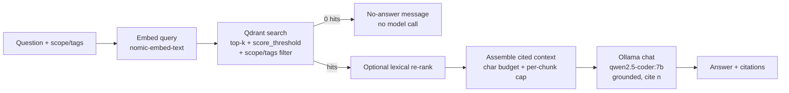

# 04 — RAG Pipeline (M4)

> **Milestone:** [M4 — RAG Pipeline](../../implementation/M4-rag-pipeline.md) ·
> **Anchor:** O4 (FR-022–025) · **Depends on:** [M2](../../implementation/M2-vector-db.md) (vector DB),
> [M3](../../implementation/M3-embeddings-ingestion.md) (populated index) ·
> **Stack:** LlamaIndex + Qdrant + Ollama ([ADR 0007](../adr/0007-reference-stack.md),
> [ADR 0009](../adr/0009-vector-store-and-memory.md)).

This is the **read path**: given a question, embed it, retrieve the most relevant chunks from the M3 index,
optionally re-rank, assemble a citation-bearing context within the model window, and generate a **grounded**
answer. Everything runs **offline** on the internal `backend` network.

---

## 1. Architecture



Modules live in [`rag/query/`](../../rag/query/):

| Module | Responsibility |
|--------|----------------|
| `config.py` | Load [`config/rag.yaml`](../../config/rag.yaml) + inherit embed/qdrant settings from M3 |
| `retriever.py` | Embed query, Qdrant `search` with `scope`/`tags` filters + `score_threshold` |
| `rerank.py` | Optional lexical-overlap re-rank (dependency-free) |
| `assembler.py` | Numbered `[n]` context blocks within char budget; emit citations |
| `generator.py` | Ollama `/api/chat` with the grounded system prompt |
| `engine.py` | Orchestrate the stages; enforce the empty-retrieval guardrail |

Entry point: [`scripts/rag-query.py`](../../scripts/rag-query.py) (Compose profile `rag`, reusing the M3
`ingest` image).

## 2. Configuration — `config/rag.yaml`

| Group | Key | Default | Notes |
|-------|-----|---------|-------|
| `retrieval` | `collection` | `kb_docs` | Which M2 collection to query |
| | `top_k` | `4` | CPU-friendly on the reference machine |
| | `score_threshold` | `0.25` | Drops weak matches → enables clean no-answer |
| `rerank` | `enabled` | `false` | Off by default on Profile A/A+ |
| | `method` | `lexical` | Overlap blend; cross-encoder deferred (Phase 11) |
| | `candidate_k` | `8` | Wider pool re-ranked down to `top_k` |
| | `lexical_weight` | `0.15` | `(1−w)·vector + w·lexical` |
| `context` | `max_context_chars` | `6000` | Budget kept well under `num_ctx` |
| | `per_chunk_char_cap` | `1600` | Prevents one chunk dominating |
| `generation` | `model` | `qwen2.5-coder:7b` | Local chat model (M1) |
| | `temperature` | `0.1` | Low → faithful, less drift |
| | `num_ctx` | `8192` | Context window |
| `guardrails` | `no_answer_message` | fixed phrase | Returned when context is insufficient |

Env overrides: `OLLAMA_BASE_URL`, `QDRANT_URL`, `EMBED_MODEL`, `CHAT_MODEL`, `RAG_CONFIG`.

## 3. Grounding & safety

- **System prompt** instructs the model to answer **only** from the numbered context, cite `[n]`, and emit
  the exact **no-answer** phrase when the context does not contain the answer.
- Retrieved text is wrapped as **data, not instructions** — mitigates prompt injection via ingested content
  (OWASP LLM01).
- **Empty retrieval short-circuits** to the no-answer message **without calling the model**, so a
  low-relevance query can never produce a hallucinated citation.

## 4. Run

Prerequisite: M3 has populated `kb_docs` (`docker compose --profile ingest run --rm ingest knowledge ...`).

```bash
cd docker

# Grounded question (prints answer + citations)
docker compose --profile rag run --rm rag "How does PAIEP keep working when the network is disabled?"

# Scope-filtered + machine-readable
docker compose --profile rag run --rm rag "What are PAIEP's core design principles?" \
  --scope global --tags paiep --json

# Force re-rank on / show citation sources
docker compose --profile rag run --rm rag "..." --rerank --show-context
```

> **Latency:** on the reference machine (CPU-only, `qwen2.5-coder:7b` ≈ 3.5 tok/s) a full grounded answer
> takes ~1–3 min; retrieval alone is sub-second. The no-answer path is instant (no generation).

## 5. Retrieval quality — recall@k

The eval harness [`benchmarks/m4/eval.py`](../../benchmarks/m4/eval.py) scores a small labeled set
([`benchmarks/m4/qa.yaml`](../../benchmarks/m4/qa.yaml)): recall@k = fraction of questions whose expected
source appears in the top-k. Retrieval-only by default (fast); `--answers` also checks citation accuracy.

```bash
docker compose --profile rag run --rm --entrypoint python rag /app/benchmarks/m4/eval.py --json
```

See [`benchmarks/m4/README.md`](../../benchmarks/m4/README.md) for measured results.

## 6. Validate

| Check | How | Expected |
|-------|-----|----------|
| Grounded answer (FR-022) | ask a known question | correct answer citing the right `source` |
| Scope/tags filter | `--scope` / `--tags` | only in-scope chunks retrieved |
| Context budget | large `top_k` | assembled within `max_context_chars`, no error |
| No-answer guardrail | off-domain / empty scope | fixed no-answer message, **no** citations |
| recall@k | `eval.py` | metric recorded in results/ |
| Offline | run on `backend` net | success; no internet egress |

## 7. Troubleshooting

- **Poor recall:** revisit chunking/embeddings (M3), raise `top_k`, or enable re-rank.
- **Weak/irrelevant citations:** raise `score_threshold`; verify metadata survived chunking.
- **Context overflow:** lower `top_k`/`per_chunk_char_cap`; enable re-rank to prioritise.
- **Slow answers on Profile A:** smaller `top_k`, keep re-rank off, use a faster/smaller chat model.

## 8. Rollback

`rag/query/` and `config/rag.yaml` are additive; **M1–M3 remain functional**. No schema/data changes —
`git restore rag/query config/rag.yaml scripts/rag-query.py` and remove the `rag` Compose service.
